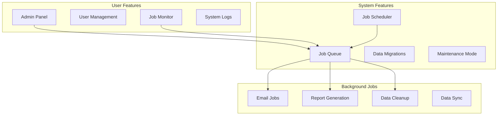

# Admin Stack

**End-to-end administrative operations, background jobs, and system maintenance**

---

## Stack Overview



---

## 📊 System Features

### 1. Background Job System

```typescript
import { Queue, Worker } from 'bullmq';

// Define job types
interface SendEmailJob {
  to: string;
  subject: string;
  template: string;
  data: any;
}

interface GenerateReportJob {
  userId: string;
  reportType: string;
  dateRange: { start: Date; end: Date };
}

// Create queues
const emailQueue = new Queue<SendEmailJob>('email', {
  connection: redis,
});

const reportQueue = new Queue<GenerateReportJob>('reports', {
  connection: redis,
});

// Workers
const emailWorker = new Worker<SendEmailJob>(
  'email',
  async (job) => {
    await emailService.send(
      job.data.to,
      job.data.template,
      job.data.data
    );
  },
  {
    connection: redis,
    concurrency: 10,
  }
);

const reportWorker = new Worker<GenerateReportJob>(
  'reports',
  async (job) => {
    const report = await generateReport(job.data);
    
    // Save report
    await db.reports.create({
      data: {
        userId: job.data.userId,
        type: job.data.reportType,
        url: report.url,
      },
    });
    
    // Notify user
    await emailQueue.add('report-ready', {
      to: job.data.userId,
      template: 'report-ready',
      data: { reportUrl: report.url },
    });
  },
  {
    connection: redis,
    concurrency: 2, // Reports are CPU-intensive
  }
);

// Queue jobs
export async function queueEmail(data: SendEmailJob): Promise<void> {
  await emailQueue.add('send-email', data, {
    attempts: 3,
    backoff: {
      type: 'exponential',
      delay: 2000,
    },
  });
}
```

---

### 2. Scheduled Jobs (Cron)

```typescript
import cron from 'node-cron';

// Daily cleanup job (2 AM)
cron.schedule('0 2 * * *', async () => {
  console.log('Running daily cleanup...');
  
  // Delete expired sessions
  await db.sessions.deleteMany({
    where: {
      expiresAt: { lt: new Date() },
    },
  });
  
  // Archive old logs
  const thirtyDaysAgo = new Date(Date.now() - 30 * 24 * 60 * 60 * 1000);
  await archiveOldLogs(thirtyDaysAgo);
  
  console.log('Cleanup complete');
});

// Weekly report (Monday 9 AM)
cron.schedule('0 9 * * 1', async () => {
  const users = await db.users.findMany({
    where: { plan: 'pro', emailNotifications: true },
  });
  
  for (const user of users) {
    await reportQueue.add('weekly-summary', {
      userId: user.id,
      reportType: 'weekly-summary',
      dateRange: {
        start: new Date(Date.now() - 7 * 24 * 60 * 60 * 1000),
        end: new Date(),
      },
    });
  }
});
```

---

### 3. Data Migrations

```typescript
// Migration system
interface Migration {
  id: string;
  name: string;
  up: () => Promise<void>;
  down: () => Promise<void>;
}

class MigrationRunner {
  async runPending(): Promise<void> {
    const applied = await db.migrations.findMany();
    const appliedIds = new Set(applied.map(m => m.id));
    
    const pending = migrations.filter(m => !appliedIds.has(m.id));
    
    for (const migration of pending) {
      console.log(`Running migration: ${migration.name}`);
      
      try {
        await migration.up();
        
        await db.migrations.create({
          data: {
            id: migration.id,
            name: migration.name,
            appliedAt: new Date(),
          },
        });
        
        console.log(`✅ Migration ${migration.name} complete`);
      } catch (error) {
        console.error(`❌ Migration ${migration.name} failed:`, error);
        throw error;
      }
    }
  }
  
  async rollback(migrationId: string): Promise<void> {
    const migration = migrations.find(m => m.id === migrationId);
    if (!migration) throw new Error('Migration not found');
    
    await migration.down();
    
    await db.migrations.delete({
      where: { id: migrationId },
    });
  }
}
```

---

## 👥 User Features

### 1. Admin Panel

```typescript
const AdminPanel: React.FC = () => {
  return (
    <AdminLayout>
      <Sidebar>
        <NavLink to="/admin/users">Users</NavLink>
        <NavLink to="/admin/jobs">Background Jobs</NavLink>
        <NavLink to="/admin/logs">System Logs</NavLink>
        <NavLink to="/admin/settings">Settings</NavLink>
      </Sidebar>
      
      <Main>
        <Routes>
          <Route path="/users" element={<UserManagement />} />
          <Route path="/jobs" element={<JobMonitor />} />
          <Route path="/logs" element={<SystemLogs />} />
          <Route path="/settings" element={<SystemSettings />} />
        </Routes>
      </Main>
    </AdminLayout>
  );
};
```

### 2. Job Monitor

```typescript
const JobMonitor: React.FC = () => {
  const [jobs, setJobs] = useState<Job[]>([]);
  const [filter, setFilter] = useState<'all' | 'active' | 'completed' | 'failed'>('active');
  
  return (
    <div className="job-monitor">
      <header>
        <h1>Background Jobs</h1>
        <Stats
          active={jobs.filter(j => j.status === 'active').length}
          completed={jobs.filter(j => j.status === 'completed').length}
          failed={jobs.filter(j => j.status === 'failed').length}
        />
      </header>
      
      <JobTable
        jobs={jobs.filter(j => filter === 'all' || j.status === filter)}
        onRetry={(jobId) => retryJob(jobId)}
        onCancel={(jobId) => cancelJob(jobId)}
      />
    </div>
  );
};
```

---

**Admin Stack Complete** ✅


