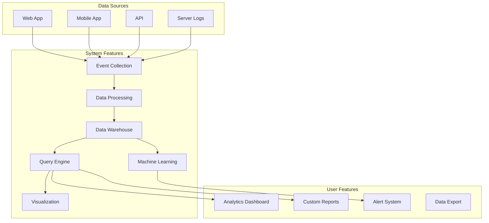
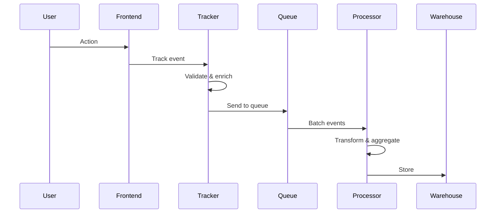
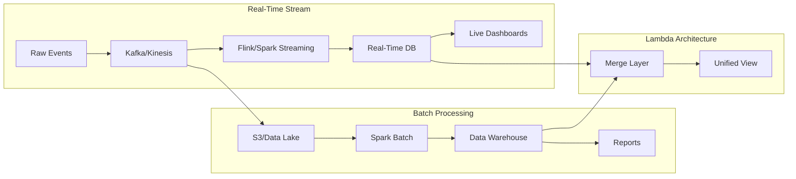
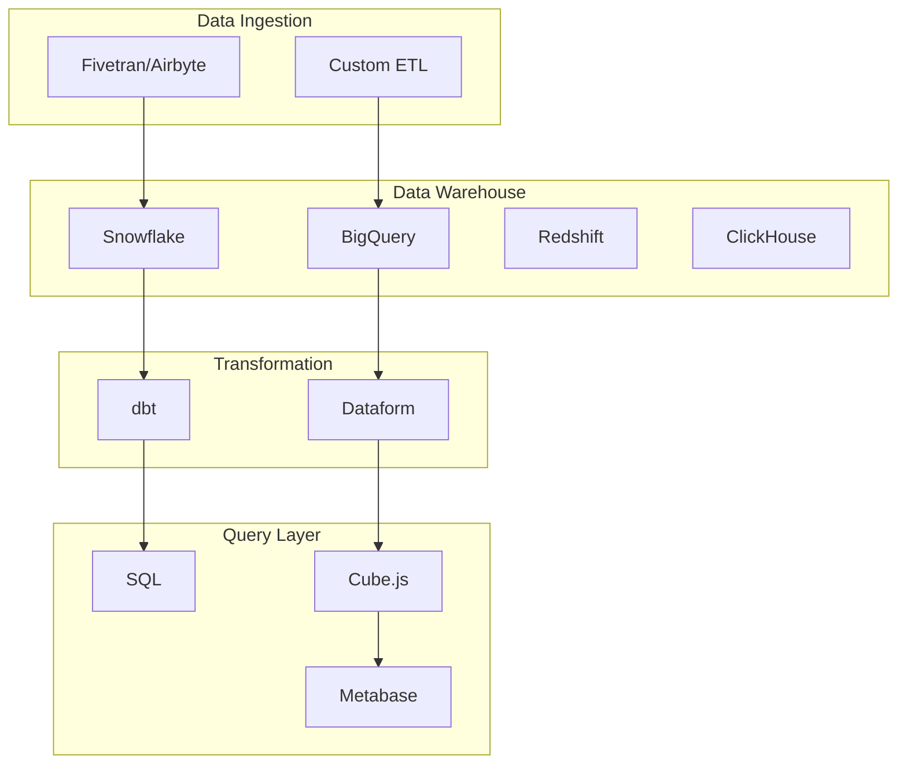
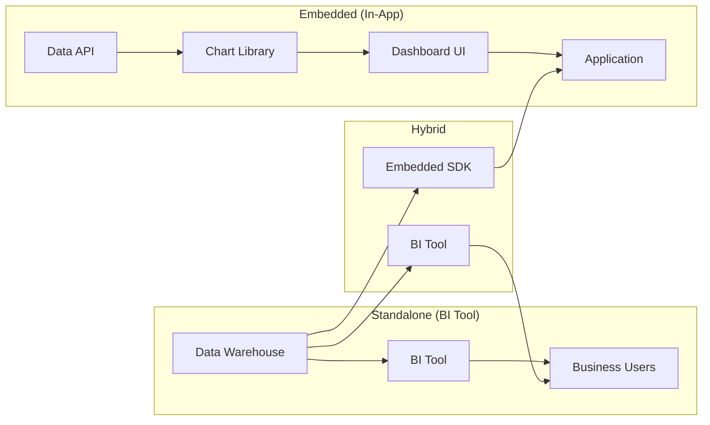
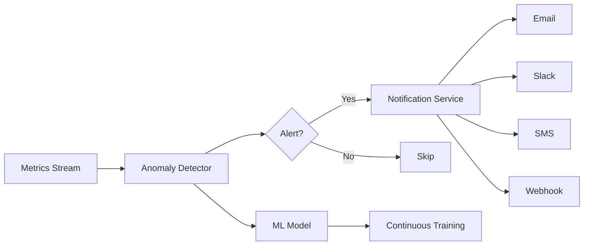
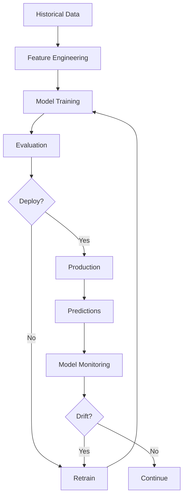

# Analytics Stack

**End-to-end architecture for tracking, metrics, dashboards, and business intelligence**

---

## Stack Overview



---

## 📊 System Features

### 1. Event Collection & Tracking

**Architecture Decision**: Client-side vs server-side tracking



**Event Tracking Philosophy**:

| Aspect | Client-Side | Server-Side | Hybrid (Best) |
|--------|-------------|-------------|---------------|
| **Accuracy** | Can be blocked | ✅ Always works | ✅ Redundant |
| **User Context** | ✅ Full context | Limited | ✅ Both |
| **Privacy** | ❌ Exposed | ✅ Secure | ✅ Configurable |
| **Performance** | Network impact | ❌ Server load | ⚖️ Balanced |
| **Use Case** | User behavior | Business metrics | Everything |

**Technology Options**:

| Solution | Type | Use Case | Pros | Cons |
|----------|------|----------|------|------|
| **Segment** | SaaS CDP | All-in-one | Easy, 300+ integrations | Expensive |
| **PostHog** | Open source | Product analytics | Self-hosted option | Less mature |
| **Mixpanel** | SaaS | Product analytics | Great UX, retention | Pricey |
| **Amplitude** | SaaS | Product analytics | Deep analysis | Complex |
| **Google Analytics** | Free/SaaS | Website analytics | Free, standard | Privacy concerns |
| **Plausible** | Privacy-first | Simple analytics | GDPR-compliant | Limited features |
| **Custom (Kafka+ClickHouse)** | DIY | Full control | Unlimited scale | High complexity |

**Implementation: Event Tracking SDK**

```typescript
// Universal event tracker with multiple backends
class AnalyticsTracker {
  private backends: AnalyticsBackend[] = [];
  private context: EventContext;
  private queue: Event[] = [];
  private flushInterval: number = 5000; // 5 seconds

  constructor(config: AnalyticsConfig) {
    this.context = this.initializeContext(config);
    this.initializeBackends(config.backends);
    this.startAutoFlush();
  }

  // Core tracking method
  track(eventName: string, properties?: Record<string, any>): void {
    const event: Event = {
      id: this.generateEventId(),
      name: eventName,
      properties: properties || {},
      context: this.getEnrichedContext(),
      timestamp: new Date().toISOString(),
    };

    // Validate event
    if (!this.validateEvent(event)) {
      console.warn('Invalid event:', event);
      return;
    }

    // Add to queue
    this.queue.push(event);

    // Flush if queue is full
    if (this.queue.length >= 10) {
      this.flush();
    }
  }

  // Page view tracking
  page(name?: string, properties?: Record<string, any>): void {
    this.track('page_viewed', {
      page_name: name || document.title,
      page_url: window.location.href,
      page_path: window.location.pathname,
      referrer: document.referrer,
      ...properties,
    });
  }

  // User identification
  identify(userId: string, traits?: Record<string, any>): void {
    this.context.userId = userId;
    this.context.traits = { ...this.context.traits, ...traits };

    this.track('user_identified', {
      user_id: userId,
      traits,
    });
  }

  // Send events to all backends
  private async flush(): Promise<void> {
    if (this.queue.length === 0) return;

    const eventsToSend = [...this.queue];
    this.queue = [];

    await Promise.all(
      this.backends.map(backend =>
        backend.send(eventsToSend).catch(error => {
          console.error('Failed to send to backend:', backend.name, error);
          // Re-add to queue on failure
          this.queue.push(...eventsToSend);
        })
      )
    );
  }

  private getEnrichedContext(): EventContext {
    return {
      ...this.context,
      // Page context
      page: {
        url: window.location.href,
        path: window.location.pathname,
        referrer: document.referrer,
        title: document.title,
      },
      // Device context
      screen: {
        width: window.screen.width,
        height: window.screen.height,
        density: window.devicePixelRatio,
      },
      // User agent
      userAgent: navigator.userAgent,
      // Locale
      locale: navigator.language,
      // Timezone
      timezone: Intl.DateTimeFormat().resolvedOptions().timeZone,
    };
  }

  private initializeContext(config: AnalyticsConfig): EventContext {
    return {
      appName: config.appName,
      appVersion: config.appVersion,
      environment: config.environment,
      sessionId: this.generateSessionId(),
      userId: null,
      traits: {},
    };
  }

  private validateEvent(event: Event): boolean {
    // Event name validation
    if (!event.name || typeof event.name !== 'string') return false;

    // Property size check (prevent huge payloads)
    const size = JSON.stringify(event).length;
    if (size > 32 * 1024) { // 32KB limit
      console.warn(`Event ${event.name} exceeds size limit: ${size} bytes`);
      return false;
    }

    return true;
  }

  private generateEventId(): string {
    return `evt_${Date.now()}_${Math.random().toString(36).slice(2, 11)}`;
  }

  private generateSessionId(): string {
    // Check for existing session
    const stored = sessionStorage.getItem('analytics_session_id');
    if (stored) return stored;

    // Generate new session
    const sessionId = `sess_${Date.now()}_${Math.random().toString(36).slice(2, 11)}`;
    sessionStorage.setItem('analytics_session_id', sessionId);
    return sessionId;
  }

  private startAutoFlush(): void {
    setInterval(() => this.flush(), this.flushInterval);

    // Flush on page unload
    window.addEventListener('beforeunload', () => {
      // Use sendBeacon for reliable delivery
      this.flushWithBeacon();
    });
  }

  private flushWithBeacon(): void {
    if (this.queue.length === 0) return;

    const payload = JSON.stringify({
      events: this.queue,
      context: this.context,
    });

    // sendBeacon is more reliable for page unload
    navigator.sendBeacon('/api/analytics/batch', payload);
    this.queue = [];
  }
}

// Backend implementations
class SegmentBackend implements AnalyticsBackend {
  name = 'segment';

  constructor(private writeKey: string) {}

  async send(events: Event[]): Promise<void> {
    await fetch('https://api.segment.io/v1/batch', {
      method: 'POST',
      headers: {
        'Content-Type': 'application/json',
        'Authorization': `Basic ${btoa(this.writeKey + ':')}`,
      },
      body: JSON.stringify({
        batch: events.map(e => ({
          type: 'track',
          event: e.name,
          properties: e.properties,
          context: e.context,
          timestamp: e.timestamp,
        })),
      }),
    });
  }
}

class CustomBackend implements AnalyticsBackend {
  name = 'custom';

  constructor(private endpoint: string) {}

  async send(events: Event[]): Promise<void> {
    await fetch(this.endpoint, {
      method: 'POST',
      headers: { 'Content-Type': 'application/json' },
      body: JSON.stringify({ events }),
    });
  }
}

// Usage
const analytics = new AnalyticsTracker({
  appName: 'MyApp',
  appVersion: '1.0.0',
  environment: 'production',
  backends: [
    new SegmentBackend(process.env.SEGMENT_WRITE_KEY),
    new CustomBackend('/api/analytics/batch'),
  ],
});

// Track events
analytics.track('button_clicked', {
  button_name: 'Sign Up',
  location: 'header',
});

analytics.page('Home');

analytics.identify('user_123', {
  email: 'user@example.com',
  plan: 'premium',
});
```

**React Hook for Easy Integration**:

```typescript
import { useEffect, useCallback } from 'react';

// Analytics hook
export function useAnalytics() {
  // Track page views automatically
  useEffect(() => {
    analytics.page();
  }, []);

  const track = useCallback((event: string, properties?: any) => {
    analytics.track(event, properties);
  }, []);

  const identify = useCallback((userId: string, traits?: any) => {
    analytics.identify(userId, traits);
  }, []);

  return { track, identify };
}

// Usage in components
function SignUpButton() {
  const { track } = useAnalytics();

  const handleClick = () => {
    track('signup_button_clicked', {
      location: 'header',
      variant: 'primary',
    });
    // ... rest of logic
  };

  return <button onClick={handleClick}>Sign Up</button>;
}

// Auto-track all clicks
function AnalyticsProvider({ children }: { children: React.ReactNode }) {
  useEffect(() => {
    const handleClick = (e: MouseEvent) => {
      const target = e.target as HTMLElement;
      
      // Track clicks on elements with data-track attribute
      const trackable = target.closest('[data-track]');
      if (trackable) {
        const eventName = trackable.getAttribute('data-track');
        const properties = JSON.parse(
          trackable.getAttribute('data-track-properties') || '{}'
        );
        
        analytics.track(eventName!, properties);
      }
    };

    document.addEventListener('click', handleClick);
    return () => document.removeEventListener('click', handleClick);
  }, []);

  return <>{children}</>;
}

// Usage: Declarative tracking
<button 
  data-track="button_clicked"
  data-track-properties='{"button_name": "Sign Up"}'
>
  Sign Up
</button>
```

---

### 2. Data Processing Pipeline

**Architecture Decision**: Stream processing vs batch processing



**Processing Patterns Comparison**:

| Pattern | Latency | Complexity | Cost | Use Case |
|---------|---------|------------|------|----------|
| **Stream (Lambda)** | Seconds | High | High | Real-time dashboards |
| **Batch (Kappa)** | Minutes-Hours | Medium | Medium | Historical reports |
| **Hybrid** | Both | Very High | High | Best of both |
| **Micro-batch** | 10-30s | Medium | Medium | Good balance |

**Technology Stack**:

| Layer | Options | Notes |
|-------|---------|-------|
| **Ingestion** | Kafka, Kinesis, Pub/Sub | Message queue |
| **Stream Processing** | Flink, Spark Streaming, Kafka Streams | Real-time |
| **Batch Processing** | Spark, Airflow, dbt | Scheduled jobs |
| **Storage** | S3, GCS, ADLS | Data lake |
| **Warehouse** | Snowflake, BigQuery, Redshift, ClickHouse | OLAP |
| **Orchestration** | Airflow, Prefect, Dagster | Workflow management |

**Implementation: Event Processing Pipeline**

```typescript
// Event processor with validation and enrichment
class EventProcessor {
  private enrichers: EventEnricher[] = [];
  private validators: EventValidator[] = [];

  constructor() {
    this.initializeEnrichers();
    this.initializeValidators();
  }

  async process(rawEvent: RawEvent): Promise<ProcessedEvent | null> {
    try {
      // 1. Parse and normalize
      let event = this.normalize(rawEvent);

      // 2. Validate
      for (const validator of this.validators) {
        const isValid = await validator.validate(event);
        if (!isValid) {
          console.warn('Event validation failed:', validator.name, event);
          return null;
        }
      }

      // 3. Enrich
      for (const enricher of this.enrichers) {
        event = await enricher.enrich(event);
      }

      // 4. Transform
      event = this.transform(event);

      return event;
    } catch (error) {
      console.error('Event processing error:', error, rawEvent);
      return null;
    }
  }

  private normalize(rawEvent: RawEvent): Event {
    return {
      // Ensure consistent schema
      id: rawEvent.id || this.generateId(),
      name: rawEvent.name.toLowerCase().replace(/\s+/g, '_'),
      timestamp: new Date(rawEvent.timestamp).toISOString(),
      properties: rawEvent.properties || {},
      context: rawEvent.context || {},
    };
  }

  private transform(event: Event): ProcessedEvent {
    // Extract common dimensions
    return {
      ...event,
      // Time dimensions
      year: new Date(event.timestamp).getFullYear(),
      month: new Date(event.timestamp).getMonth() + 1,
      day: new Date(event.timestamp).getDate(),
      hour: new Date(event.timestamp).getHours(),
      dayOfWeek: new Date(event.timestamp).getDay(),
      
      // User dimensions
      userId: event.context.userId,
      sessionId: event.context.sessionId,
      
      // Device dimensions
      device: this.parseUserAgent(event.context.userAgent),
      browser: this.parseBrowser(event.context.userAgent),
      os: this.parseOS(event.context.userAgent),
      
      // Geo dimensions (from IP)
      country: event.context.geo?.country,
      city: event.context.geo?.city,
      
      // URL parsing
      urlParts: event.context.page?.url
        ? this.parseUrl(event.context.page.url)
        : null,
    };
  }

  private initializeEnrichers(): void {
    this.enrichers = [
      new GeoEnricher(), // Add geo data from IP
      new UserEnricher(), // Add user data from DB
      new SessionEnricher(), // Add session data
      new ReferrerEnricher(), // Parse and classify referrers
    ];
  }

  private initializeValidators(): void {
    this.validators = [
      new SchemaValidator(), // Validate event schema
      new RateLimitValidator(), // Prevent spam
      new TimeValidator(), // Check timestamp validity
    ];
  }
}

// Geo enrichment (using IP lookup)
class GeoEnricher implements EventEnricher {
  name = 'geo';
  
  private cache = new Map<string, GeoData>();

  async enrich(event: Event): Promise<Event> {
    const ip = event.context.ip;
    if (!ip) return event;

    // Check cache
    if (this.cache.has(ip)) {
      event.context.geo = this.cache.get(ip);
      return event;
    }

    // Lookup geo data (using MaxMind, IP2Location, etc.)
    const geo = await this.lookupGeo(ip);
    this.cache.set(ip, geo);

    event.context.geo = geo;
    return event;
  }

  private async lookupGeo(ip: string): Promise<GeoData> {
    // Use a geo IP service
    const response = await fetch(`https://api.ipgeolocation.io/ipgeo?apiKey=${API_KEY}&ip=${ip}`);
    const data = await response.json();

    return {
      country: data.country_code2,
      countryName: data.country_name,
      city: data.city,
      region: data.state_prov,
      latitude: data.latitude,
      longitude: data.longitude,
      timezone: data.time_zone.name,
    };
  }
}

// User enrichment (add user data from database)
class UserEnricher implements EventEnricher {
  name = 'user';

  async enrich(event: Event): Promise<Event> {
    const userId = event.context.userId;
    if (!userId) return event;

    // Fetch user data from database
    const user = await this.getUserData(userId);
    if (!user) return event;

    event.context.user = {
      email: user.email,
      plan: user.plan,
      signupDate: user.createdAt,
      totalSpent: user.totalSpent,
      // ... other relevant data
    };

    return event;
  }

  private async getUserData(userId: string): Promise<User | null> {
    // Query database (with caching)
    return userCache.get(userId, async () => {
      return db.users.findUnique({ where: { id: userId } });
    });
  }
}

// Batch processing with Spark (pseudocode)
class SparkBatchProcessor {
  async processDailyEvents(date: Date): Promise<void> {
    // Read from S3/Data Lake
    const events = spark.read
      .parquet(`s3://events/${date.toISOString().split('T')[0]}/*`)
      .filter(col('timestamp').between(startOfDay, endOfDay));

    // Aggregate metrics
    const dailyMetrics = events
      .groupBy('event_name', 'user_id')
      .agg({
        'event_id': 'count',
        'session_id': 'countDistinct',
      })
      .withColumnRenamed('count(event_id)', 'event_count')
      .withColumnRenamed('countDistinct(session_id)', 'session_count');

    // Write to warehouse
    dailyMetrics
      .write
      .mode('overwrite')
      .partitionBy('date')
      .parquet('s3://warehouse/daily_metrics');

    // Compute user cohorts
    const cohorts = this.computeCohorts(events);
    
    // Compute retention
    const retention = this.computeRetention(events);
  }

  private computeCohorts(events: DataFrame): DataFrame {
    // Group users by signup week
    return events
      .filter(col('event_name') === 'user_signed_up')
      .withColumn('cohort_week', weekofyear(col('timestamp')))
      .groupBy('cohort_week')
      .agg({
        'user_id': 'countDistinct',
      });
  }

  private computeRetention(events: DataFrame): DataFrame {
    // Calculate week-over-week retention
    const firstSeen = events
      .groupBy('user_id')
      .agg(min(col('timestamp')).alias('first_seen'));

    return events
      .join(firstSeen, 'user_id')
      .withColumn('weeks_since_first', 
        (col('timestamp') - col('first_seen')) / (7 * 24 * 3600)
      )
      .groupBy('weeks_since_first')
      .agg(countDistinct('user_id').alias('retained_users'));
  }
}
```

---

### 3. Data Warehouse & Query Engine

**Architecture Decision**: OLAP database selection



**Warehouse Comparison**:

| Warehouse | Cost | Performance | Ease of Use | Best For |
|-----------|------|-------------|-------------|----------|
| **Snowflake** | $$$$ | ⭐⭐⭐⭐⭐ | ⭐⭐⭐⭐ | Enterprise |
| **BigQuery** | $$$ | ⭐⭐⭐⭐⭐ | ⭐⭐⭐⭐⭐ | Google Cloud |
| **Redshift** | $$$ | ⭐⭐⭐ | ⭐⭐⭐ | AWS ecosystem |
| **ClickHouse** | $ | ⭐⭐⭐⭐⭐ | ⭐⭐ | High performance |
| **DuckDB** | Free | ⭐⭐⭐⭐ | ⭐⭐⭐⭐⭐ | Local analytics |
| **PostgreSQL** | Free | ⭐⭐ | ⭐⭐⭐⭐⭐ | Small datasets |

**Schema Design: Star Schema**

```sql
-- Fact table: Events
CREATE TABLE fact_events (
  event_id VARCHAR(255) PRIMARY KEY,
  event_name VARCHAR(255) NOT NULL,
  timestamp TIMESTAMP NOT NULL,
  
  -- Foreign keys to dimensions
  user_id VARCHAR(255),
  session_id VARCHAR(255),
  device_id VARCHAR(255),
  geo_id VARCHAR(255),
  
  -- Metrics
  duration_ms INTEGER,
  value DECIMAL(10, 2),
  
  -- Partitioning
  year INTEGER,
  month INTEGER,
  day INTEGER
)
PARTITION BY (year, month, day);

-- Dimension table: Users
CREATE TABLE dim_users (
  user_id VARCHAR(255) PRIMARY KEY,
  email VARCHAR(255),
  signup_date DATE,
  plan VARCHAR(50),
  country VARCHAR(2),
  
  -- SCD Type 2 (slowly changing dimensions)
  valid_from TIMESTAMP,
  valid_to TIMESTAMP,
  is_current BOOLEAN
);

-- Dimension table: Sessions
CREATE TABLE dim_sessions (
  session_id VARCHAR(255) PRIMARY KEY,
  user_id VARCHAR(255),
  start_time TIMESTAMP,
  end_time TIMESTAMP,
  duration_seconds INTEGER,
  page_views INTEGER,
  events_count INTEGER,
  
  -- Attribution
  utm_source VARCHAR(255),
  utm_medium VARCHAR(255),
  utm_campaign VARCHAR(255),
  referrer VARCHAR(500)
);

-- Dimension table: Devices
CREATE TABLE dim_devices (
  device_id VARCHAR(255) PRIMARY KEY,
  device_type VARCHAR(50), -- mobile, desktop, tablet
  os VARCHAR(100),
  browser VARCHAR(100),
  screen_width INTEGER,
  screen_height INTEGER
);

-- Dimension table: Geography
CREATE TABLE dim_geo (
  geo_id VARCHAR(255) PRIMARY KEY,
  country_code VARCHAR(2),
  country_name VARCHAR(100),
  city VARCHAR(100),
  region VARCHAR(100),
  latitude DECIMAL(10, 6),
  longitude DECIMAL(10, 6),
  timezone VARCHAR(50)
);

-- Aggregated metrics (pre-computed for speed)
CREATE TABLE agg_daily_metrics (
  date DATE,
  event_name VARCHAR(255),
  country_code VARCHAR(2),
  
  -- Metrics
  event_count BIGINT,
  unique_users BIGINT,
  unique_sessions BIGINT,
  total_duration_seconds BIGINT,
  total_value DECIMAL(15, 2),
  
  PRIMARY KEY (date, event_name, country_code)
);
```

**dbt Models for Transformation**:

```sql
-- models/staging/stg_events.sql
-- Clean and normalize raw events
WITH source AS (
  SELECT * FROM {{ source('raw', 'events') }}
),

cleaned AS (
  SELECT
    event_id,
    LOWER(event_name) AS event_name,
    timestamp,
    user_id,
    session_id,
    properties,
    context,
    
    -- Parse JSON properties
    JSON_EXTRACT_SCALAR(properties, '$.button_name') AS button_name,
    JSON_EXTRACT_SCALAR(properties, '$.page_url') AS page_url,
    
    -- Extract date parts
    EXTRACT(YEAR FROM timestamp) AS year,
    EXTRACT(MONTH FROM timestamp) AS month,
    EXTRACT(DAY FROM timestamp) AS day,
    EXTRACT(HOUR FROM timestamp) AS hour
    
  FROM source
  WHERE timestamp >= CURRENT_DATE - INTERVAL 90 DAY
    AND event_name IS NOT NULL
)

SELECT * FROM cleaned

-- models/marts/fct_user_sessions.sql
-- Sessionize events
WITH events_with_gaps AS (
  SELECT
    *,
    TIMESTAMP_DIFF(
      timestamp,
      LAG(timestamp) OVER (PARTITION BY user_id ORDER BY timestamp),
      MINUTE
    ) AS minutes_since_last_event
  FROM {{ ref('stg_events') }}
),

sessions AS (
  SELECT
    *,
    -- New session if > 30 minutes since last event
    SUM(CASE WHEN minutes_since_last_event > 30 OR minutes_since_last_event IS NULL THEN 1 ELSE 0 END)
      OVER (PARTITION BY user_id ORDER BY timestamp) AS session_number
  FROM events_with_gaps
)

SELECT
  CONCAT(user_id, '-', session_number) AS session_id,
  user_id,
  MIN(timestamp) AS session_start,
  MAX(timestamp) AS session_end,
  COUNT(*) AS events_count,
  COUNT(DISTINCT CASE WHEN event_name = 'page_viewed' THEN event_id END) AS page_views,
  SUM(CASE WHEN event_name = 'purchase_completed' THEN 1 ELSE 0 END) AS purchases
FROM sessions
GROUP BY 1, 2

-- models/marts/fct_user_retention.sql
-- Calculate retention cohorts
WITH first_activity AS (
  SELECT
    user_id,
    MIN(DATE(timestamp)) AS cohort_date
  FROM {{ ref('stg_events') }}
  GROUP BY 1
),

activity AS (
  SELECT
    e.user_id,
    DATE(e.timestamp) AS activity_date,
    f.cohort_date
  FROM {{ ref('stg_events') }} e
  JOIN first_activity f ON e.user_id = f.user_id
),

cohort_sizes AS (
  SELECT
    cohort_date,
    COUNT(DISTINCT user_id) AS cohort_size
  FROM first_activity
  GROUP BY 1
)

SELECT
  a.cohort_date,
  c.cohort_size,
  DATE_DIFF(a.activity_date, a.cohort_date, DAY) AS days_since_cohort,
  COUNT(DISTINCT a.user_id) AS active_users,
  COUNT(DISTINCT a.user_id) * 100.0 / c.cohort_size AS retention_rate
FROM activity a
JOIN cohort_sizes c ON a.cohort_date = c.cohort_date
GROUP BY 1, 2, 3
ORDER BY 1, 3
```

**Query API with Cube.js**:

```javascript
// cube.js schema
cube('Events', {
  sql: `SELECT * FROM fact_events`,

  dimensions: {
    eventName: {
      sql: `event_name`,
      type: `string`,
    },

    timestamp: {
      sql: `timestamp`,
      type: `time`,
    },

    userId: {
      sql: `user_id`,
      type: `string`,
    },
  },

  measures: {
    count: {
      type: `count`,
    },

    uniqueUsers: {
      sql: `user_id`,
      type: `countDistinct`,
    },

    totalValue: {
      sql: `value`,
      type: `sum`,
    },

    averageValue: {
      sql: `value`,
      type: `avg`,
    },
  },

  preAggregations: {
    // Pre-aggregate for common queries
    dailyRollup: {
      measures: [Events.count, Events.uniqueUsers, Events.totalValue],
      dimensions: [Events.eventName],
      timeDimension: Events.timestamp,
      granularity: `day`,
      partitionGranularity: `month`,
      refreshKey: {
        every: `1 hour`,
      },
    },
  },
});

// API usage
const cubejsApi = cubejs(
  process.env.CUBEJS_TOKEN,
  { apiUrl: process.env.CUBEJS_API_URL }
);

// Query events
const resultSet = await cubejsApi.load({
  measures: ['Events.count', 'Events.uniqueUsers'],
  timeDimensions: [{
    dimension: 'Events.timestamp',
    granularity: 'day',
    dateRange: 'Last 30 days',
  }],
  dimensions: ['Events.eventName'],
});

console.log(resultSet.tablePivot());
```

---

### 4. Visualization & Dashboards

**Architecture Decision**: Embedded vs standalone BI



**Visualization Technology Options**:

| Solution | Type | Use Case | Pros | Cons |
|----------|------|----------|------|------|
| **Chart.js/Recharts** | Library | Custom dashboards | Full control | Manual work |
| **Apache Superset** | Open source BI | Self-hosted BI | Free, powerful | Ops overhead |
| **Metabase** | Open source BI | Simple BI | Easy setup | Limited features |
| **Looker** | Enterprise BI | Large orgs | Very powerful | Very expensive |
| **Tableau** | Enterprise BI | Complex viz | Best visuals | Expensive, complex |
| **Mode** | Analyst-focused | SQL-heavy teams | SQL + viz | Pricey |
| **Retool** | Low-code | Internal tools | Fast dev | Limited to internal |

**Implementation: React Dashboard**

```typescript
import { useQuery } from '@tanstack/react-query';
import {
  LineChart, Line, AreaChart, Area, BarChart, Bar,
  XAxis, YAxis, CartesianGrid, Tooltip, Legend, ResponsiveContainer
} from 'recharts';

// Dashboard component
export function AnalyticsDashboard() {
  const dateRange = useDateRange();

  return (
    <div className="grid grid-cols-1 md:grid-cols-2 lg:grid-cols-3 gap-6">
      <MetricCard
        title="Active Users"
        metric="uniqueUsers"
        dateRange={dateRange}
      />
      <MetricCard
        title="Total Events"
        metric="eventCount"
        dateRange={dateRange}
      />
      <MetricCard
        title="Avg Session Duration"
        metric="avgSessionDuration"
        dateRange={dateRange}
      />

      <div className="col-span-full">
        <EventsOverTimeChart dateRange={dateRange} />
      </div>

      <div className="col-span-full md:col-span-1">
        <TopEventsChart dateRange={dateRange} />
      </div>

      <div className="col-span-full md:col-span-2">
        <UserRetentionChart />
      </div>

      <div className="col-span-full">
        <FunnelChart />
      </div>
    </div>
  );
}

// Metric card with trend
function MetricCard({ title, metric, dateRange }: MetricCardProps) {
  const { data, isLoading } = useQuery({
    queryKey: ['metric', metric, dateRange],
    queryFn: () => fetchMetric(metric, dateRange),
  });

  if (isLoading) return <CardSkeleton />;

  const { current, previous, change } = data;

  return (
    <div className="bg-white rounded-lg shadow p-6">
      <h3 className="text-sm font-medium text-gray-500">{title}</h3>
      <div className="mt-2 flex items-baseline">
        <p className="text-3xl font-semibold text-gray-900">
          {formatNumber(current)}
        </p>
        <p className={`ml-2 flex items-baseline text-sm font-semibold ${
          change >= 0 ? 'text-green-600' : 'text-red-600'
        }`}>
          {change >= 0 ? '↑' : '↓'}
          {Math.abs(change).toFixed(1)}%
        </p>
      </div>
      <p className="mt-1 text-sm text-gray-500">
        vs. previous period: {formatNumber(previous)}
      </p>
    </div>
  );
}

// Events over time chart
function EventsOverTimeChart({ dateRange }: ChartProps) {
  const { data, isLoading } = useQuery({
    queryKey: ['events-over-time', dateRange],
    queryFn: async () => {
      const result = await cubejsApi.load({
        measures: ['Events.count', 'Events.uniqueUsers'],
        timeDimensions: [{
          dimension: 'Events.timestamp',
          granularity: dateRange.days > 90 ? 'week' : 'day',
          dateRange: dateRange.range,
        }],
      });

      return result.tablePivot();
    },
  });

  if (isLoading) return <ChartSkeleton />;

  return (
    <div className="bg-white rounded-lg shadow p-6">
      <h3 className="text-lg font-medium text-gray-900 mb-4">
        Activity Over Time
      </h3>
      <ResponsiveContainer width="100%" height={300}>
        <AreaChart data={data}>
          <CartesianGrid strokeDasharray="3 3" />
          <XAxis dataKey="Events.timestamp" />
          <YAxis yAxisId="left" />
          <YAxis yAxisId="right" orientation="right" />
          <Tooltip />
          <Legend />
          <Area
            yAxisId="left"
            type="monotone"
            dataKey="Events.count"
            name="Total Events"
            stroke="#8884d8"
            fill="#8884d8"
            fillOpacity={0.6}
          />
          <Area
            yAxisId="right"
            type="monotone"
            dataKey="Events.uniqueUsers"
            name="Unique Users"
            stroke="#82ca9d"
            fill="#82ca9d"
            fillOpacity={0.6}
          />
        </AreaChart>
      </ResponsiveContainer>
    </div>
  );
}

// Funnel visualization
function FunnelChart() {
  const { data } = useQuery({
    queryKey: ['funnel'],
    queryFn: fetchFunnelData,
  });

  if (!data) return null;

  const steps = [
    { name: 'Page Visit', value: data.visits },
    { name: 'Sign Up Started', value: data.signupStarted },
    { name: 'Email Verified', value: data.emailVerified },
    { name: 'Profile Completed', value: data.profileCompleted },
    { name: 'First Purchase', value: data.firstPurchase },
  ];

  return (
    <div className="bg-white rounded-lg shadow p-6">
      <h3 className="text-lg font-medium text-gray-900 mb-4">
        Conversion Funnel
      </h3>
      <div className="space-y-2">
        {steps.map((step, index) => {
          const percentage = (step.value / steps[0].value) * 100;
          const dropoff = index > 0
            ? ((steps[index - 1].value - step.value) / steps[index - 1].value) * 100
            : 0;

          return (
            <div key={step.name}>
              <div className="flex justify-between text-sm mb-1">
                <span>{step.name}</span>
                <span className="font-medium">
                  {formatNumber(step.value)} ({percentage.toFixed(1)}%)
                </span>
              </div>
              <div className="relative w-full h-8 bg-gray-100 rounded">
                <div
                  className="absolute h-full bg-blue-600 rounded flex items-center justify-end pr-2 text-white text-xs font-medium"
                  style={{ width: `${percentage}%` }}
                >
                  {dropoff > 0 && (
                    <span className="text-red-200">
                      -{dropoff.toFixed(1)}%
                    </span>
                  )}
                </div>
              </div>
            </div>
          );
        })}
      </div>
    </div>
  );
}

// Retention cohort heatmap
function UserRetentionChart() {
  const { data } = useQuery({
    queryKey: ['retention'],
    queryFn: fetchRetentionData,
  });

  if (!data) return null;

  return (
    <div className="bg-white rounded-lg shadow p-6">
      <h3 className="text-lg font-medium text-gray-900 mb-4">
        User Retention by Cohort
      </h3>
      <div className="overflow-x-auto">
        <table className="min-w-full divide-y divide-gray-200">
          <thead>
            <tr>
              <th className="px-3 py-2 text-left text-xs font-medium text-gray-500">
                Cohort
              </th>
              {[0, 1, 2, 3, 4, 5, 6, 7].map(week => (
                <th key={week} className="px-3 py-2 text-center text-xs font-medium text-gray-500">
                  Week {week}
                </th>
              ))}
            </tr>
          </thead>
          <tbody className="divide-y divide-gray-200">
            {data.cohorts.map(cohort => (
              <tr key={cohort.date}>
                <td className="px-3 py-2 text-sm font-medium text-gray-900">
                  {cohort.date}
                </td>
                {cohort.retention.map((rate, week) => {
                  const color = getHeatmapColor(rate);
                  return (
                    <td
                      key={week}
                      className="px-3 py-2 text-center text-xs"
                      style={{ backgroundColor: color }}
                    >
                      {rate.toFixed(1)}%
                    </td>
                  );
                })}
              </tr>
            ))}
          </tbody>
        </table>
      </div>
    </div>
  );
}

// Helper: Color for heatmap
function getHeatmapColor(percentage: number): string {
  if (percentage >= 80) return '#10b981'; // Green
  if (percentage >= 60) return '#84cc16'; // Light green
  if (percentage >= 40) return '#fbbf24'; // Yellow
  if (percentage >= 20) return '#f97316'; // Orange
  return '#ef4444'; // Red
}
```

---

## 👤 User Features

### 1. Alert System

**Architecture Decision**: Real-time anomaly detection



**Implementation: Intelligent Alerts**

```typescript
// Alert rule engine
class AlertEngine {
  private rules: AlertRule[] = [];
  private notifiers: Notifier[] = [];

  async evaluateMetric(metric: Metric): Promise<void> {
    for (const rule of this.rules) {
      if (await this.shouldTrigger(rule, metric)) {
        await this.triggerAlert(rule, metric);
      }
    }
  }

  private async shouldTrigger(rule: AlertRule, metric: Metric): Promise<boolean> {
    switch (rule.type) {
      case 'threshold':
        return this.evaluateThreshold(rule, metric);
      case 'change':
        return this.evaluateChange(rule, metric);
      case 'anomaly':
        return this.evaluateAnomaly(rule, metric);
      default:
        return false;
    }
  }

  private evaluateThreshold(rule: AlertRule, metric: Metric): boolean {
    const value = metric.value;
    const threshold = rule.threshold;

    switch (rule.operator) {
      case '>': return value > threshold;
      case '<': return value < threshold;
      case '>=': return value >= threshold;
      case '<=': return value <= threshold;
      case '==': return value === threshold;
      default: return false;
    }
  }

  private async evaluateChange(rule: AlertRule, metric: Metric): Promise<boolean> {
    // Compare with previous period
    const previous = await this.getPreviousValue(metric.name, rule.period);
    if (!previous) return false;

    const change = ((metric.value - previous) / previous) * 100;
    return Math.abs(change) > rule.changeThreshold;
  }

  private async evaluateAnomaly(rule: AlertRule, metric: Metric): Promise<boolean> {
    // Use statistical methods or ML
    const historical = await this.getHistoricalValues(metric.name, 30); // 30 days
    const stats = this.calculateStats(historical);

    // Z-score anomaly detection
    const zScore = (metric.value - stats.mean) / stats.stdDev;
    return Math.abs(zScore) > 3; // 3 standard deviations
  }

  private async triggerAlert(rule: AlertRule, metric: Metric): Promise<void> {
    // Check cooldown (don't spam)
    if (await this.isInCooldown(rule.id)) {
      return;
    }

    const alert: Alert = {
      id: this.generateAlertId(),
      ruleId: rule.id,
      ruleName: rule.name,
      metric: metric.name,
      value: metric.value,
      threshold: rule.threshold,
      severity: rule.severity,
      message: this.formatMessage(rule, metric),
      timestamp: new Date().toISOString(),
    };

    // Send notifications
    await Promise.all(
      this.notifiers.map(notifier => notifier.send(alert))
    );

    // Store alert
    await this.storeAlert(alert);

    // Set cooldown
    await this.setCooldown(rule.id, rule.cooldown || 3600); // 1 hour default
  }

  private formatMessage(rule: AlertRule, metric: Metric): string {
    return rule.messageTemplate
      .replace('{{metric}}', metric.name)
      .replace('{{value}}', metric.value.toString())
      .replace('{{threshold}}', rule.threshold?.toString() || 'N/A');
  }
}

// Notifiers
class SlackNotifier implements Notifier {
  constructor(private webhookUrl: string) {}

  async send(alert: Alert): Promise<void> {
    const color = this.getSeverityColor(alert.severity);
    
    await fetch(this.webhookUrl, {
      method: 'POST',
      headers: { 'Content-Type': 'application/json' },
      body: JSON.stringify({
        attachments: [{
          color,
          title: `🚨 ${alert.ruleName}`,
          text: alert.message,
          fields: [
            { title: 'Metric', value: alert.metric, short: true },
            { title: 'Value', value: alert.value.toString(), short: true },
            { title: 'Severity', value: alert.severity, short: true },
            { title: 'Time', value: new Date(alert.timestamp).toLocaleString(), short: true },
          ],
        }],
      }),
    });
  }

  private getSeverityColor(severity: string): string {
    const colors = {
      critical: '#dc2626',
      high: '#f97316',
      medium: '#fbbf24',
      low: '#84cc16',
    };
    return colors[severity] || '#6b7280';
  }
}

// React UI for alert configuration
export function AlertConfiguration() {
  const [rules, setRules] = useState<AlertRule[]>([]);
  const [editing, setEditing] = useState<AlertRule | null>(null);

  return (
    <div className="max-w-4xl mx-auto p-6">
      <div className="flex justify-between items-center mb-6">
        <h1 className="text-2xl font-bold">Alert Rules</h1>
        <button
          onClick={() => setEditing({} as AlertRule)}
          className="px-4 py-2 bg-blue-600 text-white rounded"
        >
          Add Rule
        </button>
      </div>

      <div className="space-y-4">
        {rules.map(rule => (
          <AlertRuleCard
            key={rule.id}
            rule={rule}
            onEdit={() => setEditing(rule)}
            onDelete={() => deleteRule(rule.id)}
          />
        ))}
      </div>

      {editing && (
        <AlertRuleEditor
          rule={editing}
          onSave={(rule) => {
            saveRule(rule);
            setEditing(null);
          }}
          onCancel={() => setEditing(null)}
        />
      )}
    </div>
  );
}

function AlertRuleEditor({ rule, onSave, onCancel }: AlertRuleEditorProps) {
  const [formData, setFormData] = useState(rule);

  return (
    <div className="fixed inset-0 bg-black bg-opacity-50 flex items-center justify-center">
      <div className="bg-white rounded-lg p-6 max-w-2xl w-full">
        <h2 className="text-xl font-bold mb-4">
          {rule.id ? 'Edit Alert Rule' : 'New Alert Rule'}
        </h2>

        <div className="space-y-4">
          <div>
            <label className="block text-sm font-medium mb-1">Rule Name</label>
            <input
              type="text"
              value={formData.name}
              onChange={(e) => setFormData({ ...formData, name: e.target.value })}
              className="w-full px-3 py-2 border rounded"
            />
          </div>

          <div>
            <label className="block text-sm font-medium mb-1">Metric</label>
            <select
              value={formData.metric}
              onChange={(e) => setFormData({ ...formData, metric: e.target.value })}
              className="w-full px-3 py-2 border rounded"
            >
              <option value="">Select metric...</option>
              <option value="active_users">Active Users</option>
              <option value="error_rate">Error Rate</option>
              <option value="response_time">Response Time</option>
              <option value="conversion_rate">Conversion Rate</option>
            </select>
          </div>

          <div>
            <label className="block text-sm font-medium mb-1">Alert Type</label>
            <select
              value={formData.type}
              onChange={(e) => setFormData({ ...formData, type: e.target.value })}
              className="w-full px-3 py-2 border rounded"
            >
              <option value="threshold">Threshold</option>
              <option value="change">Percentage Change</option>
              <option value="anomaly">Anomaly Detection</option>
            </select>
          </div>

          {formData.type === 'threshold' && (
            <div className="grid grid-cols-2 gap-4">
              <div>
                <label className="block text-sm font-medium mb-1">Operator</label>
                <select
                  value={formData.operator}
                  onChange={(e) => setFormData({ ...formData, operator: e.target.value })}
                  className="w-full px-3 py-2 border rounded"
                >
                  <option value=">">Greater than</option>
                  <option value="<">Less than</option>
                  <option value=">=">Greater than or equal</option>
                  <option value="<=">Less than or equal</option>
                </select>
              </div>
              <div>
                <label className="block text-sm font-medium mb-1">Threshold</label>
                <input
                  type="number"
                  value={formData.threshold}
                  onChange={(e) => setFormData({ ...formData, threshold: Number(e.target.value) })}
                  className="w-full px-3 py-2 border rounded"
                />
              </div>
            </div>
          )}

          <div>
            <label className="block text-sm font-medium mb-1">Severity</label>
            <select
              value={formData.severity}
              onChange={(e) => setFormData({ ...formData, severity: e.target.value })}
              className="w-full px-3 py-2 border rounded"
            >
              <option value="low">Low</option>
              <option value="medium">Medium</option>
              <option value="high">High</option>
              <option value="critical">Critical</option>
            </select>
          </div>

          <div>
            <label className="block text-sm font-medium mb-1">Notification Channels</label>
            <div className="space-y-2">
              <label className="flex items-center">
                <input type="checkbox" className="mr-2" />
                Email
              </label>
              <label className="flex items-center">
                <input type="checkbox" className="mr-2" />
                Slack
              </label>
              <label className="flex items-center">
                <input type="checkbox" className="mr-2" />
                SMS
              </label>
            </div>
          </div>
        </div>

        <div className="flex justify-end gap-2 mt-6">
          <button
            onClick={onCancel}
            className="px-4 py-2 border rounded"
          >
            Cancel
          </button>
          <button
            onClick={() => onSave(formData)}
            className="px-4 py-2 bg-blue-600 text-white rounded"
          >
            Save Rule
          </button>
        </div>
      </div>
    </div>
  );
}
```

---

### 2. Custom Reports

**Architecture Decision**: Self-service analytics

```typescript
// Report builder
class ReportBuilder {
  private queries: Query[] = [];

  addMetric(metric: string, aggregation: string = 'sum'): this {
    this.queries.push({
      type: 'metric',
      metric,
      aggregation,
    });
    return this;
  }

  addDimension(dimension: string): this {
    this.queries.push({
      type: 'dimension',
      dimension,
    });
    return this;
  }

  addFilter(field: string, operator: string, value: any): this {
    this.queries.push({
      type: 'filter',
      field,
      operator,
      value,
    });
    return this;
  }

  dateRange(start: Date, end: Date): this {
    this.queries.push({
      type: 'date_range',
      start,
      end,
    });
    return this;
  }

  async execute(): Promise<ReportResult> {
    // Build SQL query
    const sql = this.buildSQL();
    
    // Execute against warehouse
    const result = await executeQuery(sql);
    
    return {
      data: result,
      metadata: {
        query: sql,
        executionTime: result.executionTime,
        rowCount: result.rows.length,
      },
    };
  }

  async schedule(cron: string, recipients: string[]): Promise<ScheduledReport> {
    // Save report definition
    const report = await db.reports.create({
      data: {
        name: this.name,
        queries: this.queries,
        schedule: cron,
        recipients,
      },
    });

    // Create cron job
    await scheduleJob(report.id, cron, async () => {
      const result = await this.execute();
      await this.sendReport(result, recipients);
    });

    return report;
  }

  private buildSQL(): string {
    // Convert queries to SQL
    const metrics = this.queries
      .filter(q => q.type === 'metric')
      .map(q => `${q.aggregation}(${q.metric}) AS ${q.metric}`);

    const dimensions = this.queries
      .filter(q => q.type === 'dimension')
      .map(q => q.dimension);

    const filters = this.queries
      .filter(q => q.type === 'filter')
      .map(q => `${q.field} ${q.operator} ${this.formatValue(q.value)}`);

    const dateRange = this.queries.find(q => q.type === 'date_range');

    return `
      SELECT
        ${dimensions.join(', ')},
        ${metrics.join(', ')}
      FROM events
      WHERE ${filters.join(' AND ')}
        ${dateRange ? `AND timestamp BETWEEN '${dateRange.start}' AND '${dateRange.end}'` : ''}
      GROUP BY ${dimensions.join(', ')}
      ORDER BY ${dimensions[0]} DESC
    `.trim();
  }
}

// Usage: Custom report
const report = new ReportBuilder()
  .addMetric('revenue', 'sum')
  .addMetric('orders', 'count')
  .addDimension('country')
  .addDimension('product_category')
  .addFilter('status', '=', 'completed')
  .dateRange(new Date('2025-01-01'), new Date('2025-12-31'))
  .execute();

// Schedule daily report
await report.schedule('0 9 * * *', ['team@company.com']);
```

---

### 3. Data Export

**Implementation: Flexible Export System**

```typescript
class DataExporter {
  async export(query: Query, format: ExportFormat): Promise<ExportResult> {
    // Execute query
    const data = await this.executeQuery(query);

    // Format data
    const formatted = await this.formatData(data, format);

    // Upload to storage
    const url = await this.uploadFile(formatted, format);

    return {
      url,
      format,
      rowCount: data.length,
      size: formatted.length,
    };
  }

  private async formatData(data: any[], format: ExportFormat): Promise<Buffer> {
    switch (format) {
      case 'csv':
        return this.toCSV(data);
      case 'json':
        return this.toJSON(data);
      case 'excel':
        return this.toExcel(data);
      case 'parquet':
        return this.toParquet(data);
      default:
        throw new Error(`Unsupported format: ${format}`);
    }
  }

  private toCSV(data: any[]): Buffer {
    const headers = Object.keys(data[0]);
    const rows = data.map(row => 
      headers.map(h => this.escapeCSV(row[h])).join(',')
    );

    return Buffer.from([
      headers.join(','),
      ...rows,
    ].join('\n'));
  }

  private toJSON(data: any[]): Buffer {
    return Buffer.from(JSON.stringify(data, null, 2));
  }

  private async toExcel(data: any[]): Promise<Buffer> {
    const XLSX = await import('xlsx');
    const ws = XLSX.utils.json_to_sheet(data);
    const wb = XLSX.utils.book_new();
    XLSX.utils.book_append_sheet(wb, ws, 'Data');
    
    return XLSX.write(wb, { type: 'buffer', bookType: 'xlsx' });
  }
}

// React export UI
export function DataExportDialog({ query }: DataExportDialogProps) {
  const [format, setFormat] = useState<ExportFormat>('csv');
  const [exporting, setExporting] = useState(false);

  const handleExport = async () => {
    setExporting(true);
    
    try {
      const result = await exporter.export(query, format);
      
      // Download file
      const link = document.createElement('a');
      link.href = result.url;
      link.download = `export-${Date.now()}.${format}`;
      link.click();
    } catch (error) {
      console.error('Export failed:', error);
    } finally {
      setExporting(false);
    }
  };

  return (
    <div className="p-6">
      <h2 className="text-xl font-bold mb-4">Export Data</h2>

      <div className="space-y-4">
        <div>
          <label className="block text-sm font-medium mb-2">Format</label>
          <div className="grid grid-cols-2 gap-2">
            {['csv', 'json', 'excel', 'parquet'].map(fmt => (
              <button
                key={fmt}
                onClick={() => setFormat(fmt as ExportFormat)}
                className={`px-4 py-2 border rounded ${
                  format === fmt
                    ? 'bg-blue-600 text-white'
                    : 'bg-white text-gray-700'
                }`}
              >
                {fmt.toUpperCase()}
              </button>
            ))}
          </div>
        </div>

        <div className="text-sm text-gray-600">
          Exporting {query.rowCount?.toLocaleString()} rows
        </div>

        <button
          onClick={handleExport}
          disabled={exporting}
          className="w-full px-4 py-2 bg-blue-600 text-white rounded disabled:bg-gray-400"
        >
          {exporting ? 'Exporting...' : 'Export'}
        </button>
      </div>
    </div>
  );
}
```

---

### 4. Machine Learning & Predictions

**Architecture Decision**: Integrated ML pipeline



**Use Cases**:

| Use Case | Algorithm | Benefit |
|----------|-----------|---------|
| **Churn Prediction** | Gradient Boosting | Identify at-risk customers |
| **LTV Prediction** | Linear Regression | Forecast customer value |
| **Anomaly Detection** | Isolation Forest | Detect unusual patterns |
| **Demand Forecasting** | Prophet/ARIMA | Predict future demand |
| **Recommendation** | Collaborative Filtering | Personalize content |
| **Cohort Analysis** | K-Means Clustering | Segment users |

**Implementation: ML Pipeline**

```python
# Feature engineering pipeline
class FeatureEngineer:
    def create_features(self, df):
        # Time-based features
        df['day_of_week'] = df['timestamp'].dt.dayofweek
        df['hour'] = df['timestamp'].dt.hour
        df['is_weekend'] = df['day_of_week'].isin([5, 6])
        
        # User behavior features
        df['events_per_session'] = df.groupby('session_id')['event_id'].transform('count')
        df['time_on_site'] = df.groupby('session_id')['timestamp'].transform(
            lambda x: (x.max() - x.min()).total_seconds()
        )
        
        # Engagement features
        df['pages_viewed'] = df.groupby('user_id')['page_url'].transform('nunique')
        df['days_since_signup'] = (df['timestamp'] - df['signup_date']).dt.days
        
        # Conversion features
        df['has_purchased'] = df.groupby('user_id')['event_name'].transform(
            lambda x: 'purchase_completed' in x.values
        )
        
        return df

# Churn prediction model
class ChurnPredictor:
    def __init__(self):
        self.model = GradientBoostingClassifier(
            n_estimators=100,
            learning_rate=0.1,
            max_depth=5,
        )
        self.features = [
            'days_since_signup',
            'events_per_session',
            'time_on_site',
            'pages_viewed',
            'purchase_count',
            'days_since_last_activity',
        ]
    
    def train(self, X, y):
        # Split data
        X_train, X_test, y_train, y_test = train_test_split(
            X[self.features], y, test_size=0.2, random_state=42
        )
        
        # Train model
        self.model.fit(X_train, y_train)
        
        # Evaluate
        y_pred = self.model.predict(X_test)
        metrics = {
            'accuracy': accuracy_score(y_test, y_pred),
            'precision': precision_score(y_test, y_pred),
            'recall': recall_score(y_test, y_pred),
            'f1': f1_score(y_test, y_pred),
            'auc': roc_auc_score(y_test, self.model.predict_proba(X_test)[:, 1]),
        }
        
        return metrics
    
    def predict(self, X):
        # Predict churn probability
        proba = self.model.predict_proba(X[self.features])[:, 1]
        return proba
    
    def explain(self, X):
        # SHAP for model explainability
        import shap
        explainer = shap.TreeExplainer(self.model)
        shap_values = explainer.shap_values(X[self.features])
        return shap_values

# Demand forecasting with Prophet
class DemandForecaster:
    def __init__(self):
        from fbprophet import Prophet
        self.model = Prophet(
            yearly_seasonality=True,
            weekly_seasonality=True,
            daily_seasonality=False,
        )
    
    def train(self, df):
        # Prepare data (Prophet requires ds and y columns)
        train_df = df[['date', 'value']].rename(
            columns={'date': 'ds', 'value': 'y'}
        )
        
        self.model.fit(train_df)
    
    def forecast(self, periods=30):
        # Create future dataframe
        future = self.model.make_future_dataframe(periods=periods)
        
        # Generate forecast
        forecast = self.model.predict(future)
        
        return forecast[['ds', 'yhat', 'yhat_lower', 'yhat_upper']]

# Model serving API
from fastapi import FastAPI
import joblib

app = FastAPI()

# Load model
churn_model = joblib.load('models/churn_predictor.pkl')

@app.post('/predict/churn')
async def predict_churn(features: ChurnFeatures):
    # Convert to DataFrame
    df = pd.DataFrame([features.dict()])
    
    # Predict
    churn_probability = churn_model.predict(df)[0]
    
    # Get explanation
    explanation = churn_model.explain(df)
    
    return {
        'churn_probability': float(churn_probability),
        'risk_level': 'high' if churn_probability > 0.7 else 'medium' if churn_probability > 0.4 else 'low',
        'top_factors': explanation[:3],  # Top 3 contributing factors
    }

# Continuous training pipeline
class ModelTrainingPipeline:
    def run_daily_training(self):
        # Extract data from warehouse
        data = self.extract_training_data()
        
        # Engineer features
        features = FeatureEngineer().create_features(data)
        
        # Train model
        X = features[self.feature_columns]
        y = features['churned']
        
        model = ChurnPredictor()
        metrics = model.train(X, y)
        
        # Evaluate model quality
        if metrics['auc'] > 0.75:  # Threshold
            # Deploy new model
            self.deploy_model(model)
            
            # Log metrics
            self.log_metrics(metrics)
        else:
            # Alert on poor performance
            self.alert_poor_performance(metrics)
```

---

## 🔧 Implementation Checklist

### Phase 1: Event Tracking Foundation
- [ ] Choose analytics backend (Segment, custom, etc.)
- [ ] Implement event tracker SDK
- [ ] Set up event schema validation
- [ ] Configure client-side tracking
- [ ] Configure server-side tracking
- [ ] Add user identification
- [ ] Test tracking in production

### Phase 2: Data Pipeline
- [ ] Set up message queue (Kafka/Kinesis)
- [ ] Implement event processor
- [ ] Set up data warehouse (Snowflake/BigQuery)
- [ ] Create star schema
- [ ] Set up dbt transformations
- [ ] Configure data quality checks
- [ ] Set up orchestration (Airflow)

### Phase 3: Visualization
- [ ] Choose BI tool or build custom
- [ ] Create core dashboards
- [ ] Implement real-time metrics
- [ ] Add custom report builder
- [ ] Set up drill-down views
- [ ] Optimize query performance
- [ ] Add caching layer

### Phase 4: Alerts & Notifications
- [ ] Build alert rule engine
- [ ] Implement anomaly detection
- [ ] Set up notification channels
- [ ] Add alert management UI
- [ ] Configure alert cooldowns
- [ ] Test alert reliability

### Phase 5: ML & Predictions
- [ ] Identify ML use cases
- [ ] Build feature engineering pipeline
- [ ] Train initial models
- [ ] Set up model serving
- [ ] Implement continuous training
- [ ] Add model monitoring
- [ ] Deploy to production

### Phase 6: Self-Service
- [ ] Build report builder UI
- [ ] Add data export
- [ ] Implement saved reports
- [ ] Add scheduled reports
- [ ] Set up permissions
- [ ] Add collaboration features

---

## 📊 Architecture Matrix

| Layer | System Feature | User Feature | Tools |
|-------|---------------|--------------|-------|
| **Collection** | Event tracking SDK, Schema validation | - | Segment, PostHog, Custom |
| **Ingestion** | Kafka/Kinesis, Event processing | - | Kafka, Kinesis, Pub/Sub |
| **Storage** | Data warehouse, Data lake | - | Snowflake, BigQuery, ClickHouse |
| **Transformation** | dbt, Spark, Airflow | - | dbt, Spark, Airflow |
| **Query** | SQL, Cube.js, GraphQL | - | Cube.js, Trino, Presto |
| **Visualization** | Dashboard engine, Charts | Interactive dashboards | Recharts, D3.js, Chart.js |
| **Reporting** | Report scheduler, PDF generation | Custom reports, Exports | Puppeteer, Node-cron |
| **Alerting** | Rule engine, Anomaly detection | Alert configuration | Custom, PagerDuty |
| **ML** | Feature engineering, Model training | Predictions, Insights | Scikit-learn, Prophet, TensorFlow |

---

## 🔗 Related Stacks

- [**Auth Stack**](./auth.md) - User identification and tracking
- [**Data Stack**](./data.md) - Database for raw event storage
- [**Content Stack**](./content.md) - Track content engagement
- [**Communication Stack**](./communication.md) - Send alert notifications
- [**Integration Stack**](./integration.md) - Connect external analytics tools

---

## 📚 Learning Resources

### Books
- "Designing Data-Intensive Applications" by Martin Kleppmann
- "The Data Warehouse Toolkit" by Ralph Kimball
- "Streaming Systems" by Tyler Akidau

### Courses
- "Data Engineering on Google Cloud" (Coursera)
- "Building Data Pipelines with Airflow" (Udemy)
- "Analytics Engineering with dbt" (dbt Labs)

### Key Concepts to Master

**1. Data Modeling**
- Star schema vs snowflake schema
- Slowly changing dimensions (SCD)
- Fact and dimension tables
- Denormalization strategies

**2. Stream Processing**
- Event sourcing
- Lambda vs Kappa architecture
- Windowing (tumbling, sliding, session)
- Exactly-once semantics

**3. Query Optimization**
- Partitioning strategies
- Indexing best practices
- Materialized views
- Query result caching

**4. Data Quality**
- Schema validation
- Completeness checks
- Consistency validation
- Anomaly detection

**5. Cost Optimization**
- Data compression
- Storage tiering
- Query cost monitoring
- Sampling strategies

---

## 🎯 Common Patterns

### Pattern 1: Event-Driven Analytics

```typescript
// Emit events throughout your app
analytics.track('button_clicked', { button_id: 'signup' });
analytics.track('form_submitted', { form_id: 'contact' });
analytics.track('purchase_completed', { amount: 99.99 });

// Process events in real-time
eventStream
  .filter(event => event.name === 'purchase_completed')
  .window(Time.seconds(60))
  .aggregate((events) => ({
    revenue: events.reduce((sum, e) => sum + e.properties.amount, 0),
    count: events.length,
  }))
  .forEach(metrics => {
    updateLiveDashboard(metrics);
  });
```

### Pattern 2: Metric Aggregation

```sql
-- Daily active users (DAU)
SELECT
  DATE(timestamp) AS date,
  COUNT(DISTINCT user_id) AS dau
FROM events
WHERE event_name = 'session_started'
GROUP BY 1
ORDER BY 1 DESC;

-- Week-over-week growth
SELECT
  current.date,
  current.dau,
  previous.dau AS dau_last_week,
  (current.dau - previous.dau) * 100.0 / previous.dau AS growth_pct
FROM daily_metrics current
LEFT JOIN daily_metrics previous
  ON current.date = previous.date + INTERVAL 7 DAY;
```

### Pattern 3: Cohort Analysis

```sql
-- Retention by signup cohort
WITH cohorts AS (
  SELECT
    user_id,
    DATE_TRUNC('week', MIN(timestamp)) AS cohort_week
  FROM events
  WHERE event_name = 'user_signed_up'
  GROUP BY 1
),

activity AS (
  SELECT
    e.user_id,
    c.cohort_week,
    DATE_TRUNC('week', e.timestamp) AS activity_week,
    DATEDIFF('week', c.cohort_week, DATE_TRUNC('week', e.timestamp)) AS weeks_since_signup
  FROM events e
  JOIN cohorts c ON e.user_id = c.user_id
)

SELECT
  cohort_week,
  weeks_since_signup,
  COUNT(DISTINCT user_id) AS active_users
FROM activity
GROUP BY 1, 2
ORDER BY 1, 2;
```

---

**Last Updated**: 2025-12-12

