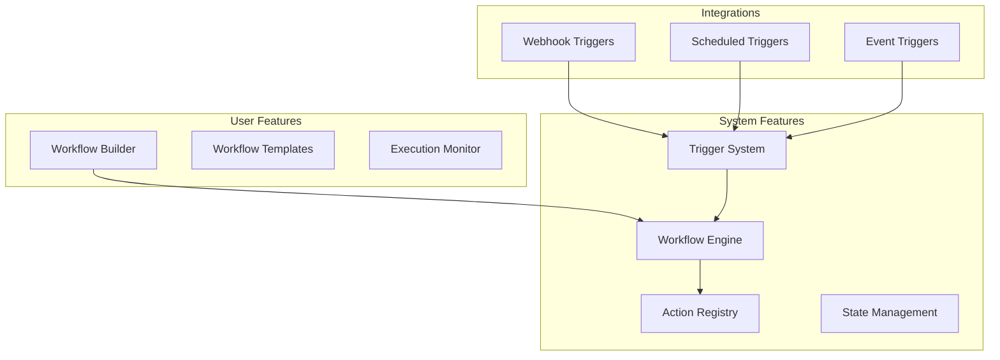

# Automation Stack

**End-to-end workflow automation, rules engines, and trigger systems**

---

## Stack Overview



---

## 📊 System Features

### 1. Workflow Engine

```typescript
interface Workflow {
  id: string;
  name: string;
  trigger: Trigger;
  steps: Step[];
  enabled: boolean;
}

interface Trigger {
  type: 'webhook' | 'schedule' | 'event';
  config: any;
}

interface Step {
  id: string;
  action: string; // 'send_email', 'create_record', 'http_request'
  params: Record<string, any>;
  condition?: string; // JavaScript expression
  retryPolicy?: RetryPolicy;
}

class WorkflowEngine {
  async execute(workflowId: string, input: any): Promise<void> {
    const workflow = await db.workflows.findUnique({
      where: { id: workflowId },
      include: { steps: true },
    });
    
    if (!workflow || !workflow.enabled) return;
    
    const execution = await db.executions.create({
      data: {
        workflowId,
        status: 'running',
        input,
        startedAt: new Date(),
      },
    });
    
    try {
      let context = { input, output: {} };
      
      for (const step of workflow.steps) {
        // Evaluate condition
        if (step.condition && !this.evaluateCondition(step.condition, context)) {
          continue;
        }
        
        // Execute step
        context.output[step.id] = await this.executeStep(step, context);
      }
      
      await db.executions.update({
        where: { id: execution.id },
        data: {
          status: 'completed',
          output: context.output,
          completedAt: new Date(),
        },
      });
    } catch (error) {
      await db.executions.update({
        where: { id: execution.id },
        data: {
          status: 'failed',
          error: error.message,
          completedAt: new Date(),
        },
      });
      
      throw error;
    }
  }
  
  private async executeStep(step: Step, context: any): Promise<any> {
    const action = this.actions.get(step.action);
    if (!action) throw new Error(`Unknown action: ${step.action}`);
    
    return await action.execute(step.params, context);
  }
}
```

---

### 2. Trigger System

```typescript
// Event-based triggers
class TriggerSystem {
  async registerTrigger(trigger: Trigger): Promise<void> {
    switch (trigger.type) {
      case 'webhook':
        await this.registerWebhook(trigger);
        break;
      case 'schedule':
        await this.registerSchedule(trigger);
        break;
      case 'event':
        await this.registerEvent(trigger);
        break;
    }
  }
  
  private async registerEvent(trigger: Trigger): Promise<void> {
    // Listen for application events
    eventBus.on(trigger.config.eventName, async (data) => {
      await workflowEngine.execute(trigger.workflowId, data);
    });
  }
}

// Example: Auto-send welcome email on signup
eventBus.on('user.signup', async (user) => {
  await workflowEngine.execute('welcome-workflow', { user });
});
```

---

## 👥 User Features

### 1. Workflow Builder

```typescript
const WorkflowBuilder: React.FC = () => {
  const [workflow, setWorkflow] = useState<Workflow>({
    name: '',
    trigger: { type: 'webhook', config: {} },
    steps: [],
  });
  
  return (
    <div className="workflow-builder">
      <TriggerSelector
        value={workflow.trigger}
        onChange={trigger => setWorkflow({ ...workflow, trigger })}
      />
      
      <StepBuilder
        steps={workflow.steps}
        onChange={steps => setWorkflow({ ...workflow, steps })}
      />
      
      <Button onClick={saveWorkflow}>Save Workflow</Button>
    </div>
  );
};
```

---

**Automation Stack Complete** ✅


