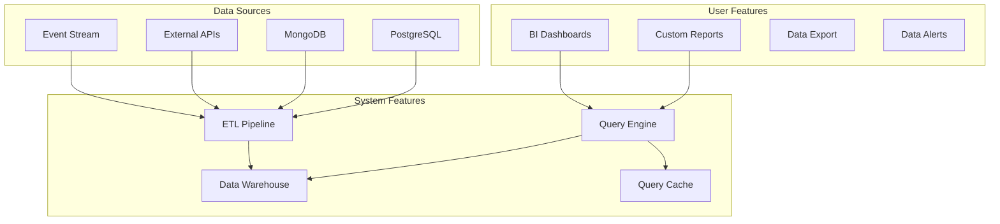

# Business Intelligence (BI) Stack

**End-to-end data warehousing, reporting, and business analytics**

---

## Stack Overview



---

## 📊 System Features

### 1. Data Warehouse

**Schema Design**

```sql
-- Fact table: Events
CREATE TABLE fact_events (
  event_id BIGINT PRIMARY KEY,
  user_id INT REFERENCES dim_users(user_id),
  event_type VARCHAR(50),
  timestamp TIMESTAMP,
  properties JSONB,
  revenue DECIMAL(10,2)
);

-- Dimension table: Users
CREATE TABLE dim_users (
  user_id INT PRIMARY KEY,
  email VARCHAR(255),
  signup_date DATE,
  plan VARCHAR(50),
  country VARCHAR(2)
);

-- Dimension table: Time
CREATE TABLE dim_date (
  date_id INT PRIMARY KEY,
  date DATE,
  year INT,
  quarter INT,
  month INT,
  week INT,
  day_of_week INT
);

-- Aggregate table: Daily metrics
CREATE TABLE agg_daily_metrics (
  date DATE,
  metric_name VARCHAR(100),
  metric_value DECIMAL(18,6),
  dimensions JSONB,
  PRIMARY KEY (date, metric_name, dimensions)
);
```

**Data Warehouse Comparison**

| Tool | Best For | Pros | Cons |
|------|----------|------|------|
| **Snowflake** | Large-scale analytics | Scalable, fast, SQL | Expensive |
| **BigQuery** | Google Cloud | Serverless, petabyte-scale | GCP lock-in |
| **Redshift** | AWS native | AWS integration, mature | Complex tuning |
| **ClickHouse** | Real-time analytics | Very fast, open source | Ops burden |
| **DuckDB** | Embedded analytics | In-process, fast | Single-node only |

---

### 2. ETL Pipeline

```typescript
// Extract-Transform-Load pipeline
class ETLPipeline {
  async runDaily(): Promise<void> {
    // 1. Extract
    const rawData = await this.extract();
    
    // 2. Transform
    const transformed = await this.transform(rawData);
    
    // 3. Load
    await this.load(transformed);
  }
  
  private async extract(): Promise<RawData[]> {
    // Extract from multiple sources
    const [dbData, apiData, eventData] = await Promise.all([
      this.extractFromDatabase(),
      this.extractFromAPIs(),
      this.extractFromEventStream(),
    ]);
    
    return [...dbData, ...apiData, ...eventData];
  }
  
  private async transform(data: RawData[]): Promise<TransformedData[]> {
    return data.map(row => ({
      userId: row.user_id,
      eventType: row.event_type,
      timestamp: new Date(row.ts),
      revenue: this.calculateRevenue(row),
      dimensions: this.extractDimensions(row),
    }));
  }
  
  private async load(data: TransformedData[]): Promise<void> {
    // Batch insert into warehouse
    await warehouse.batchInsert('fact_events', data, { batchSize: 1000 });
    
    // Update aggregates
    await this.updateAggregates(data);
  }
}

// Schedule ETL
cron.schedule('0 2 * * *', async () => {
  await etlPipeline.runDaily();
});
```

---

## 👥 User Features

### 1. Report Builder

```typescript
const ReportBuilder: React.FC = () => {
  const [config, setConfig] = useState<ReportConfig>({
    metrics: [],
    dimensions: [],
    filters: [],
    dateRange: '30d',
  });
  
  const runReport = async () => {
    const results = await fetch('/api/reports/run', {
      method: 'POST',
      body: JSON.stringify(config),
    }).then(r => r.json());
    
    setReportData(results);
  };
  
  return (
    <div className="report-builder">
      <MetricSelector
        selected={config.metrics}
        onChange={metrics => setConfig({ ...config, metrics })}
      />
      
      <DimensionSelector
        selected={config.dimensions}
        onChange={dimensions => setConfig({ ...config, dimensions })}
      />
      
      <FilterBuilder
        filters={config.filters}
        onChange={filters => setConfig({ ...config, filters })}
      />
      
      <Button onClick={runReport}>Run Report</Button>
      
      {reportData && (
        <ReportVisualization
          data={reportData}
          chartType={config.chartType}
        />
      )}
    </div>
  );
};
```

---

**BI Stack Complete** ✅


