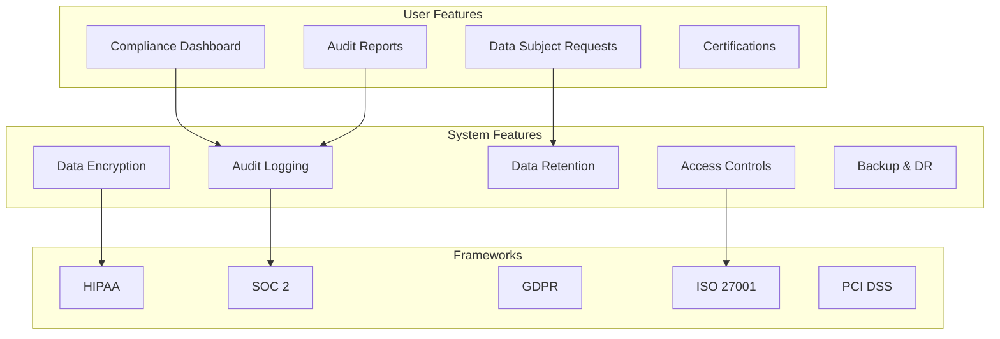

# Compliance Stack

**End-to-end compliance architecture for HIPAA, SOC 2, GDPR, and other regulations**

---

## Stack Overview



---

## 📊 System Features

### 1. Audit Logging

**Comprehensive Audit Trail**

```typescript
// Audit log schema
interface AuditEvent {
  id: string;
  timestamp: Date;
  userId: string;
  userEmail: string;
  action: string; // 'create' | 'read' | 'update' | 'delete'
  resource: string; // 'user' | 'order' | 'payment'
  resourceId: string;
  ipAddress: string;
  userAgent: string;
  changes?: {
    before: any;
    after: any;
  };
  metadata?: Record<string, any>;
}

// Audit logger
class AuditLogger {
  async log(event: Omit<AuditEvent, 'id' | 'timestamp'>): Promise<void> {
    await db.auditLogs.create({
      data: {
        ...event,
        id: crypto.randomUUID(),
        timestamp: new Date(),
      },
    });
    
    // Also send to immutable storage (S3, etc.)
    await s3.putObject({
      Bucket: 'audit-logs',
      Key: `${event.userId}/${Date.now()}.json`,
      Body: JSON.stringify(event),
    });
  }
}

// Usage in middleware
app.use(async (req, res, next) => {
  const originalSend = res.send;
  
  res.send = function (data) {
    // Log after response
    auditLogger.log({
      userId: req.user?.id,
      userEmail: req.user?.email,
      action: req.method,
      resource: req.route?.path,
      resourceId: req.params.id,
      ipAddress: req.ip,
      userAgent: req.headers['user-agent'],
    });
    
    return originalSend.call(this, data);
  };
  
  next();
});
```

---

### 2. Data Encryption

**Encryption at Rest & In Transit**

```typescript
// Encrypt PII fields at rest
import crypto from 'crypto';

const ENCRYPTION_KEY = process.env.ENCRYPTION_KEY; // 32 bytes
const ALGORITHM = 'aes-256-gcm';

export function encrypt(text: string): string {
  const iv = crypto.randomBytes(16);
  const cipher = crypto.createCipheriv(ALGORITHM, Buffer.from(ENCRYPTION_KEY, 'hex'), iv);
  
  let encrypted = cipher.update(text, 'utf8', 'hex');
  encrypted += cipher.final('hex');
  
  const authTag = cipher.getAuthTag();
  
  return `${iv.toString('hex')}:${authTag.toString('hex')}:${encrypted}`;
}

export function decrypt(encrypted: string): string {
  const [ivHex, authTagHex, ciphertext] = encrypted.split(':');
  
  const iv = Buffer.from(ivHex, 'hex');
  const authTag = Buffer.from(authTagHex, 'hex');
  const decipher = crypto.createDecipheriv(ALGORITHM, Buffer.from(ENCRYPTION_KEY, 'hex'), iv);
  
  decipher.setAuthTag(authTag);
  
  let decrypted = decipher.update(ciphertext, 'hex', 'utf8');
  decrypted += decipher.final('utf8');
  
  return decrypted;
}

// Usage in Prisma
await prisma.user.create({
  data: {
    email: 'user@example.com',
    ssn: encrypt('123-45-6789'), // Encrypt PII
    phone: encrypt('+1234567890'),
  },
});
```

---

### 3. Data Retention & Deletion

**GDPR Right to Erasure**

```typescript
// Delete user data (GDPR Article 17)
export async function deleteUserData(userId: string): Promise<void> {
  // 1. Delete user record
  await db.users.delete({ where: { id: userId } });
  
  // 2. Delete related data
  await db.orders.deleteMany({ where: { userId } });
  await db.sessions.deleteMany({ where: { userId } });
  
  // 3. Anonymize audit logs (retain for compliance)
  await db.auditLogs.updateMany({
    where: { userId },
    data: {
      userId: 'DELETED',
      userEmail: 'deleted@deleted.com',
    },
  });
  
  // 4. Delete files from S3
  const objects = await s3.listObjectsV2({
    Bucket: 'user-files',
    Prefix: `users/${userId}/`,
  });
  
  if (objects.Contents) {
    await s3.deleteObjects({
      Bucket: 'user-files',
      Delete: {
        Objects: objects.Contents.map(obj => ({ Key: obj.Key })),
      },
    });
  }
  
  // 5. Log deletion
  await auditLogger.log({
    userId: 'SYSTEM',
    action: 'delete_user_data',
    resource: 'user',
    resourceId: userId,
    metadata: { reason: 'gdpr_erasure' },
  });
}

// Data retention policy (auto-delete old data)
cron.schedule('0 2 * * *', async () => {
  const thirtyDaysAgo = new Date(Date.now() - 30 * 24 * 60 * 60 * 1000);
  
  // Delete old sessions
  await db.sessions.deleteMany({
    where: {
      expiresAt: { lt: thirtyDaysAgo },
    },
  });
  
  // Archive old audit logs (move to cold storage)
  const oldLogs = await db.auditLogs.findMany({
    where: {
      timestamp: { lt: thirtyDaysAgo },
    },
  });
  
  await s3.putObject({
    Bucket: 'audit-logs-archive',
    Key: `${new Date().toISOString()}.json.gz`,
    Body: gzip(JSON.stringify(oldLogs)),
  });
  
  await db.auditLogs.deleteMany({
    where: {
      timestamp: { lt: thirtyDaysAgo },
    },
  });
});
```

---

### 4. Access Controls

**Role-Based Access Control (RBAC)**

```typescript
// RBAC middleware
const roles = {
  admin: ['read', 'write', 'delete', 'manage_users'],
  editor: ['read', 'write'],
  viewer: ['read'],
};

function requirePermission(permission: string) {
  return (req: Request, res: Response, next: NextFunction) => {
    const userRole = req.user?.role;
    
    if (!userRole || !roles[userRole]?.includes(permission)) {
      return res.status(403).json({ error: 'Forbidden' });
    }
    
    // Log access
    auditLogger.log({
      userId: req.user.id,
      action: 'access_check',
      resource: req.route.path,
      metadata: { permission, granted: true },
    });
    
    next();
  };
}

// Usage
app.delete('/api/users/:id', requirePermission('delete'), async (req, res) => {
  await deleteUser(req.params.id);
  res.json({ success: true });
});
```

---

### 5. Compliance Reporting

**SOC 2 Compliance Report**

```typescript
// Generate SOC 2 compliance report
export async function generateSOC2Report(
  startDate: Date,
  endDate: Date
): Promise<SOC2Report> {
  const report = {
    period: { start: startDate, end: endDate },
    controls: {},
  };
  
  // CC6.1: Logical and Physical Access Controls
  report.controls.access = {
    mfaEnabled: await db.users.count({
      where: { mfaEnabled: true },
    }),
    totalUsers: await db.users.count(),
    failedLogins: await db.auditLogs.count({
      where: {
        action: 'login_failed',
        timestamp: { gte: startDate, lte: endDate },
      },
    }),
  };
  
  // CC7.2: System Monitoring
  report.controls.monitoring = {
    uptime: await calculateUptime(startDate, endDate),
    incidents: await db.incidents.count({
      where: {
        createdAt: { gte: startDate, lte: endDate },
      },
    }),
  };
  
  // CC7.3: Environmental Protections
  report.controls.backup = {
    backupsCompleted: await db.backups.count({
      where: {
        status: 'success',
        createdAt: { gte: startDate, lte: endDate },
      },
    }),
    backupsFailed: await db.backups.count({
      where: {
        status: 'failed',
        createdAt: { gte: startDate, lte: endDate },
      },
    }),
  };
  
  return report;
}
```

---

## 👥 User Features

### 1. Compliance Dashboard

```typescript
const ComplianceDashboard: React.FC = () => {
  const [frameworks, setFrameworks] = useState<Framework[]>([]);
  
  return (
    <Dashboard>
      <h1>Compliance Status</h1>
      
      {frameworks.map(framework => (
        <FrameworkCard
          key={framework.id}
          name={framework.name}
          status={framework.status}
          progress={framework.progress}
        />
      ))}
      
      <AuditLogViewer />
      <CertificationsList />
    </Dashboard>
  );
};
```

### 2. Data Subject Request (DSR) Portal

```typescript
const DSRPortal: React.FC = () => {
  const [requestType, setRequestType] = useState<'access' | 'delete' | 'portability'>('access');
  
  const submitRequest = async () => {
    await fetch('/api/dsr/request', {
      method: 'POST',
      body: JSON.stringify({ type: requestType }),
    });
  };
  
  return (
    <div>
      <h1>Your Data Rights (GDPR)</h1>
      
      <Select
        label="Request Type"
        value={requestType}
        onChange={setRequestType}
        options={[
          { value: 'access', label: 'Access My Data' },
          { value: 'delete', label: 'Delete My Data' },
          { value: 'portability', label: 'Export My Data' },
        ]}
      />
      
      <Button onClick={submitRequest}>Submit Request</Button>
    </div>
  );
};
```

---

## 📋 Compliance Checklist

### HIPAA (Healthcare)
- [ ] PHI encryption at rest (AES-256)
- [ ] PHI encryption in transit (TLS 1.3)
- [ ] Access controls (RBAC)
- [ ] Audit logging (all PHI access)
- [ ] BAA with subprocessors
- [ ] Breach notification plan (<60 days)
- [ ] Annual risk assessment

### SOC 2 (SaaS)
- [ ] Logical access controls (MFA, SSO)
- [ ] System monitoring (uptime, alerts)
- [ ] Change management (code review, CI/CD)
- [ ] Backup & disaster recovery (tested)
- [ ] Vendor management (risk assessment)
- [ ] Security awareness training (annual)
- [ ] Annual penetration testing

### GDPR (EU Data)
- [ ] Lawful basis for processing (consent, contract)
- [ ] Data processing agreements (DPAs)
- [ ] Right to erasure (automated)
- [ ] Right to portability (data export)
- [ ] Data breach notification (<72 hours)
- [ ] Privacy policy (clear, accessible)
- [ ] Cookie consent (explicit)

### ISO 27001
- [ ] Information security policy
- [ ] Risk assessment (annual)
- [ ] Asset inventory
- [ ] Access control policy
- [ ] Cryptography policy
- [ ] Incident response plan
- [ ] Business continuity plan

---

**Compliance Stack Complete** ✅


