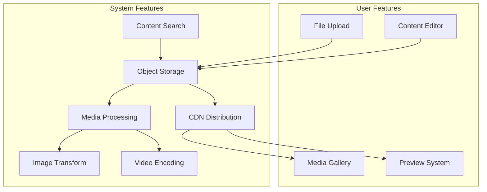
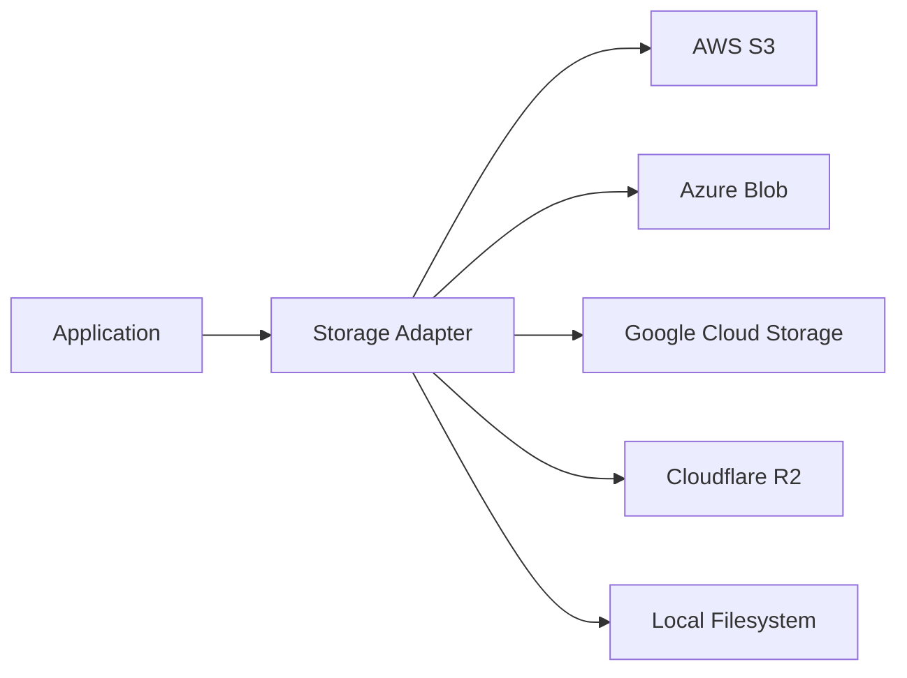
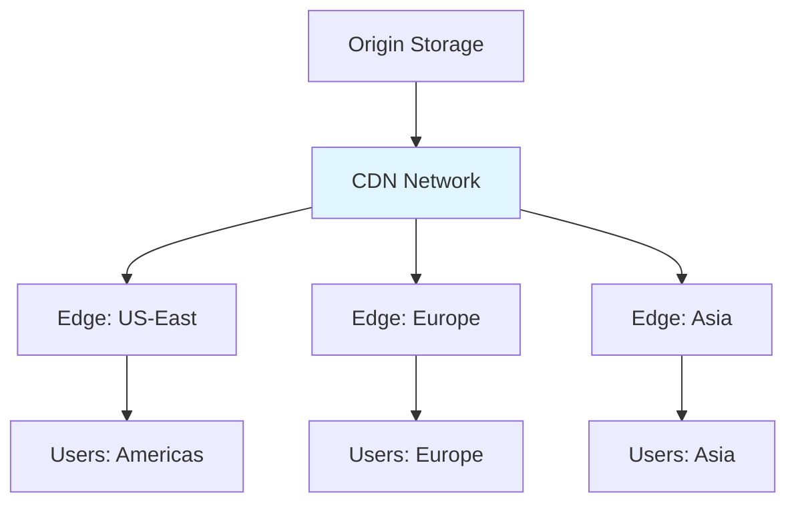
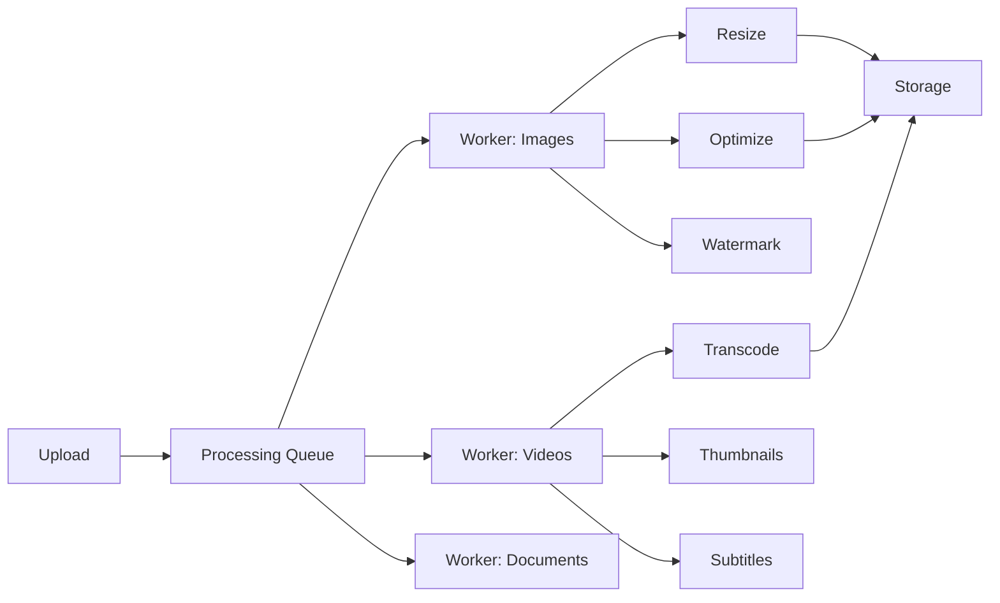
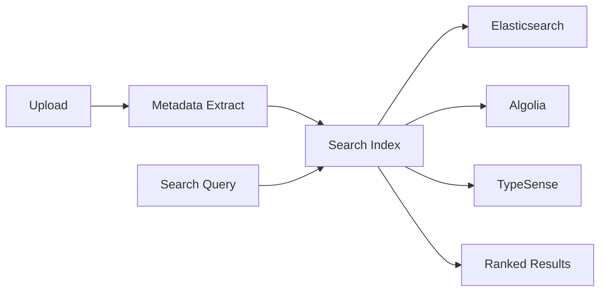
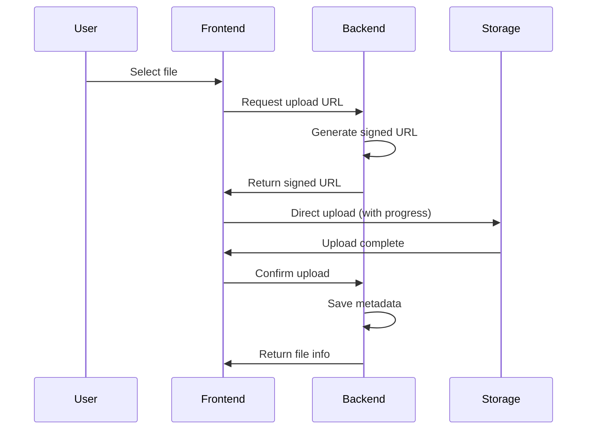

# Content Stack

**End-to-end architecture for file storage, media processing, and content delivery**

---

## Stack Overview



---

## 📊 System Features

### 1. Object Storage

**Architecture Decision**: Blob storage vs filesystem



**Technology Options**:

| Solution | Use Case | Pros | Cons |
|----------|----------|------|------|
| **AWS S3** | Enterprise production | Industry standard, feature-rich | Cost at scale |
| **Cloudflare R2** | Cost-optimized CDN | No egress fees, global | Newer, less mature |
| **Azure Blob** | Microsoft ecosystem | AD integration, compliance | Complex pricing |
| **Google Cloud Storage** | ML/AI workloads | Integration with Vertex AI | Regional limitations |
| **MinIO** | Self-hosted | Open source, S3-compatible | Ops overhead |
| **Supabase Storage** | Rapid prototyping | Built-in auth, free tier | Limited scale |

**Implementation Pattern**:

```typescript
// Storage abstraction layer
interface StorageProvider {
  upload(file: File, options: UploadOptions): Promise<UploadResult>;
  download(key: string): Promise<Blob>;
  delete(key: string): Promise<void>;
  getSignedUrl(key: string, expiresIn: number): Promise<string>;
  list(prefix: string, options?: ListOptions): Promise<StorageObject[]>;
}

// AWS S3 implementation
class S3StorageProvider implements StorageProvider {
  private s3Client: S3Client;
  private bucket: string;

  constructor(config: S3Config) {
    this.s3Client = new S3Client({
      region: config.region,
      credentials: config.credentials,
    });
    this.bucket = config.bucket;
  }

  async upload(file: File, options: UploadOptions): Promise<UploadResult> {
    const key = options.key || generateKey(file);
    
    // Multipart upload for large files
    if (file.size > 100 * 1024 * 1024) { // 100MB
      return this.multipartUpload(file, key, options);
    }

    const command = new PutObjectCommand({
      Bucket: this.bucket,
      Key: key,
      Body: file,
      ContentType: file.type,
      Metadata: options.metadata,
      ACL: options.public ? 'public-read' : 'private',
    });

    await this.s3Client.send(command);

    return {
      key,
      url: this.getPublicUrl(key),
      size: file.size,
      contentType: file.type,
    };
  }

  async getSignedUrl(key: string, expiresIn: number): Promise<string> {
    const command = new GetObjectCommand({
      Bucket: this.bucket,
      Key: key,
    });

    return getSignedUrl(this.s3Client, command, { expiresIn });
  }

  private async multipartUpload(
    file: File,
    key: string,
    options: UploadOptions
  ): Promise<UploadResult> {
    const upload = new Upload({
      client: this.s3Client,
      params: {
        Bucket: this.bucket,
        Key: key,
        Body: file,
        ContentType: file.type,
      },
      queueSize: 4, // Parallel uploads
      partSize: 10 * 1024 * 1024, // 10MB parts
    });

    upload.on('httpUploadProgress', (progress) => {
      options.onProgress?.(progress.loaded || 0, progress.total || 0);
    });

    await upload.done();

    return {
      key,
      url: this.getPublicUrl(key),
      size: file.size,
      contentType: file.type,
    };
  }

  private getPublicUrl(key: string): string {
    return `https://${this.bucket}.s3.amazonaws.com/${key}`;
  }
}

// Cloudflare R2 implementation (S3-compatible)
class R2StorageProvider extends S3StorageProvider {
  constructor(config: R2Config) {
    super({
      region: 'auto',
      credentials: {
        accessKeyId: config.accessKeyId,
        secretAccessKey: config.secretAccessKey,
      },
      bucket: config.bucket,
      endpoint: `https://${config.accountId}.r2.cloudflarestorage.com`,
    });
  }

  private getPublicUrl(key: string): string {
    // Use custom domain if configured
    if (this.config.publicDomain) {
      return `https://${this.config.publicDomain}/${key}`;
    }
    return `https://${this.bucket}.r2.dev/${key}`;
  }
}

// Usage with adapter pattern
class StorageService {
  private provider: StorageProvider;

  constructor(provider: StorageProvider) {
    this.provider = provider;
  }

  async uploadFile(file: File, options?: UploadOptions): Promise<string> {
    // Validate file
    this.validateFile(file);

    // Generate optimized key
    const key = this.generateStorageKey(file, options);

    // Upload with progress tracking
    const result = await this.provider.upload(file, {
      ...options,
      key,
      onProgress: (loaded, total) => {
        console.log(`Upload progress: ${(loaded / total * 100).toFixed(2)}%`);
      },
    });

    // Store metadata in database
    await this.storeMetadata({
      key: result.key,
      url: result.url,
      size: result.size,
      contentType: result.contentType,
      uploadedAt: new Date(),
      userId: options?.userId,
    });

    return result.url;
  }

  private generateStorageKey(file: File, options?: UploadOptions): string {
    const timestamp = Date.now();
    const random = crypto.randomUUID().slice(0, 8);
    const sanitized = file.name.replace(/[^a-zA-Z0-9.-]/g, '_');
    const prefix = options?.prefix || 'uploads';
    
    return `${prefix}/${timestamp}-${random}-${sanitized}`;
  }

  private validateFile(file: File): void {
    const maxSize = 100 * 1024 * 1024; // 100MB
    if (file.size > maxSize) {
      throw new Error(`File size exceeds maximum of ${maxSize} bytes`);
    }

    const allowedTypes = [
      'image/jpeg',
      'image/png',
      'image/gif',
      'image/webp',
      'video/mp4',
      'application/pdf',
    ];

    if (!allowedTypes.includes(file.type)) {
      throw new Error(`File type ${file.type} not allowed`);
    }
  }
}
```

**Lifecycle & Retention**:

```typescript
// S3 Lifecycle configuration
const lifecyclePolicy = {
  Rules: [
    {
      Id: 'DeleteOldThumbnails',
      Status: 'Enabled',
      Prefix: 'thumbnails/',
      Expiration: { Days: 30 },
    },
    {
      Id: 'ArchiveOldUploads',
      Status: 'Enabled',
      Prefix: 'uploads/',
      Transitions: [
        {
          Days: 90,
          StorageClass: 'INTELLIGENT_TIERING',
        },
        {
          Days: 365,
          StorageClass: 'GLACIER',
        },
      ],
    },
    {
      Id: 'CleanupIncompleteUploads',
      Status: 'Enabled',
      AbortIncompleteMultipartUpload: { DaysAfterInitiation: 7 },
    },
  ],
};
```

---

### 2. CDN Distribution

**Architecture Decision**: CDN strategy for global delivery



**Technology Options**:

| CDN Provider | Use Case | Pros | Cons |
|--------------|----------|------|------|
| **Cloudflare** | Best value | Free tier, DDoS protection | Limited analytics on free |
| **AWS CloudFront** | AWS ecosystem | Deep S3 integration | Complex pricing |
| **Fastly** | Real-time purging | Instant cache invalidation | Expensive |
| **Bunny CDN** | Cost-effective | Simple pricing, fast | Smaller network |
| **Vercel Edge** | Next.js apps | Zero config, ISR support | Vendor lock-in |

**Implementation**:

```typescript
// CDN configuration for CloudFront
const cdnConfig = {
  origin: {
    domainName: 'my-bucket.s3.amazonaws.com',
    s3OriginConfig: {
      originAccessIdentity: 'origin-access-identity/cloudfront/...',
    },
  },
  defaultCacheBehavior: {
    targetOriginId: 's3-origin',
    viewerProtocolPolicy: 'redirect-to-https',
    allowedMethods: ['GET', 'HEAD', 'OPTIONS'],
    cachedMethods: ['GET', 'HEAD', 'OPTIONS'],
    compress: true,
    cachePolicyId: '658327ea-f89d-4fab-a63d-7e88639e58f6', // CachingOptimized
    responseHeadersPolicyId: '60669652-455b-4ae9-85a4-c4c02393f86c', // CORS
  },
  priceClass: 'PriceClass_100', // US, Europe, Israel
  enabled: true,
  httpVersion: 'http2and3',
};

// URL generation with CDN
class CDNUrlGenerator {
  constructor(
    private cdnDomain: string,
    private signingKey?: string
  ) {}

  getUrl(key: string, options?: URLOptions): string {
    let url = `https://${this.cdnDomain}/${key}`;

    // Add image transformations (if using image CDN)
    if (options?.transform) {
      const params = new URLSearchParams();
      if (options.transform.width) params.set('w', options.transform.width.toString());
      if (options.transform.height) params.set('h', options.transform.height.toString());
      if (options.transform.quality) params.set('q', options.transform.quality.toString());
      if (options.transform.format) params.set('f', options.transform.format);
      
      url += `?${params.toString()}`;
    }

    // Sign URL if required
    if (this.signingKey && options?.expiresIn) {
      const signature = this.signUrl(url, options.expiresIn);
      url += `${url.includes('?') ? '&' : '?'}signature=${signature}`;
    }

    return url;
  }

  private signUrl(url: string, expiresIn: number): string {
    const expires = Math.floor(Date.now() / 1000) + expiresIn;
    const message = `${url}:${expires}`;
    return crypto.createHmac('sha256', this.signingKey!)
      .update(message)
      .digest('hex');
  }
}
```

**Cache Invalidation**:

```typescript
class CDNCacheManager {
  constructor(private cdn: CloudFrontClient) {}

  async invalidate(paths: string[]): Promise<void> {
    const command = new CreateInvalidationCommand({
      DistributionId: process.env.CLOUDFRONT_DISTRIBUTION_ID,
      InvalidationBatch: {
        Paths: {
          Quantity: paths.length,
          Items: paths.map(p => `/${p}`),
        },
        CallerReference: Date.now().toString(),
      },
    });

    await this.cdn.send(command);
  }

  async invalidatePattern(pattern: string): Promise<void> {
    // Wildcard invalidation (counts as multiple invalidations)
    await this.invalidate([`${pattern}*`]);
  }
}

// Usage
const cacheManager = new CDNCacheManager(cloudFrontClient);

// Invalidate specific file
await cacheManager.invalidate(['images/profile-123.jpg']);

// Invalidate entire directory
await cacheManager.invalidatePattern('thumbnails/');
```

---

### 3. Media Processing

**Architecture Decision**: On-demand vs pre-processing



**Technology Options**:

| Tool | Use Case | Pros | Cons |
|------|----------|------|------|
| **Sharp** | Image processing (Node) | Fast, modern | Node-only |
| **ImageMagick** | Legacy images | Feature-rich | Security concerns |
| **FFmpeg** | Video processing | Industry standard | Complex |
| **Cloudinary** | SaaS processing | Zero ops, feature-rich | Cost, vendor lock-in |
| **imgix** | Real-time transforms | On-demand, fast | Expensive |
| **AWS MediaConvert** | Video transcoding | Scalable, reliable | AWS-only |

**Image Processing**:

```typescript
import sharp from 'sharp';

class ImageProcessor {
  async processUpload(
    input: Buffer,
    options: ProcessingOptions
  ): Promise<ProcessedImages> {
    const image = sharp(input);
    const metadata = await image.metadata();

    // Generate multiple sizes
    const variants = await Promise.all([
      this.generateVariant(image, 'thumbnail', { width: 150, height: 150 }),
      this.generateVariant(image, 'small', { width: 640 }),
      this.generateVariant(image, 'medium', { width: 1280 }),
      this.generateVariant(image, 'large', { width: 1920 }),
      this.generateVariant(image, 'original', {}),
    ]);

    return {
      original: { width: metadata.width!, height: metadata.height! },
      variants,
    };
  }

  private async generateVariant(
    image: sharp.Sharp,
    name: string,
    options: ResizeOptions
  ): Promise<ImageVariant> {
    const pipeline = image.clone();

    // Resize
    if (options.width || options.height) {
      pipeline.resize({
        width: options.width,
        height: options.height,
        fit: options.fit || 'inside',
        withoutEnlargement: true,
      });
    }

    // Optimize
    pipeline
      .webp({ quality: 85, effort: 4 }) // Convert to WebP
      .jpeg({ quality: 85, progressive: true, mozjpeg: true });

    // Get metadata
    const metadata = await pipeline.metadata();
    const buffer = await pipeline.toBuffer();

    return {
      name,
      width: metadata.width!,
      height: metadata.height!,
      size: buffer.length,
      format: metadata.format!,
      buffer,
    };
  }

  async addWatermark(
    input: Buffer,
    watermarkPath: string,
    position: 'topLeft' | 'topRight' | 'bottomLeft' | 'bottomRight' = 'bottomRight'
  ): Promise<Buffer> {
    const image = sharp(input);
    const metadata = await image.metadata();
    const watermark = sharp(watermarkPath);

    // Resize watermark to 20% of image width
    const watermarkWidth = Math.floor(metadata.width! * 0.2);
    await watermark.resize({ width: watermarkWidth });

    // Calculate position
    const positions = {
      topLeft: { top: 10, left: 10 },
      topRight: { top: 10, left: metadata.width! - watermarkWidth - 10 },
      bottomLeft: { top: metadata.height! - 50, left: 10 },
      bottomRight: { 
        top: metadata.height! - 50,
        left: metadata.width! - watermarkWidth - 10
      },
    };

    return image
      .composite([{
        input: await watermark.toBuffer(),
        ...positions[position],
      }])
      .toBuffer();
  }
}

// Background processing with queue
import { Queue, Worker } from 'bullmq';

const imageQueue = new Queue('image-processing', {
  connection: redisConnection,
});

const worker = new Worker('image-processing', async (job) => {
  const { key, url } = job.data;

  // Download original
  const response = await fetch(url);
  const buffer = await response.arrayBuffer();

  // Process
  const processor = new ImageProcessor();
  const result = await processor.processUpload(Buffer.from(buffer), {});

  // Upload variants
  for (const variant of result.variants) {
    const variantKey = key.replace(/(\.[^.]+)$/, `-${variant.name}$1`);
    await storageService.upload(variant.buffer, { key: variantKey });
  }

  return { processedVariants: result.variants.length };
}, {
  connection: redisConnection,
  concurrency: 5,
});

// Trigger processing on upload
async function handleUpload(file: File): Promise<UploadResult> {
  const result = await storageService.uploadFile(file);

  // Queue for processing
  await imageQueue.add('process-image', {
    key: result.key,
    url: result.url,
  });

  return result;
}
```

**Video Processing**:

```typescript
import ffmpeg from 'fluent-ffmpeg';
import { PassThrough } from 'stream';

class VideoProcessor {
  async transcode(
    inputUrl: string,
    outputs: TranscodeOutput[]
  ): Promise<TranscodedVideos> {
    const results: TranscodedVideo[] = [];

    for (const output of outputs) {
      const result = await this.transcodeVariant(inputUrl, output);
      results.push(result);
    }

    return { variants: results };
  }

  private async transcodeVariant(
    inputUrl: string,
    output: TranscodeOutput
  ): Promise<TranscodedVideo> {
    return new Promise((resolve, reject) => {
      const outputStream = new PassThrough();
      const chunks: Buffer[] = [];

      outputStream.on('data', (chunk) => chunks.push(chunk));
      outputStream.on('end', () => {
        resolve({
          quality: output.quality,
          buffer: Buffer.concat(chunks),
          size: chunks.reduce((sum, chunk) => sum + chunk.length, 0),
        });
      });

      ffmpeg(inputUrl)
        .outputOptions([
          `-vf scale=${output.width}:${output.height}`,
          `-c:v libx264`,
          `-preset ${output.preset || 'medium'}`,
          `-crf ${output.crf || 23}`,
          `-c:a aac`,
          `-b:a 128k`,
        ])
        .format('mp4')
        .on('progress', (progress) => {
          console.log(`Transcoding ${output.quality}: ${progress.percent}%`);
        })
        .on('error', reject)
        .pipe(outputStream);
    });
  }

  async generateThumbnails(
    videoUrl: string,
    count: number = 5
  ): Promise<Buffer[]> {
    // Get video duration first
    const duration = await this.getVideoDuration(videoUrl);
    const interval = duration / (count + 1);

    const thumbnails: Buffer[] = [];

    for (let i = 1; i <= count; i++) {
      const timestamp = interval * i;
      const thumbnail = await this.captureThumbnail(videoUrl, timestamp);
      thumbnails.push(thumbnail);
    }

    return thumbnails;
  }

  private async captureThumbnail(
    videoUrl: string,
    timestamp: number
  ): Promise<Buffer> {
    return new Promise((resolve, reject) => {
      const chunks: Buffer[] = [];
      const stream = new PassThrough();

      stream.on('data', (chunk) => chunks.push(chunk));
      stream.on('end', () => resolve(Buffer.concat(chunks)));

      ffmpeg(videoUrl)
        .seekInput(timestamp)
        .frames(1)
        .outputOptions(['-vf', 'scale=640:-1'])
        .format('image2')
        .on('error', reject)
        .pipe(stream);
    });
  }

  private async getVideoDuration(videoUrl: string): Promise<number> {
    return new Promise((resolve, reject) => {
      ffmpeg.ffprobe(videoUrl, (err, metadata) => {
        if (err) reject(err);
        else resolve(metadata.format.duration || 0);
      });
    });
  }
}

// AWS MediaConvert for scalable video transcoding
class MediaConvertService {
  constructor(private client: MediaConvertClient) {}

  async transcodeVideo(
    inputUrl: string,
    outputs: MediaConvertOutput[]
  ): Promise<string> {
    const command = new CreateJobCommand({
      Role: process.env.MEDIACONVERT_ROLE_ARN,
      Settings: {
        Inputs: [{
          FileInput: inputUrl,
          AudioSelectors: {
            'Audio Selector 1': { DefaultSelection: 'DEFAULT' },
          },
        }],
        OutputGroups: outputs.map(output => ({
          Name: output.name,
          OutputGroupSettings: {
            Type: 'FILE_GROUP_SETTINGS',
            FileGroupSettings: {
              Destination: output.destination,
            },
          },
          Outputs: [{
            VideoDescription: {
              CodecSettings: {
                Codec: 'H_264',
                H264Settings: {
                  MaxBitrate: output.bitrate,
                  RateControlMode: 'QVBR',
                },
              },
              Width: output.width,
              Height: output.height,
            },
            AudioDescriptions: [{
              CodecSettings: {
                Codec: 'AAC',
                AacSettings: {
                  Bitrate: 96000,
                  CodingMode: 'CODING_MODE_2_0',
                  SampleRate: 48000,
                },
              },
            }],
            ContainerSettings: {
              Container: 'MP4',
            },
          }],
        })),
      },
    });

    const response = await this.client.send(command);
    return response.Job!.Id!;
  }
}
```

---

### 4. Content Search & Indexing

**Architecture Decision**: Full-text search for media metadata



**Implementation**:

```typescript
import { Client as ElasticsearchClient } from '@elastic/elasticsearch';

class ContentSearchService {
  constructor(private es: ElasticsearchClient) {}

  async indexContent(content: ContentMetadata): Promise<void> {
    await this.es.index({
      index: 'content',
      id: content.id,
      document: {
        title: content.title,
        description: content.description,
        tags: content.tags,
        filename: content.filename,
        contentType: content.contentType,
        size: content.size,
        uploadedAt: content.uploadedAt,
        userId: content.userId,
        // Full-text search fields
        text: this.extractText(content),
        // Geolocation (if applicable)
        location: content.location,
      },
    });
  }

  async search(query: string, filters?: SearchFilters): Promise<SearchResults> {
    const must: any[] = [
      {
        multi_match: {
          query,
          fields: ['title^3', 'description^2', 'tags^2', 'filename', 'text'],
          fuzziness: 'AUTO',
        },
      },
    ];

    const filter: any[] = [];

    if (filters?.contentType) {
      filter.push({ term: { contentType: filters.contentType } });
    }

    if (filters?.userId) {
      filter.push({ term: { userId: filters.userId } });
    }

    if (filters?.dateRange) {
      filter.push({
        range: {
          uploadedAt: {
            gte: filters.dateRange.from,
            lte: filters.dateRange.to,
          },
        },
      });
    }

    const response = await this.es.search({
      index: 'content',
      body: {
        query: {
          bool: { must, filter },
        },
        highlight: {
          fields: {
            title: {},
            description: {},
            text: {},
          },
        },
        aggs: {
          types: {
            terms: { field: 'contentType' },
          },
          uploadedByMonth: {
            date_histogram: {
              field: 'uploadedAt',
              calendar_interval: 'month',
            },
          },
        },
      },
    });

    return this.formatResults(response);
  }

  private extractText(content: ContentMetadata): string {
    // Extract searchable text from various formats
    // This would integrate with OCR, PDF parsing, etc.
    return content.description || '';
  }
}
```

---

## 👤 User Features

### 1. File Upload UI

**Architecture Decision**: Client-side direct upload vs proxy



**Implementation**:

```typescript
// React upload component with progress
import { useState } from 'react';
import { useDropzone } from 'react-dropzone';

export function FileUploader({ onUploadComplete }: FileUploaderProps) {
  const [uploads, setUploads] = useState<Upload[]>([]);

  const { getRootProps, getInputProps, isDragActive } = useDropzone({
    onDrop: async (acceptedFiles) => {
      for (const file of acceptedFiles) {
        await uploadFile(file);
      }
    },
    maxSize: 100 * 1024 * 1024, // 100MB
    accept: {
      'image/*': ['.png', '.jpg', '.jpeg', '.gif', '.webp'],
      'video/*': ['.mp4', '.mov', '.avi'],
      'application/pdf': ['.pdf'],
    },
  });

  async function uploadFile(file: File) {
    const uploadId = crypto.randomUUID();

    // Add to upload list
    setUploads(prev => [...prev, {
      id: uploadId,
      file,
      progress: 0,
      status: 'uploading',
    }]);

    try {
      // Get signed upload URL
      const { uploadUrl, key } = await fetch('/api/uploads/signed-url', {
        method: 'POST',
        headers: { 'Content-Type': 'application/json' },
        body: JSON.stringify({
          filename: file.name,
          contentType: file.type,
          size: file.size,
        }),
      }).then(r => r.json());

      // Upload directly to storage with progress
      await uploadWithProgress(uploadUrl, file, (progress) => {
        setUploads(prev => prev.map(upload =>
          upload.id === uploadId
            ? { ...upload, progress }
            : upload
        ));
      });

      // Confirm upload completion
      const result = await fetch('/api/uploads/complete', {
        method: 'POST',
        headers: { 'Content-Type': 'application/json' },
        body: JSON.stringify({ key }),
      }).then(r => r.json());

      // Update status
      setUploads(prev => prev.map(upload =>
        upload.id === uploadId
          ? { ...upload, status: 'complete', result }
          : upload
      ));

      onUploadComplete?.(result);

    } catch (error) {
      setUploads(prev => prev.map(upload =>
        upload.id === uploadId
          ? { ...upload, status: 'error', error: error.message }
          : upload
      ));
    }
  }

  async function uploadWithProgress(
    url: string,
    file: File,
    onProgress: (progress: number) => void
  ): Promise<void> {
    return new Promise((resolve, reject) => {
      const xhr = new XMLHttpRequest();

      xhr.upload.addEventListener('progress', (e) => {
        if (e.lengthComputable) {
          onProgress(Math.round((e.loaded / e.total) * 100));
        }
      });

      xhr.addEventListener('load', () => {
        if (xhr.status >= 200 && xhr.status < 300) {
          resolve();
        } else {
          reject(new Error(`Upload failed: ${xhr.statusText}`));
        }
      });

      xhr.addEventListener('error', () => {
        reject(new Error('Upload failed'));
      });

      xhr.open('PUT', url);
      xhr.setRequestHeader('Content-Type', file.type);
      xhr.send(file);
    });
  }

  return (
    <div>
      <div
        {...getRootProps()}
        className={`border-2 border-dashed rounded-lg p-8 text-center cursor-pointer
          ${isDragActive ? 'border-blue-500 bg-blue-50' : 'border-gray-300'}`}
      >
        <input {...getInputProps()} />
        {isDragActive ? (
          <p>Drop files here...</p>
        ) : (
          <p>Drag & drop files here, or click to select</p>
        )}
      </div>

      {uploads.length > 0 && (
        <div className="mt-4 space-y-2">
          {uploads.map(upload => (
            <UploadProgress key={upload.id} upload={upload} />
          ))}
        </div>
      )}
    </div>
  );
}

function UploadProgress({ upload }: { upload: Upload }) {
  return (
    <div className="flex items-center gap-3 p-3 border rounded">
      <div className="flex-1">
        <div className="flex justify-between mb-1">
          <span className="text-sm font-medium">{upload.file.name}</span>
          <span className="text-sm text-gray-500">
            {upload.status === 'uploading' && `${upload.progress}%`}
            {upload.status === 'complete' && '✓ Complete'}
            {upload.status === 'error' && '✗ Error'}
          </span>
        </div>
        <div className="w-full bg-gray-200 rounded-full h-2">
          <div
            className="bg-blue-600 h-2 rounded-full transition-all"
            style={{ width: `${upload.progress}%` }}
          />
        </div>
      </div>
    </div>
  );
}
```

**Backend API**:

```typescript
// Generate signed upload URL
app.post('/api/uploads/signed-url', async (req, res) => {
  const { filename, contentType, size } = req.body;
  const userId = req.user.id;

  // Validate
  if (size > 100 * 1024 * 1024) {
    return res.status(400).json({ error: 'File too large' });
  }

  // Generate unique key
  const key = `uploads/${userId}/${Date.now()}-${filename}`;

  // Generate signed URL (15 minutes expiry)
  const uploadUrl = await storageService.getSignedUploadUrl(key, {
    contentType,
    expiresIn: 15 * 60,
  });

  res.json({ uploadUrl, key });
});

// Confirm upload and save metadata
app.post('/api/uploads/complete', async (req, res) => {
  const { key } = req.body;
  const userId = req.user.id;

  // Verify upload exists
  const exists = await storageService.exists(key);
  if (!exists) {
    return res.status(404).json({ error: 'Upload not found' });
  }

  // Get file metadata
  const metadata = await storageService.getMetadata(key);

  // Save to database
  const file = await db.files.create({
    data: {
      key,
      filename: path.basename(key),
      contentType: metadata.contentType,
      size: metadata.size,
      url: storageService.getPublicUrl(key),
      userId,
      uploadedAt: new Date(),
    },
  });

  // Queue for processing (images, videos)
  if (metadata.contentType.startsWith('image/')) {
    await imageQueue.add('process-image', { fileId: file.id, key });
  } else if (metadata.contentType.startsWith('video/')) {
    await videoQueue.add('process-video', { fileId: file.id, key });
  }

  res.json(file);
});
```

---

### 2. Media Gallery

**Architecture Decision**: Virtual scrolling for large galleries

```typescript
import { useVirtualizer } from '@tanstack/react-virtual';
import { useInfiniteQuery } from '@tanstack/react-query';

export function MediaGallery({ userId }: MediaGalleryProps) {
  const parentRef = useRef<HTMLDivElement>(null);

  // Infinite scroll data fetching
  const {
    data,
    fetchNextPage,
    hasNextPage,
    isFetchingNextPage,
  } = useInfiniteQuery({
    queryKey: ['media', userId],
    queryFn: ({ pageParam = 0 }) =>
      fetch(`/api/media?page=${pageParam}&limit=50`)
        .then(r => r.json()),
    getNextPageParam: (lastPage, pages) =>
      lastPage.hasMore ? pages.length : undefined,
  });

  const allItems = data?.pages.flatMap(page => page.items) ?? [];

  // Virtual scrolling for performance
  const rowVirtualizer = useVirtualizer({
    count: Math.ceil(allItems.length / 4), // 4 columns
    getScrollElement: () => parentRef.current,
    estimateSize: () => 300, // Estimated row height
    overscan: 5,
  });

  // Load more when scrolling near bottom
  useEffect(() => {
    const lastItem = rowVirtualizer.getVirtualItems().at(-1);

    if (
      lastItem &&
      lastItem.index >= Math.ceil(allItems.length / 4) - 1 &&
      hasNextPage &&
      !isFetchingNextPage
    ) {
      fetchNextPage();
    }
  }, [
    hasNextPage,
    fetchNextPage,
    allItems.length,
    isFetchingNextPage,
    rowVirtualizer.getVirtualItems(),
  ]);

  return (
    <div ref={parentRef} className="h-screen overflow-auto">
      <div
        className="relative"
        style={{ height: `${rowVirtualizer.getTotalSize()}px` }}
      >
        {rowVirtualizer.getVirtualItems().map(virtualRow => {
          const startIndex = virtualRow.index * 4;
          const items = allItems.slice(startIndex, startIndex + 4);

          return (
            <div
              key={virtualRow.key}
              className="absolute top-0 left-0 w-full grid grid-cols-4 gap-4 p-4"
              style={{
                transform: `translateY(${virtualRow.start}px)`,
              }}
            >
              {items.map(item => (
                <MediaThumbnail key={item.id} item={item} />
              ))}
            </div>
          );
        })}
      </div>

      {isFetchingNextPage && (
        <div className="text-center p-4">Loading more...</div>
      )}
    </div>
  );
}

function MediaThumbnail({ item }: { item: MediaItem }) {
  return (
    <div className="relative aspect-square bg-gray-100 rounded-lg overflow-hidden group">
      {/* Lazy-loaded image */}
      

      {/* Overlay on hover */}
      <div className="absolute inset-0 bg-black bg-opacity-0 group-hover:bg-opacity-50 transition-all">
        <div className="absolute inset-0 flex items-center justify-center opacity-0 group-hover:opacity-100">
          <button className="px-4 py-2 bg-white rounded">
            View
          </button>
        </div>
      </div>

      {/* Video indicator */}
      {item.contentType.startsWith('video/') && (
        <div className="absolute top-2 right-2 bg-black bg-opacity-75 rounded px-2 py-1 text-white text-xs">
          {formatDuration(item.duration)}
        </div>
      )}
    </div>
  );
}
```

---

### 3. Content Editor

**Architecture Decision**: Rich media editing capabilities

```typescript
import { Tldraw } from '@tldraw/tldraw';
import { fabric } from 'fabric';

// Image editor with annotations
export function ImageEditor({ imageUrl, onSave }: ImageEditorProps) {
  const canvasRef = useRef<HTMLCanvasElement>(null);
  const [canvas, setCanvas] = useState<fabric.Canvas | null>(null);

  useEffect(() => {
    if (canvasRef.current) {
      const fabricCanvas = new fabric.Canvas(canvasRef.current, {
        width: 800,
        height: 600,
      });

      // Load image
      fabric.Image.fromURL(imageUrl, (img) => {
        fabricCanvas.setBackgroundImage(img, fabricCanvas.renderAll.bind(fabricCanvas), {
          scaleX: fabricCanvas.width! / img.width!,
          scaleY: fabricCanvas.height! / img.height!,
        });
      });

      setCanvas(fabricCanvas);

      return () => {
        fabricCanvas.dispose();
      };
    }
  }, [imageUrl]);

  const addText = () => {
    if (!canvas) return;

    const text = new fabric.IText('Add text', {
      left: 100,
      top: 100,
      fill: '#000000',
      fontSize: 24,
    });

    canvas.add(text);
    canvas.setActiveObject(text);
  };

  const addRectangle = () => {
    if (!canvas) return;

    const rect = new fabric.Rect({
      left: 100,
      top: 100,
      fill: 'transparent',
      stroke: '#FF0000',
      strokeWidth: 2,
      width: 200,
      height: 150,
    });

    canvas.add(rect);
  };

  const addArrow = () => {
    if (!canvas) return;

    const line = new fabric.Line([100, 100, 300, 300], {
      stroke: '#FF0000',
      strokeWidth: 3,
    });

    canvas.add(line);
  };

  const handleSave = async () => {
    if (!canvas) return;

    // Export as data URL
    const dataUrl = canvas.toDataURL({
      format: 'png',
      quality: 1,
    });

    // Convert to blob
    const blob = await fetch(dataUrl).then(r => r.blob());

    // Upload
    const file = new File([blob], 'edited-image.png', { type: 'image/png' });
    const result = await uploadFile(file);

    onSave(result);
  };

  return (
    <div className="flex flex-col h-screen">
      <div className="flex gap-2 p-4 border-b">
        <button onClick={addText} className="px-4 py-2 bg-gray-100 rounded">
          Add Text
        </button>
        <button onClick={addRectangle} className="px-4 py-2 bg-gray-100 rounded">
          Add Rectangle
        </button>
        <button onClick={addArrow} className="px-4 py-2 bg-gray-100 rounded">
          Add Arrow
        </button>
        <button onClick={handleSave} className="px-4 py-2 bg-blue-600 text-white rounded ml-auto">
          Save
        </button>
      </div>

      <div className="flex-1 flex items-center justify-center bg-gray-50">
        <canvas ref={canvasRef} />
      </div>
    </div>
  );
}

// Video trimmer
export function VideoTrimmer({ videoUrl, onSave }: VideoTrimmerProps) {
  const videoRef = useRef<HTMLVideoElement>(null);
  const [duration, setDuration] = useState(0);
  const [startTime, setStartTime] = useState(0);
  const [endTime, setEndTime] = useState(0);

  useEffect(() => {
    if (videoRef.current) {
      videoRef.current.addEventListener('loadedmetadata', () => {
        const dur = videoRef.current!.duration;
        setDuration(dur);
        setEndTime(dur);
      });
    }
  }, []);

  const handleTrim = async () => {
    // Send trim request to backend
    const result = await fetch('/api/video/trim', {
      method: 'POST',
      headers: { 'Content-Type': 'application/json' },
      body: JSON.stringify({
        videoUrl,
        startTime,
        endTime,
      }),
    }).then(r => r.json());

    onSave(result);
  };

  return (
    <div className="flex flex-col gap-4 p-4">
      <video
        ref={videoRef}
        src={videoUrl}
        controls
        className="w-full max-w-2xl mx-auto"
      />

      <div className="max-w-2xl mx-auto w-full">
        <label className="block text-sm font-medium mb-2">
          Start Time: {formatTime(startTime)}
        </label>
        <input
          type="range"
          min={0}
          max={duration}
          step={0.1}
          value={startTime}
          onChange={(e) => setStartTime(Number(e.target.value))}
          className="w-full"
        />

        <label className="block text-sm font-medium mb-2 mt-4">
          End Time: {formatTime(endTime)}
        </label>
        <input
          type="range"
          min={0}
          max={duration}
          step={0.1}
          value={endTime}
          onChange={(e) => setEndTime(Number(e.target.value))}
          className="w-full"
        />

        <div className="mt-4 flex justify-between items-center">
          <span className="text-sm text-gray-600">
            Duration: {formatTime(endTime - startTime)}
          </span>
          <button
            onClick={handleTrim}
            className="px-4 py-2 bg-blue-600 text-white rounded"
          >
            Trim Video
          </button>
        </div>
      </div>
    </div>
  );
}
```

---

## 🔧 Implementation Checklist

### Phase 1: Storage Foundation
- [ ] Choose storage provider (S3, R2, etc.)
- [ ] Set up storage buckets/containers
- [ ] Implement storage abstraction layer
- [ ] Configure CORS for direct uploads
- [ ] Set up lifecycle policies
- [ ] Implement signed URL generation

### Phase 2: CDN Setup
- [ ] Choose CDN provider
- [ ] Configure CDN distribution
- [ ] Set up custom domain
- [ ] Implement cache invalidation
- [ ] Configure compression
- [ ] Set up SSL/TLS

### Phase 3: Processing Pipeline
- [ ] Set up processing queue (BullMQ/SQS)
- [ ] Implement image processing (Sharp)
- [ ] Implement video processing (FFmpeg)
- [ ] Set up background workers
- [ ] Implement thumbnail generation
- [ ] Configure retry logic

### Phase 4: Upload UI
- [ ] Build file uploader component
- [ ] Implement drag & drop
- [ ] Add progress tracking
- [ ] Implement chunked uploads
- [ ] Add file validation
- [ ] Handle upload errors

### Phase 5: Gallery & Preview
- [ ] Build media gallery
- [ ] Implement virtual scrolling
- [ ] Add infinite scroll
- [ ] Build preview modal
- [ ] Implement zoom/pan
- [ ] Add fullscreen mode

### Phase 6: Search & Organization
- [ ] Set up search index
- [ ] Implement metadata extraction
- [ ] Build search UI
- [ ] Add filters (type, date, size)
- [ ] Implement tagging
- [ ] Add folders/albums

---

## 📊 Architecture Matrix

| Layer | System Feature | User Feature | Tools |
|-------|---------------|--------------|-------|
| **Storage** | S3, R2, Azure Blob | - | AWS SDK, Sharp |
| **Distribution** | CloudFront, Cloudflare CDN | - | CDN APIs |
| **Processing** | Image resize, Video transcode | - | Sharp, FFmpeg, MediaConvert |
| **Upload** | Signed URLs, Direct upload | File uploader, Progress bar | React Dropzone |
| **Gallery** | Virtual scrolling, Lazy loading | Media browser, Thumbnails | TanStack Virtual |
| **Editor** | - | Image annotator, Video trimmer | Fabric.js, Canvas API |
| **Search** | Elasticsearch, Metadata index | Search UI, Filters | Elasticsearch, Algolia |

---

## 🔗 Related Stacks

- [**Data Stack**](./data.md) - Database for metadata storage
- [**Auth Stack**](./auth.md) - Access control for private files
- [**Analytics Stack**](./analytics.md) - Usage tracking and reporting
- [**Integration Stack**](./integration.md) - Webhooks for upload events

---

**Last Updated**: 2025-12-12


