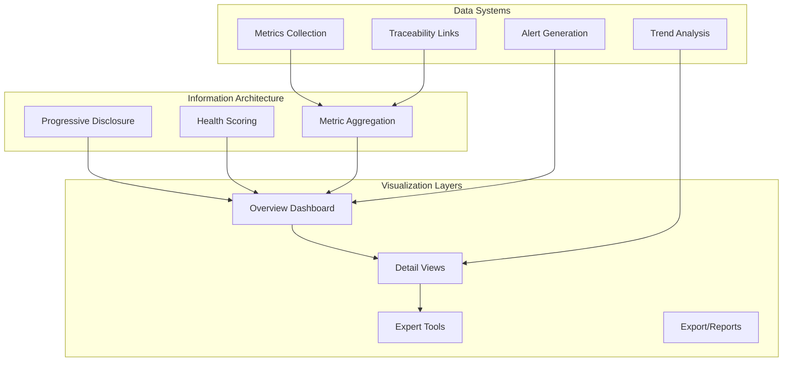

# Dashboard & Visualization Stack

**Building dashboards that guide, not overwhelm: From health scores to traceability systems**

---

## Stack Overview



---

## 🎯 What Problem Does This Solve?

Dashboards fail when they:
- **Overwhelm users** with too much information at once
- **Lack clear answers** (show data, not insights)
- **Hide actionable steps** (what do I do next?)
- **Assume expert knowledge** (no guidance for beginners)
- **Treat all users the same** (no progressive complexity)

**This stack provides patterns for building dashboards that:**
- Start with answers, not raw data
- Guide users from overview → action → details
- Adapt complexity to user expertise
- Make next steps obvious
- Celebrate progress and improvements

---

## 🎨 Core Design Principles

### 1. **Complexity is a Feature, Not the Interface**

```
❌ Bad: Show all metrics equally
┌─────────────────────────────────┐
│ Metric A: 73.2%                 │
│ Metric B: 45.8%                 │
│ Metric C: 91.4%                 │
│ Metric D: 62.1%                 │
│ Metric E: 88.9%                 │
└─────────────────────────────────┘

✅ Good: Show health, then details on demand
┌─────────────────────────────────┐
│ System Health: ●●●●○ 82%       │ ← One glance
│                                 │
│ ⚠️ Attention Needed:            │
│   • Metric B below target (46%) │ ← Actionable
│                                 │
│ [View Details] [Export Report]  │ ← Progressive
└─────────────────────────────────┘
```

### 2. **Progressive Disclosure Pattern**

```
Level 1: Answer (1 second)
   ↓
Level 2: Key Metrics (30 seconds)
   ↓
Level 3: Detailed Analysis (5 minutes)
   ↓
Level 4: Expert Deep Dive (when needed)
```

**Interface Pattern:**
```typescript
interface ProgressiveDisclosure {
  overview: HealthScore;           // L1: Immediate answer
  keyMetrics: Metric[];            // L2: Top 3-5 metrics
  detailViews: View[];             // L3: Drill-down sections
  expertTools: Tool[];             // L4: Advanced analysis
  
  // Navigation state
  currentLevel: 1 | 2 | 3 | 4;
  allowSkipToExpert: boolean;      // Power users can skip
}
```

### 3. **The Car Dashboard Metaphor**

```
🚗 When driving, you see:
   - Speed (big, always visible)
   - Fuel (quick glance)
   - Warning lights (only when needed)
   
   Hidden but available:
   - Engine diagnostics
   - Tire pressure per wheel
   - Detailed fuel consumption

Apply to software dashboards:
   - Health score (big, always visible)
   - Key metrics (quick glance)
   - Alerts (only when needed)
   
   Hidden but available:
   - Raw data tables
   - Advanced filters
   - Export/API access
```

---

## 📊 System Features

### 1. Health Score Architecture

**Health Score = Aggregated, Weighted Metric**

```typescript
interface HealthScore {
  value: number;              // 0-100
  status: 'healthy' | 'warning' | 'critical';
  trend: 'improving' | 'stable' | 'declining';
  components: ComponentScore[];
  lastUpdated: Date;
}

interface ComponentScore {
  name: string;
  value: number;              // 0-100
  weight: number;             // 0-1 (sum = 1)
  threshold: {
    healthy: number;          // e.g., 80+
    warning: number;          // e.g., 60-79
    critical: number;         // e.g., <60
  };
}

// Example: Quality Dashboard Health Score
function calculateQualityHealth(metrics: QualityMetrics): HealthScore {
  const components = [
    { name: 'Test Coverage', value: metrics.testCoverage, weight: 0.35 },
    { name: 'Code Coverage', value: metrics.codeCoverage, weight: 0.25 },
    { name: 'Structure Compliance', value: metrics.structureScore, weight: 0.20 },
    { name: 'Documentation', value: metrics.docScore, weight: 0.20 },
  ];
  
  const value = components.reduce((sum, c) => sum + (c.value * c.weight), 0);
  
  return {
    value: Math.round(value),
    status: value >= 80 ? 'healthy' : value >= 60 ? 'warning' : 'critical',
    trend: calculateTrend(value, metrics.history),
    components: components.map(c => ({ ...c, threshold: { healthy: 80, warning: 60, critical: 0 } })),
    lastUpdated: new Date(),
  };
}
```

**When to Use Health Scores:**
- ✅ Multiple related metrics need synthesis
- ✅ Users need quick "good/bad" assessment
- ✅ Trends matter more than absolute values
- ✅ Different metrics have different importance

**When NOT to Use:**
- ❌ Single metric is sufficient (just show it)
- ❌ Metrics are unrelated (separate displays)
- ❌ Users need precision (show exact values)

---

### 2. Metric Visualization Patterns

**Pattern A: Comparison Cards**

```typescript
interface MetricCard {
  label: string;
  current: number;
  target?: number;
  previous?: number;
  unit: 'percent' | 'count' | 'duration';
  status: 'success' | 'warning' | 'error';
  trend?: {
    direction: 'up' | 'down' | 'stable';
    change: number;
    period: string;
  };
}

// Example: Coverage Card
const coverageCard: MetricCard = {
  label: 'Test Coverage',
  current: 73,
  target: 80,
  previous: 68,
  unit: 'percent',
  status: 'warning',
  trend: {
    direction: 'up',
    change: 5,
    period: '7 days'
  }
};
```

**Pattern B: Dual Metrics (When Context Matters)**

```typescript
interface DualMetric {
  primary: {
    label: string;
    value: number;
    unit: string;
  };
  secondary: {
    label: string;
    value: number;
    unit: string;
  };
  explanation: string;      // Why show both?
  context: string;          // When is each relevant?
}

// Example: Unit vs Integration Coverage
const testCoverage: DualMetric = {
  primary: {
    label: 'Unit Test Coverage',
    value: 85,
    unit: 'percent'
  },
  secondary: {
    label: 'Integration Tests',
    value: 142,
    unit: 'passing'
  },
  explanation: 'Unit coverage measures code execution. Integration tests measure feature validation.',
  context: 'Both are needed: unit for code quality, integration for feature confidence.'
};
```

**Pattern C: Actionable Insights (Data + Action)**

```typescript
interface ActionableInsight {
  type: 'suggestion' | 'warning' | 'celebration';
  message: string;
  priority: number;           // 1-10
  action?: {
    label: string;
    command?: string;         // CLI command
    route?: string;           // UI route
  };
  relatedMetrics: string[];   // Which metrics triggered this
}

// Example: Coverage Warning
const lowCoverageInsight: ActionableInsight = {
  type: 'warning',
  message: 'Code coverage is below target (73% vs 80%). Focus on /lib/api directory.',
  priority: 8,
  action: {
    label: 'View Uncovered Files',
    route: '/quality/coverage?filter=uncovered'
  },
  relatedMetrics: ['codeCoverage', 'testCoverage']
};

// Example: Improvement Celebration
const improvementInsight: ActionableInsight = {
  type: 'celebration',
  message: 'Coverage increased 12% this week! 🎉 Great work on auth.test.ts',
  priority: 3,
  relatedMetrics: ['codeCoverage', 'testCoverage']
};
```

---

### 3. Traceability Architecture

**What is Traceability?**
- Linking related artifacts across the development lifecycle
- Requirements → Tests → Code → Evidence → Compliance

```typescript
interface TraceabilitySystem {
  nodes: TraceabilityNode[];
  links: TraceabilityLink[];
  coverage: CoverageReport;
}

interface TraceabilityNode {
  id: string;
  type: 'requirement' | 'feature' | 'test' | 'code' | 'evidence';
  metadata: {
    title: string;
    status: string;
    path: string;
    lastModified: Date;
  };
}

interface TraceabilityLink {
  from: string;               // Node ID
  to: string;                 // Node ID
  type: 'implements' | 'tests' | 'documents' | 'evidences';
  automated: boolean;         // Auto-detected vs manual
  confidence: number;         // 0-1 for auto-detected links
}

interface CoverageReport {
  totalNodes: Record<string, number>;
  linkedNodes: Record<string, number>;
  orphanedNodes: Record<string, string[]>;
  coverageByType: Record<string, number>;
}
```

**Pattern: Automatic Traceability Detection**

```typescript
interface TraceabilityDetector {
  detectFromPath(filePath: string): string[];
  detectFromContent(content: string): string[];
  detectFromTestName(testName: string): string[];
  
  // Example: tests/requirements/req-042/auth.test.ts → REQ-042
  // Example: describe('REQ-042: Authentication') → REQ-042
  // Example: requirement frontmatter: tests: [path/to/test.ts]
}

// Strategy Pattern: Multiple Detection Methods
type DetectionStrategy = 
  | { type: 'path'; pattern: RegExp }
  | { type: 'content'; markers: string[] }
  | { type: 'frontmatter'; field: string }
  | { type: 'comment'; prefix: string };
```

**When to Use Traceability:**
- ✅ Regulated industries (compliance evidence)
- ✅ Large teams (understand impact of changes)
- ✅ Complex systems (many dependencies)
- ✅ Long-lived products (historical context)

**When NOT to Use:**
- ❌ Small projects (<10 requirements)
- ❌ Rapid prototyping (overhead too high)
- ❌ Single developer (mental model sufficient)

---

### 4. Navigation Patterns

**Pattern A: Dual Sidebar (Main + Sub)**

```typescript
interface NavigationConfig {
  mainSections: MainSection[];
  currentMain: string;
  currentSub?: string;
}

interface MainSection {
  id: string;
  label: string;
  icon: string;
  hasSubNav: boolean;
  subNavItems?: SubNavItem[];
}

interface SubNavItem {
  id: string;
  label: string;
  description?: string;
  isGroupHeader?: boolean;    // Non-clickable group label
  indent?: boolean;           // Visual nesting
}

// Example: Quality Dashboard
const qualitySection: MainSection = {
  id: 'quality',
  label: 'Quality',
  icon: 'check-circle',
  hasSubNav: true,
  subNavItems: [
    { id: 'overview', label: 'Overview' },
    { id: 'group-coverage', label: 'Coverage & Traceability', isGroupHeader: true },
    { id: 'req-matrix', label: 'Requirement Matrix', indent: true },
    { id: 'traceability-graph', label: 'Traceability Graph', indent: true },
    { id: 'code-coverage', label: 'Code Coverage', indent: true },
  ]
};
```

**Pattern B: Flat with Visual Hierarchy**

```
❌ Bad: Deep nesting requires clicks
Quality → Coverage → Traceability → Graph (3 clicks)

✅ Good: Flat with visual grouping
Quality (sidebar shows all)
  COVERAGE & TRACEABILITY
    • Requirement Matrix
    • Traceability Graph
    • Code Coverage
```

**Pattern C: Overview + Detail Routing**

```typescript
interface DashboardRouter {
  overview: OverviewConfig;        // Aggregated summary
  detailViews: Record<string, DetailViewConfig>;
  expertTools: Record<string, ToolConfig>;
  
  // Smart routing
  getDefaultRoute(userRole: string): string;
  getRelevantRoute(context: AlertContext): string;
}

// Example: Route to problem area
function getRelevantRoute(alert: Alert): string {
  if (alert.type === 'low-coverage' && alert.area === 'tests') {
    return '/quality/test-gap-analysis';
  }
  if (alert.type === 'failing-tests') {
    return '/quality/test-results?filter=failed';
  }
  return '/quality/overview';
}
```

---

## 👥 User Features

### 1. **Overview Dashboard (Level 1)**

**Purpose:** Answer "Is everything okay?" in 10 seconds

```typescript
interface OverviewDashboard {
  healthScore: HealthScore;
  keyMetrics: MetricCard[];         // 3-5 most important
  actionItems: ActionableInsight[]; // Top 3 by priority
  quickActions: QuickAction[];      // Common tasks
  recentActivity: Activity[];       // Last 5 changes
}

// Visual Layout
┌─────────────────────────────────────────────┐
│  System Health: ●●●●○ 82%                  │
│  Trending: ↑ Improved 5% this week          │
├─────────────────────────────────────────────┤
│  Key Metrics                                │
│  ┌─────────┐ ┌─────────┐ ┌─────────┐      │
│  │Tests    │ │Coverage │ │Structure│      │
│  │53/67 ✅ │ │73% ⚠️   │ │100% ✅  │      │
│  └─────────┘ └─────────┘ └─────────┘      │
├─────────────────────────────────────────────┤
│  📝 Next Actions                            │
│  1. ⚠️ Add tests for REQ-042 (high priority)│
│  2. ⚠️ Improve coverage in /api (73% → 80%) │
│  3. ℹ️ Review 3 new failing tests          │
└─────────────────────────────────────────────┘
```

### 2. **Detail Views (Level 2)**

**Purpose:** Explore specific metrics, understand trends

```typescript
interface DetailView {
  metric: Metric;
  trend: TrendChart;              // 7d, 30d, 90d
  breakdown: Breakdown[];         // By category/type
  relatedInsights: ActionableInsight[];
  drillDowns: DrillDown[];        // Links to Level 3
}

// Example: Test Coverage Detail
interface TestCoverageDetail extends DetailView {
  totalRequirements: number;
  testedRequirements: number;
  coverageByPhase: Record<string, number>;
  recentChanges: Change[];
  gapAnalysis: {
    untestedRequirements: string[];
    suggestedTestFiles: string[];
  };
}
```

### 3. **Expert Tools (Level 3)**

**Purpose:** Deep analysis, data export, custom queries

```typescript
interface ExpertTools {
  advancedFilters: Filter[];
  customReports: ReportBuilder;
  dataExport: ExportOptions;
  apiAccess: APICredentials;
  rawDataView: DataTable;
}

// Only show to:
// - Users who explicitly navigate here
// - Users with "expert" role
// - Users who used advanced features before
```

### 4. **Celebration Moments**

**Purpose:** Reward progress, build confidence

```typescript
interface CelebrationTrigger {
  condition: string;
  animation: 'confetti' | 'pulse' | 'badge';
  message: string;
  shareOption?: boolean;
}

// Examples
const celebrations: CelebrationTrigger[] = [
  {
    condition: 'coverage >= 100',
    animation: 'confetti',
    message: '🎉 100% Coverage! Outstanding work!',
    shareOption: true
  },
  {
    condition: 'all_tests_passing && was_failing',
    animation: 'pulse',
    message: '✅ All tests passing! Great debugging!',
  },
  {
    condition: 'improvement >= 10',
    animation: 'badge',
    message: '📈 Coverage increased 10%! Keep it up!',
  }
];
```

---

## 🎯 Decision Framework

### When to Build a Dashboard?

| Question | Yes = Dashboard | No = Reports/Alerts |
|----------|----------------|---------------------|
| Users check status frequently? | ✅ | Reports |
| Need real-time monitoring? | ✅ | Alerts |
| Multiple related metrics? | ✅ | Single metric widget |
| Different user personas? | ✅ | Fixed report |
| Action needed based on data? | ✅ | Alerts |

### Dashboard Complexity Decision Tree

```
Start: What's the primary use case?

1. Quick health check (daily)
   → Simple overview dashboard
   → 1-3 key metrics
   → Green/Yellow/Red status

2. Investigation (when issues arise)
   → Detailed dashboard
   → Drill-down capability
   → Trend analysis
   → Filter/search

3. Analysis & reporting (weekly/monthly)
   → Comprehensive dashboard
   → Custom reports
   → Data export
   → Historical comparison

4. Expert analysis (rare, deep dives)
   → Expert tools
   → Raw data access
   → API integration
   → Custom queries
```

---

## 📈 Metrics & Success Criteria

### Dashboard Effectiveness Metrics

```typescript
interface DashboardMetrics {
  // Adoption
  dailyActiveUsers: number;
  weeklyActiveUsers: number;
  retentionRate: number;
  
  // Engagement
  avgTimeToFirstInsight: Duration;    // Target: <10s
  avgClicksToAction: number;          // Target: <3
  bounceRate: number;                 // Target: <20%
  
  // Satisfaction
  userSatisfactionScore: number;      // Target: >4/5
  supportTicketsReduced: number;      // Target: -70%
  
  // Business Impact
  issuesResolvedFaster: Duration;
  preventedOutages: number;
  timeToDecision: Duration;
}
```

### Success Criteria Checklist

**Level 1: Functional**
- [ ] Loads in <2 seconds
- [ ] Shows current data (< 5 min stale)
- [ ] Works on mobile (responsive)
- [ ] Accessible (WCAG AA)

**Level 2: Effective**
- [ ] Users understand status in <10 seconds
- [ ] Users reach action in <3 clicks
- [ ] Users return daily (>50% retention)
- [ ] Support questions reduced (-70%)

**Level 3: Delightful**
- [ ] Users proactively check (not just when broken)
- [ ] Users show dashboard to others
- [ ] Users request new features
- [ ] NPS score >50

---

## 🏗️ Architecture Patterns

### Pattern: Event-Driven Dashboard Updates

```typescript
interface DashboardEventSystem {
  events: {
    'metric.updated': MetricUpdatedEvent;
    'alert.triggered': AlertTriggeredEvent;
    'user.action': UserActionEvent;
  };
  
  subscribers: {
    [eventType: string]: EventHandler[];
  };
  
  publish<T extends keyof DashboardEventSystem['events']>(
    event: T,
    data: DashboardEventSystem['events'][T]
  ): void;
}

// Example: Real-time test result updates
eventSystem.subscribe('test.completed', (event) => {
  updateMetric('testCoverage', calculateCoverage(event.results));
  
  if (event.results.failureCount === 0 && previouslyFailing) {
    triggerCelebration('all_tests_passing');
  }
  
  if (event.results.failureCount > previousFailures) {
    showAlert('test-regression', {
      newFailures: event.results.failureCount - previousFailures
    });
  }
});
```

### Pattern: Smart Caching for Performance

```typescript
interface DashboardCache {
  strategy: 'aggressive' | 'balanced' | 'fresh';
  
  layers: {
    l1: InMemoryCache;        // <1s old
    l2: LocalStorageCache;    // <5min old
    l3: CDNCache;             // <1hr old
    l4: DatabaseCache;        // <1day old
  };
  
  // Cache invalidation rules
  invalidateOn: {
    events: string[];         // e.g., ['test.completed', 'build.finished']
    time: Duration;           // e.g., 5 minutes
    userAction: boolean;      // e.g., manual refresh
  };
}

// Example: Balance freshness vs performance
const cacheConfig = {
  strategy: 'balanced',
  rules: [
    { metric: 'healthScore', ttl: '1m', priority: 'high' },
    { metric: 'testResults', ttl: '30s', priority: 'high' },
    { metric: 'trends', ttl: '5m', priority: 'medium' },
    { metric: 'historicalData', ttl: '1h', priority: 'low' },
  ]
};
```

---

## 🛠️ Trade-off Tables

### Dashboard Framework Comparison

| Framework | Pros | Cons | Best For |
|-----------|------|------|----------|
| **Custom React** | Full control, no overhead | Time-consuming | Unique UX requirements |
| **Recharts** | Simple, React-native | Limited customization | Standard charts |
| **D3.js** | Powerful, flexible | Steep learning curve | Complex visualizations |
| **Tremor** | Pre-built dashboard components | Less flexible | Quick dashboards |
| **Apache Superset** | Full BI platform | Heavy, complex | Data warehouse dashboards |

### Real-time vs Polling vs Batch

| Approach | Latency | Resource Cost | Use When |
|----------|---------|---------------|----------|
| **Real-time (WebSocket)** | <100ms | High (persistent connections) | Live monitoring, alerts |
| **Polling (1-5s)** | 1-5s | Medium | Active dashboards |
| **Polling (30-60s)** | 30-60s | Low | Background updates |
| **Batch (on-demand)** | 1-5min | Very Low | Reports, historical data |

---

## 📚 Real-World Examples

### Example 1: GitHub Actions Dashboard

**What They Do Well:**
- ✅ Clear pass/fail status (immediate answer)
- ✅ Collapsible logs (progressive disclosure)
- ✅ Re-run button (obvious action)
- ✅ Time tracking (accountability)

**Pattern to Steal:**
```typescript
interface BuildDashboard {
  status: 'success' | 'failure' | 'running';
  duration: Duration;
  steps: BuildStep[];         // Each step collapsible
  quickActions: ['rerun', 'cancel', 'view-logs'];
}
```

### Example 2: Vercel Deployment Dashboard

**What They Do Well:**
- ✅ Single deployment status (not overwhelming)
- ✅ Preview link (immediate value)
- ✅ Build logs on demand (not in your face)
- ✅ Performance metrics (integrated)

**Pattern to Steal:**
```typescript
interface DeploymentDashboard {
  primaryStatus: 'ready' | 'building' | 'error';
  primaryAction: {
    label: 'Visit Preview';
    url: string;
  };
  secondaryInfo: {
    buildTime: Duration;
    domainStatus: string;
  };
  detailsOnDemand: {
    logs: boolean;
    metrics: boolean;
    settings: boolean;
  };
}
```

### Example 3: Lighthouse Scores

**What They Do Well:**
- ✅ 4 scores, clear targets (100 = perfect)
- ✅ Color coding (green/yellow/red)
- ✅ Actionable suggestions (what to fix)
- ✅ Priority ordering (fix highest impact first)

**Pattern to Steal:**
```typescript
interface QualityScoreDashboard {
  scores: {
    name: string;
    value: number;            // 0-100
    target: number;           // e.g., 90
    status: 'pass' | 'fail';
  }[];
  
  opportunities: {
    title: string;
    impact: 'high' | 'medium' | 'low';
    effort: 'easy' | 'medium' | 'hard';
    howToFix: string;
  }[];
}
```

---

## ✅ Implementation Checklist

### Phase 1: Foundation (Week 1)
- [ ] Define health score algorithm
- [ ] Identify 3-5 key metrics
- [ ] Design overview layout
- [ ] Implement basic data fetching
- [ ] Add loading states

### Phase 2: Progressive Disclosure (Week 2)
- [ ] Create detail views for each metric
- [ ] Add trend visualization (7d/30d/90d)
- [ ] Implement drill-down navigation
- [ ] Add breadcrumbs
- [ ] Smart routing (alert → relevant view)

### Phase 3: Intelligence (Week 3)
- [ ] Actionable insights engine
- [ ] Threshold-based alerts
- [ ] Trend detection (improving/declining)
- [ ] Suggested actions
- [ ] Celebration triggers

### Phase 4: Polish (Week 4)
- [ ] Animations (smooth, purposeful)
- [ ] Empty states (helpful, not frustrating)
- [ ] Error states (actionable recovery)
- [ ] Accessibility audit (WCAG AA)
- [ ] Performance optimization (<2s load)
- [ ] Mobile responsive

---

## 🚀 Getting Started

### 1. Start with the Answer
```
Before building anything, answer:
- What question does this dashboard answer?
- Can users get the answer in 10 seconds?
- What action should they take next?
```

### 2. Sketch the Overview
```
On paper (literally):
- Draw the "10-second view"
- Show only health score + top 3 metrics
- Add 1-2 obvious actions
```

### 3. Validate with Users
```
Show the sketch to 3-5 users:
- "What does this tell you?"
- "What would you click first?"
- "What's missing?"
```

### 4. Build Iteratively
```
Week 1: Static overview (fake data)
Week 2: Real data, no interactivity
Week 3: Add detail views
Week 4: Polish + intelligence
```

---

## 🌟 Anti-Patterns to Avoid

### ❌ **The Data Dump**
```
Bad: Show every metric you have
Good: Show 3-5 most important, hide rest behind "More"
```

### ❌ **The Expert Assumption**
```
Bad: Use technical terms without explanation
Good: Add hover tooltips, "Learn more" links
```

### ❌ **The Flat Hierarchy**
```
Bad: All metrics equally prominent
Good: Size/color hierarchy (important = bigger/brighter)
```

### ❌ **The Static Dashboard**
```
Bad: No trends, no context, just current values
Good: Show trends (↑↓), compare to target, recent changes
```

### ❌ **The Action-less Display**
```
Bad: "Coverage: 73%" (so what?)
Good: "Coverage: 73% (target: 80%) [Run Tests] [View Gaps]"
```

---

## 📖 Further Reading

### Books
- "The Lean Startup" - Metrics that matter
- "Designing Data Visualizations" - Edward Tufte
- "Don't Make Me Think" - Steve Krug

### Articles
- [Progressive Disclosure](https://www.nngroup.com/articles/progressive-disclosure/)
- [Dashboard Design Patterns](https://uxdesign.cc/dashboard-design-patterns)
- [Health Score Algorithms](https://www.gainsight.com/guides/health-scores/)

### Tools
- [Figma](https://figma.com) - Design dashboards
- [Recharts](https://recharts.org) - React charts
- [Tremor](https://tremor.so) - Dashboard components

---

## 🎯 Next Steps for Implementation

This stack provides **patterns, not prescription**. Your dashboard should:

1. **Solve a real problem** (not just display data)
2. **Start simple** (overview first, details later)
3. **Guide users** (make next steps obvious)
4. **Celebrate wins** (build confidence)
5. **Evolve based on feedback** (iterate, don't perfect)

**Start here:**
- Define your health score algorithm
- Sketch the 10-second overview
- Validate with 3 users
- Build the simplest version that works
- Add complexity only when needed

---

**Remember:** The best dashboard is the one users actually check daily, not the one with the most features.

