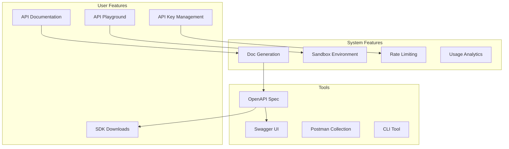

# Developer Stack

**End-to-end developer experience with API documentation, SDKs, and sandbox environments**

---

## Stack Overview



---

## 📊 System Features

### 1. API Documentation Generation

```typescript
// OpenAPI specification generation
import { generateOpenApiDocument } from '@asteasolutions/zod-to-openapi';
import { z } from 'zod';

// Define schemas with Zod
const UserSchema = z.object({
  id: z.string().uuid(),
  email: z.string().email(),
  name: z.string(),
  createdAt: z.string().datetime(),
});

const CreateUserSchema = UserSchema.omit({ id: true, createdAt: true });

// Generate OpenAPI spec
const openApiDoc = generateOpenApiDocument({
  openapi: '3.0.0',
  info: {
    title: 'My API',
    version: '1.0.0',
  },
  paths: {
    '/users': {
      post: {
        summary: 'Create user',
        requestBody: {
          content: {
            'application/json': {
              schema: CreateUserSchema,
            },
          },
        },
        responses: {
          201: {
            content: {
              'application/json': {
                schema: UserSchema,
              },
            },
          },
        },
      },
    },
  },
});

// Serve docs
app.get('/api/docs/openapi.json', (req, res) => {
  res.json(openApiDoc);
});

// Serve Swagger UI
import swaggerUi from 'swagger-ui-express';
app.use('/api/docs', swaggerUi.serve, swaggerUi.setup(openApiDoc));
```

---

### 2. SDK Generation

```bash
# Generate TypeScript SDK
npx openapi-typescript-codegen --input openapi.json --output ./sdks/typescript

# Generate Python SDK
npx openapi-python-client generate --url http://localhost:3000/api/docs/openapi.json

# Generate Go SDK
openapi-generator generate -i openapi.json -g go -o ./sdks/go
```

---

## 👥 User Features

### 1. API Playground

```typescript
const APIPlayground: React.FC = () => {
  const [endpoint, setEndpoint] = useState('/api/users');
  const [method, setMethod] = useState('GET');
  const [headers, setHeaders] = useState({ 'Authorization': 'Bearer ...' });
  const [body, setBody] = useState('{}');
  const [response, setResponse] = useState<any>(null);
  
  const executeRequest = async () => {
    const res = await fetch(endpoint, {
      method,
      headers,
      body: method !== 'GET' ? body : undefined,
    });
    
    setResponse({
      status: res.status,
      headers: Object.fromEntries(res.headers),
      body: await res.json(),
    });
  };
  
  return (
    <div className="api-playground">
      <RequestBuilder
        endpoint={endpoint}
        method={method}
        headers={headers}
        body={body}
        onEndpointChange={setEndpoint}
        onMethodChange={setMethod}
        onHeadersChange={setHeaders}
        onBodyChange={setBody}
      />
      
      <Button onClick={executeRequest}>Send Request</Button>
      
      {response && (
        <ResponseViewer response={response} />
      )}
    </div>
  );
};
```

---

**Developer Stack Complete** ✅


