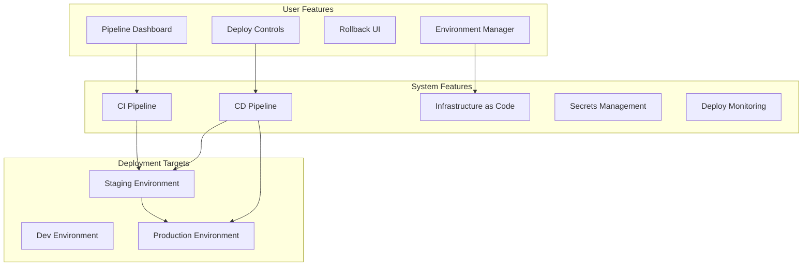
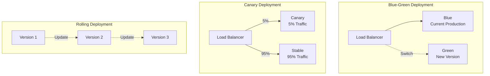

# DevOps Stack

**End-to-end CI/CD, infrastructure as code, and deployment automation**

---

## Stack Overview



---

## 📊 System Features

### 1. CI Pipeline

**GitHub Actions Example**

```yaml
# .github/workflows/ci.yml
name: CI Pipeline
on:
  pull_request:
  push:
    branches: [main, develop]

jobs:
  test:
    runs-on: ubuntu-latest
    steps:
      - uses: actions/checkout@v3
      
      - uses: actions/setup-node@v3
        with:
          node-version: 18
          cache: 'npm'
      
      - name: Install dependencies
        run: npm ci
      
      - name: Lint
        run: npm run lint
      
      - name: Type check
        run: npm run type-check
      
      - name: Test
        run: npm test -- --coverage
      
      - name: Upload coverage
        uses: codecov/codecov-action@v3
  
  security:
    runs-on: ubuntu-latest
    steps:
      - uses: actions/checkout@v3
      
      - name: Run Snyk
        uses: snyk/actions/node@master
        env:
          SNYK_TOKEN: ${{ secrets.SNYK_TOKEN }}
      
      - name: Run Semgrep
        uses: returntocorp/semgrep-action@v1
  
  build:
    runs-on: ubuntu-latest
    needs: [test, security]
    steps:
      - uses: actions/checkout@v3
      
      - name: Build Docker image
        run: docker build -t myapp:${{ github.sha }} .
      
      - name: Push to registry
        run: |
          echo ${{ secrets.DOCKER_PASSWORD }} | docker login -u ${{ secrets.DOCKER_USERNAME }} --password-stdin
          docker push myapp:${{ github.sha }}
```

**CI Tools Comparison**

| Tool | Pros | Cons | Use When |
|------|------|------|----------|
| **GitHub Actions** | Native integration, free for public repos | Limited for complex pipelines | GitHub-hosted projects |
| **GitLab CI** | Powerful, built-in registry | GitLab only | GitLab projects |
| **CircleCI** | Fast, great caching | Credit-based pricing | Need speed |
| **Jenkins** | Fully customizable | Complex setup, maintenance | On-prem, legacy |
| **Buildkite** | Hybrid (cloud + self-hosted) | Requires infrastructure | Need control + speed |

---

### 2. CD Pipeline

**Deployment Strategies**



**Deployment Automation**

```typescript
// Deployment script with health checks
import { exec } from 'child_process';
import { promisify } from 'util';

const execAsync = promisify(exec);

interface DeploymentConfig {
  environment: 'staging' | 'production';
  version: string;
  strategy: 'rolling' | 'blue-green' | 'canary';
  healthCheckUrl: string;
  rollbackOnFailure: boolean;
}

class Deployer {
  async deploy(config: DeploymentConfig): Promise<void> {
    console.log(`🚀 Deploying ${config.version} to ${config.environment}`);
    
    // Pre-deployment checks
    await this.preDeploymentChecks(config);
    
    // Deploy based on strategy
    switch (config.strategy) {
      case 'rolling':
        await this.rollingDeploy(config);
        break;
      case 'blue-green':
        await this.blueGreenDeploy(config);
        break;
      case 'canary':
        await this.canaryDeploy(config);
        break;
    }
    
    // Post-deployment checks
    const healthy = await this.healthCheck(config.healthCheckUrl);
    
    if (!healthy && config.rollbackOnFailure) {
      console.error('❌ Health check failed, rolling back');
      await this.rollback(config);
      throw new Error('Deployment failed health check');
    }
    
    console.log('✅ Deployment successful');
  }
  
  private async rollingDeploy(config: DeploymentConfig): Promise<void> {
    const instances = await this.getInstances(config.environment);
    
    for (const instance of instances) {
      // Remove from load balancer
      await this.deregisterFromLB(instance);
      
      // Update instance
      await this.updateInstance(instance, config.version);
      
      // Health check
      const healthy = await this.instanceHealthCheck(instance);
      
      if (!healthy) {
        throw new Error(`Instance ${instance.id} failed health check`);
      }
      
      // Add back to load balancer
      await this.registerToLB(instance);
      
      // Wait before next instance
      await this.sleep(30000); // 30 seconds
    }
  }
  
  private async blueGreenDeploy(config: DeploymentConfig): Promise<void> {
    // Create new environment (green)
    const greenEnv = await this.createEnvironment({
      ...config,
      name: `${config.environment}-green`,
    });
    
    // Deploy to green
    await this.deployToEnvironment(greenEnv, config.version);
    
    // Health check green
    const healthy = await this.healthCheck(greenEnv.url);
    
    if (!healthy) {
      await this.destroyEnvironment(greenEnv);
      throw new Error('Green environment failed health check');
    }
    
    // Switch traffic to green
    await this.switchTraffic(config.environment, greenEnv);
    
    // Wait for confirmation
    await this.sleep(300000); // 5 minutes
    
    // Destroy old environment (blue)
    await this.destroyEnvironment(`${config.environment}-blue`);
  }
  
  private async healthCheck(url: string, retries = 3): Promise<boolean> {
    for (let i = 0; i < retries; i++) {
      try {
        const response = await fetch(`${url}/health`);
        if (response.ok) {
          const data = await response.json();
          return data.status === 'healthy';
        }
      } catch (error) {
        console.log(`Health check attempt ${i + 1} failed`);
      }
      
      if (i < retries - 1) {
        await this.sleep(10000); // Wait 10s before retry
      }
    }
    
    return false;
  }
  
  private async rollback(config: DeploymentConfig): Promise<void> {
    const previousVersion = await this.getPreviousVersion(config.environment);
    
    console.log(`⏮️ Rolling back to ${previousVersion}`);
    
    await this.deploy({
      ...config,
      version: previousVersion,
      rollbackOnFailure: false, // Don't rollback a rollback
    });
  }
}
```

---

### 3. Infrastructure as Code

**Terraform Example**

```hcl
# main.tf - ECS Fargate deployment
terraform {
  required_providers {
    aws = {
      source  = "hashicorp/aws"
      version = "~> 5.0"
    }
  }
  
  backend "s3" {
    bucket = "my-terraform-state"
    key    = "production/terraform.tfstate"
    region = "us-east-1"
  }
}

# VPC
resource "aws_vpc" "main" {
  cidr_block           = "10.0.0.0/16"
  enable_dns_hostnames = true
  
  tags = {
    Name        = "main-vpc"
    Environment = var.environment
  }
}

# ECS Cluster
resource "aws_ecs_cluster" "main" {
  name = "${var.app_name}-${var.environment}"
  
  setting {
    name  = "containerInsights"
    value = "enabled"
  }
}

# ECS Task Definition
resource "aws_ecs_task_definition" "app" {
  family                   = "${var.app_name}-${var.environment}"
  network_mode             = "awsvpc"
  requires_compatibilities = ["FARGATE"]
  cpu                      = "256"
  memory                   = "512"
  execution_role_arn       = aws_iam_role.ecs_execution.arn
  
  container_definitions = jsonencode([{
    name  = var.app_name
    image = "${var.docker_image}:${var.version}"
    
    portMappings = [{
      containerPort = 3000
      protocol      = "tcp"
    }]
    
    environment = [
      {
        name  = "NODE_ENV"
        value = var.environment
      }
    ]
    
    secrets = [
      {
        name      = "DATABASE_URL"
        valueFrom = aws_secretsmanager_secret.db_url.arn
      }
    ]
    
    logConfiguration = {
      logDriver = "awslogs"
      options = {
        "awslogs-group"         = "/ecs/${var.app_name}"
        "awslogs-region"        = var.region
        "awslogs-stream-prefix" = "ecs"
      }
    }
  }])
}

# ECS Service
resource "aws_ecs_service" "app" {
  name            = "${var.app_name}-${var.environment}"
  cluster         = aws_ecs_cluster.main.id
  task_definition = aws_ecs_task_definition.app.arn
  desired_count   = var.instance_count
  launch_type     = "FARGATE"
  
  network_configuration {
    subnets          = aws_subnet.private[*].id
    security_groups  = [aws_security_group.ecs_tasks.id]
    assign_public_ip = false
  }
  
  load_balancer {
    target_group_arn = aws_lb_target_group.app.arn
    container_name   = var.app_name
    container_port   = 3000
  }
  
  deployment_configuration {
    maximum_percent         = 200
    minimum_healthy_percent = 100
  }
  
  depends_on = [aws_lb_listener.app]
}

# Auto Scaling
resource "aws_appautoscaling_target" "ecs" {
  max_capacity       = 10
  min_capacity       = 2
  resource_id        = "service/${aws_ecs_cluster.main.name}/${aws_ecs_service.app.name}"
  scalable_dimension = "ecs:service:DesiredCount"
  service_namespace  = "ecs"
}

resource "aws_appautoscaling_policy" "cpu" {
  name               = "cpu-autoscaling"
  policy_type        = "TargetTrackingScaling"
  resource_id        = aws_appautoscaling_target.ecs.resource_id
  scalable_dimension = aws_appautoscaling_target.ecs.scalable_dimension
  service_namespace  = aws_appautoscaling_target.ecs.service_namespace
  
  target_tracking_scaling_policy_configuration {
    predefined_metric_specification {
      predefined_metric_type = "ECSServiceAverageCPUUtilization"
    }
    
    target_value = 70.0
  }
}
```

**IaC Tools Comparison**

| Tool | Language | Best For | Avoid When |
|------|----------|----------|------------|
| **Terraform** | HCL | Multi-cloud, mature | Simple AWS-only |
| **Pulumi** | TypeScript/Python/Go | Developer-friendly, type-safe | Team prefers HCL |
| **AWS CDK** | TypeScript/Python | AWS-native, OOP | Multi-cloud |
| **CloudFormation** | YAML/JSON | AWS-native, free | Complex stacks |
| **Ansible** | YAML | Configuration management | Cloud provisioning |

---

### 4. Secrets Management

```typescript
// Secrets management wrapper
import { SecretsManagerClient, GetSecretValueCommand } from '@aws-sdk/client-secrets-manager';

class SecretsManager {
  private client: SecretsManagerClient;
  private cache: Map<string, { value: string; expiresAt: number }> = new Map();
  
  constructor(region: string) {
    this.client = new SecretsManagerClient({ region });
  }
  
  async getSecret(secretName: string, cacheTTL = 300): Promise<string> {
    // Check cache
    const cached = this.cache.get(secretName);
    if (cached && Date.now() < cached.expiresAt) {
      return cached.value;
    }
    
    // Fetch from AWS
    const command = new GetSecretValueCommand({ SecretId: secretName });
    const response = await this.client.send(command);
    
    if (!response.SecretString) {
      throw new Error(`Secret ${secretName} not found`);
    }
    
    // Cache
    this.cache.set(secretName, {
      value: response.SecretString,
      expiresAt: Date.now() + (cacheTTL * 1000),
    });
    
    return response.SecretString;
  }
  
  async rotateSecret(secretName: string, newValue: string): Promise<void> {
    // Implement secret rotation logic
    await this.client.send(new PutSecretValueCommand({
      SecretId: secretName,
      SecretString: newValue,
    }));
    
    // Invalidate cache
    this.cache.delete(secretName);
  }
}

// Usage in application startup
const secrets = new SecretsManager(process.env.AWS_REGION);

async function loadSecrets() {
  process.env.DATABASE_URL = await secrets.getSecret('prod/database-url');
  process.env.API_KEY = await secrets.getSecret('prod/api-key');
  process.env.JWT_SECRET = await secrets.getSecret('prod/jwt-secret');
}

await loadSecrets();
```

---

## 👥 User Features

### 1. Pipeline Dashboard

```typescript
const PipelineDashboard: React.FC = () => {
  const [pipelines, setPipelines] = useState<Pipeline[]>([]);
  
  return (
    <Dashboard>
      <h1>CI/CD Pipelines</h1>
      
      <PipelineList>
        {pipelines.map(pipeline => (
          <PipelineCard
            key={pipeline.id}
            pipeline={pipeline}
            onRetry={() => retryPipeline(pipeline.id)}
            onCancel={() => cancelPipeline(pipeline.id)}
          />
        ))}
      </PipelineList>
      
      <DeploymentHistory />
    </Dashboard>
  );
};
```

### 2. Environment Manager

```typescript
const EnvironmentManager: React.FC = () => {
  const [environments, setEnvironments] = useState<Environment[]>([]);
  
  const promoteToProduction = async (version: string) => {
    if (!confirm('Promote to production?')) return;
    
    await fetch('/api/deploy', {
      method: 'POST',
      body: JSON.stringify({
        environment: 'production',
        version,
        strategy: 'blue-green',
      }),
    });
  };
  
  return (
    <div className="environment-manager">
      {environments.map(env => (
        <EnvironmentCard
          key={env.name}
          environment={env}
          onPromote={promoteToProduction}
          onRollback={() => rollbackEnvironment(env.name)}
        />
      ))}
    </div>
  );
};
```

---

## 📋 Implementation Checklist

### CI Pipeline
- [ ] Automated testing on every PR
- [ ] Code quality checks (ESLint, Prettier)
- [ ] Security scanning (Snyk, Semgrep)
- [ ] Build artifacts
- [ ] Test coverage reports
- [ ] Branch protection rules

### CD Pipeline
- [ ] Automated deployment to staging
- [ ] Manual approval for production
- [ ] Health checks after deployment
- [ ] Automatic rollback on failure
- [ ] Deployment notifications (Slack)
- [ ] Deployment history & audit log

### Infrastructure
- [ ] Infrastructure as Code (Terraform/Pulumi)
- [ ] Environment parity (dev = staging = prod)
- [ ] Auto-scaling configuration
- [ ] Load balancing
- [ ] SSL/TLS certificates
- [ ] DNS management

### Monitoring
- [ ] Deployment success/failure metrics
- [ ] Deployment duration tracking
- [ ] Rollback frequency
- [ ] MTTR (Mean Time To Recovery)
- [ ] Change failure rate
- [ ] Deployment frequency

---

**DevOps Stack Complete** ✅


