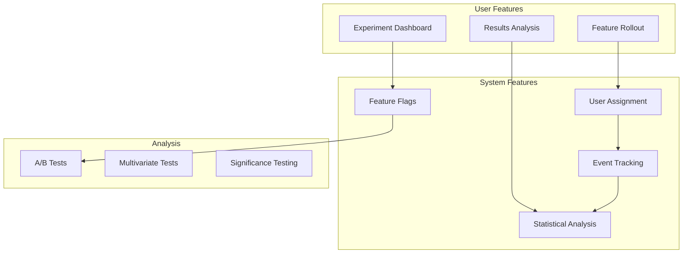

# Experimentation Stack

**End-to-end A/B testing, feature flags, and experimentation platform**

---

## Stack Overview



---

## 📊 System Features

### 1. Feature Flags

```typescript
class FeatureFlagService {
  async isEnabled(
    flagKey: string,
    userId: string,
    context?: Record<string, any>
  ): Promise<boolean> {
    const flag = await this.getFlag(flagKey);
    
    if (!flag) return false;
    if (!flag.enabled) return false;
    
    // Percentage rollout
    if (flag.rolloutPercentage < 100) {
      const hash = this.hashUser(userId, flagKey);
      if (hash > flag.rolloutPercentage) {
        return false;
      }
    }
    
    // Targeting rules
    if (flag.rules && flag.rules.length > 0) {
      return this.evaluateRules(flag.rules, context);
    }
    
    return true;
  }
  
  private hashUser(userId: string, flagKey: string): number {
    const hash = crypto
      .createHash('sha256')
      .update(`${userId}:${flagKey}`)
      .digest('hex');
    
    return parseInt(hash.substring(0, 8), 16) % 100;
  }
}

// Usage in code
if (await featureFlags.isEnabled('new-checkout', user.id)) {
  return <NewCheckout />;
} else {
  return <OldCheckout />;
}
```

---

### 2. A/B Testing

```typescript
interface Experiment {
  id: string;
  name: string;
  hypothesis: string;
  variants: Variant[];
  metrics: Metric[];
  startDate: Date;
  endDate?: Date;
  status: 'draft' | 'running' | 'completed' | 'stopped';
}

interface Variant {
  id: string;
  name: string;
  weight: number; // 0-100
  isControl: boolean;
}

class ExperimentService {
  async assignVariant(experimentId: string, userId: string): Promise<Variant> {
    // Check if user already assigned
    const existing = await db.assignments.findUnique({
      where: {
        experimentId_userId: { experimentId, userId },
      },
    });
    
    if (existing) {
      return existing.variant;
    }
    
    // Get experiment
    const experiment = await db.experiments.findUnique({
      where: { id: experimentId },
      include: { variants: true },
    });
    
    // Assign variant based on weights
    const variant = this.selectVariant(experiment.variants, userId);
    
    // Store assignment
    await db.assignments.create({
      data: {
        experimentId,
        userId,
        variantId: variant.id,
        assignedAt: new Date(),
      },
    });
    
    return variant;
  }
  
  async trackMetric(
    experimentId: string,
    userId: string,
    metricName: string,
    value: number
  ): Promise<void> {
    const assignment = await db.assignments.findUnique({
      where: {
        experimentId_userId: { experimentId, userId },
      },
    });
    
    if (!assignment) return; // User not in experiment
    
    await db.metricEvents.create({
      data: {
        experimentId,
        variantId: assignment.variantId,
        userId,
        metricName,
        value,
        timestamp: new Date(),
      },
    });
  }
}
```

---

## 👥 User Features

### 1. Experiment Results

```typescript
const ExperimentResults: React.FC<{ experimentId: string }> = ({ experimentId }) => {
  const [results, setResults] = useState<ExperimentResults | null>(null);
  
  return (
    <div className="experiment-results">
      <h1>{results.experiment.name}</h1>
      
      <VariantComparison>
        {results.variants.map(variant => (
          <VariantCard
            key={variant.id}
            variant={variant}
            isWinner={variant.id === results.winner}
          />
        ))}
      </VariantComparison>
      
      <StatisticalSignificance
        pValue={results.pValue}
        confidenceInterval={results.confidenceInterval}
      />
      
      {results.winner && (
        <Button onClick={() => declareWinner(results.winner)}>
          Roll Out Winner to 100%
        </Button>
      )}
    </div>
  );
};
```

---

**Experimentation Stack Complete** ✅


