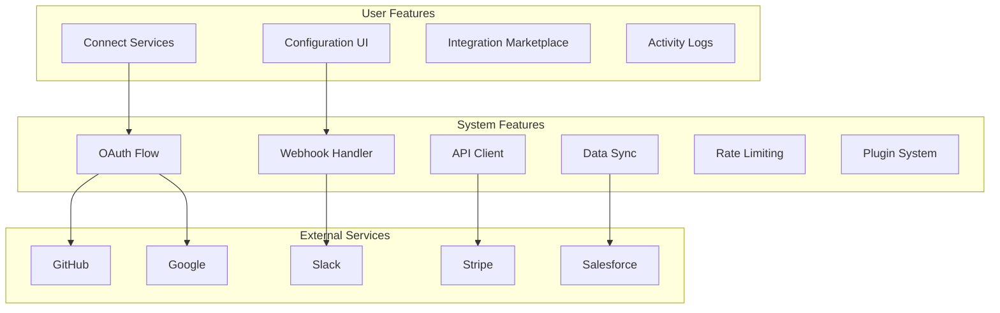
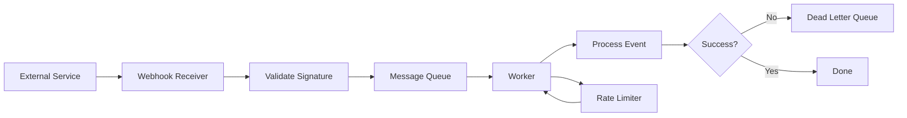

# Integration Stack

**End-to-end architecture for connecting external services, APIs, OAuth, and webhooks**

---

## Stack Overview



---

## 📊 System Features

### 1. OAuth 2.0 Integration

**Architecture Decision**: Authorization flow pattern

```mermaid
sequenceDiagram
    participant User
    participant App
    participant AuthServer
    participant Resource
    
    User->>App: Click "Connect GitHub"
    App->>App: Generate state token
    App->>AuthServer: Redirect with client_id, scope, state
    AuthServer->>User: Show consent screen
    User->>AuthServer: Approve
    AuthServer->>App: Redirect with code
    App->>App: Verify state
    App->>AuthServer: Exchange code for tokens
    AuthServer->>App: Access token + refresh token
    App->>Resource: API call with access token
    Resource->>App: Protected data
```



**OAuth Provider Comparison**:

| Provider | Use Case | Pros | Cons |
|----------|----------|------|------|
| **Auth0** | Full-service | Easy, 30+ providers | Expensive |
| **Clerk** | Modern SaaS | Great DX, embeddable | Limited customization |
| **NextAuth** | Next.js apps | Free, flexible | DIY maintenance |
| **Passport.js** | Node/Express | Mature, 500+ strategies | Manual setup |
| **Custom** | Full control | Total flexibility | Complex, security risk |

**Implementation: OAuth Client**

```typescript
// OAuth flow manager
class OAuthManager {
  private providers = new Map<string, OAuthProvider>();

  registerProvider(name: string, config: OAuthConfig): void {
    this.providers.set(name, new OAuthProvider(name, config));
  }

  async initiateFlow(provider: string, userId: string): Promise<string> {
    const oauth = this.providers.get(provider);
    if (!oauth) throw new Error(`Unknown provider: ${provider}`);

    // Generate state token (CSRF protection)
    const state = await this.generateState(userId, provider);

    // Build authorization URL
    const authUrl = oauth.getAuthorizationUrl({
      state,
      redirectUri: oauth.config.callbackUrl,
      scope: oauth.config.scope.join(' '),
    });

    return authUrl;
  }

  async handleCallback(
    provider: string,
    code: string,
    state: string
  ): Promise<OAuthTokens> {
    // Verify state token
    const { userId } = await this.verifyState(state);

    const oauth = this.providers.get(provider);
    if (!oauth) throw new Error(`Unknown provider: ${provider}`);

    // Exchange code for tokens
    const tokens = await oauth.exchangeCode(code);

    // Store tokens (encrypted)
    await this.storeTokens(userId, provider, tokens);

    // Fetch user info
    const userInfo = await oauth.getUserInfo(tokens.accessToken);

    // Store connection
    await db.connections.create({
      data: {
        userId,
        provider,
        externalId: userInfo.id,
        email: userInfo.email,
        metadata: userInfo,
        accessToken: await encrypt(tokens.accessToken),
        refreshToken: await encrypt(tokens.refreshToken),
        expiresAt: new Date(Date.now() + tokens.expiresIn * 1000),
      },
    });

    return tokens;
  }

  async refreshToken(connectionId: string): Promise<OAuthTokens> {
    const connection = await db.connections.findUnique({
      where: { id: connectionId },
    });

    if (!connection) throw new Error('Connection not found');

    const oauth = this.providers.get(connection.provider);
    if (!oauth) throw new Error(`Unknown provider: ${connection.provider}`);

    // Decrypt refresh token
    const refreshToken = await decrypt(connection.refreshToken);

    // Request new tokens
    const tokens = await oauth.refresh(refreshToken);

    // Update stored tokens
    await db.connections.update({
      where: { id: connectionId },
      data: {
        accessToken: await encrypt(tokens.accessToken),
        refreshToken: tokens.refreshToken 
          ? await encrypt(tokens.refreshToken)
          : connection.refreshToken,
        expiresAt: new Date(Date.now() + tokens.expiresIn * 1000),
      },
    });

    return tokens;
  }

  private async generateState(userId: string, provider: string): Promise<string> {
    const state = crypto.randomBytes(32).toString('hex');
    
    await redis.setex(
      `oauth:state:${state}`,
      600, // 10 minutes
      JSON.stringify({ userId, provider })
    );

    return state;
  }

  private async verifyState(state: string): Promise<{ userId: string; provider: string }> {
    const data = await redis.get(`oauth:state:${state}`);
    if (!data) throw new Error('Invalid or expired state');

    await redis.del(`oauth:state:${state}`);
    return JSON.parse(data);
  }
}

// OAuth provider implementation
class OAuthProvider {
  constructor(
    private name: string,
    private config: OAuthConfig
  ) {}

  getAuthorizationUrl(params: AuthUrlParams): string {
    const url = new URL(this.config.authorizationEndpoint);
    
    url.searchParams.set('client_id', this.config.clientId);
    url.searchParams.set('redirect_uri', params.redirectUri);
    url.searchParams.set('response_type', 'code');
    url.searchParams.set('scope', params.scope);
    url.searchParams.set('state', params.state);

    return url.toString();
  }

  async exchangeCode(code: string): Promise<OAuthTokens> {
    const response = await fetch(this.config.tokenEndpoint, {
      method: 'POST',
      headers: {
        'Content-Type': 'application/x-www-form-urlencoded',
        'Accept': 'application/json',
      },
      body: new URLSearchParams({
        grant_type: 'authorization_code',
        code,
        client_id: this.config.clientId,
        client_secret: this.config.clientSecret,
        redirect_uri: this.config.callbackUrl,
      }),
    });

    if (!response.ok) {
      throw new Error(`Token exchange failed: ${response.statusText}`);
    }

    const data = await response.json();

    return {
      accessToken: data.access_token,
      refreshToken: data.refresh_token,
      expiresIn: data.expires_in,
      tokenType: data.token_type,
    };
  }

  async refresh(refreshToken: string): Promise<OAuthTokens> {
    const response = await fetch(this.config.tokenEndpoint, {
      method: 'POST',
      headers: {
        'Content-Type': 'application/x-www-form-urlencoded',
        'Accept': 'application/json',
      },
      body: new URLSearchParams({
        grant_type: 'refresh_token',
        refresh_token: refreshToken,
        client_id: this.config.clientId,
        client_secret: this.config.clientSecret,
      }),
    });

    if (!response.ok) {
      throw new Error(`Token refresh failed: ${response.statusText}`);
    }

    return await response.json();
  }

  async getUserInfo(accessToken: string): Promise<UserInfo> {
    const response = await fetch(this.config.userInfoEndpoint, {
      headers: {
        'Authorization': `Bearer ${accessToken}`,
        'Accept': 'application/json',
      },
    });

    if (!response.ok) {
      throw new Error(`Failed to fetch user info: ${response.statusText}`);
    }

    return await response.json();
  }
}

// Provider configurations
const providers = {
  github: {
    clientId: process.env.GITHUB_CLIENT_ID,
    clientSecret: process.env.GITHUB_CLIENT_SECRET,
    authorizationEndpoint: 'https://github.com/login/oauth/authorize',
    tokenEndpoint: 'https://github.com/login/oauth/access_token',
    userInfoEndpoint: 'https://api.github.com/user',
    callbackUrl: `${process.env.APP_URL}/api/auth/callback/github`,
    scope: ['user', 'repo'],
  },
  google: {
    clientId: process.env.GOOGLE_CLIENT_ID,
    clientSecret: process.env.GOOGLE_CLIENT_SECRET,
    authorizationEndpoint: 'https://accounts.google.com/o/oauth2/v2/auth',
    tokenEndpoint: 'https://oauth2.googleapis.com/token',
    userInfoEndpoint: 'https://www.googleapis.com/oauth2/v2/userinfo',
    callbackUrl: `${process.env.APP_URL}/api/auth/callback/google`,
    scope: ['openid', 'email', 'profile'],
  },
  slack: {
    clientId: process.env.SLACK_CLIENT_ID,
    clientSecret: process.env.SLACK_CLIENT_SECRET,
    authorizationEndpoint: 'https://slack.com/oauth/v2/authorize',
    tokenEndpoint: 'https://slack.com/api/oauth.v2.access',
    userInfoEndpoint: 'https://slack.com/api/users.identity',
    callbackUrl: `${process.env.APP_URL}/api/auth/callback/slack`,
    scope: ['chat:write', 'channels:read'],
  },
};

// Initialize OAuth manager
const oauth = new OAuthManager();
Object.entries(providers).forEach(([name, config]) => {
  oauth.registerProvider(name, config);
});

// API routes
app.get('/api/connect/:provider', async (req, res) => {
  const { provider } = req.params;
  const userId = req.user.id;

  try {
    const authUrl = await oauth.initiateFlow(provider, userId);
    res.redirect(authUrl);
  } catch (error) {
    res.status(400).json({ error: error.message });
  }
});

app.get('/api/auth/callback/:provider', async (req, res) => {
  const { provider } = req.params;
  const { code, state } = req.query;

  try {
    await oauth.handleCallback(provider, code, state);
    res.redirect('/settings/integrations?success=true');
  } catch (error) {
    res.redirect('/settings/integrations?error=' + encodeURIComponent(error.message));
  }
});
```

---

### 2. Webhook System

**Architecture Decision**: Reliable webhook delivery



**Implementation: Webhook Handler**

```typescript
// Webhook receiver with validation
class WebhookHandler {
  private handlers = new Map<string, WebhookProcessor>();

  registerHandler(provider: string, processor: WebhookProcessor): void {
    this.handlers.set(provider, processor);
  }

  async receive(req: Request): Promise<Response> {
    const provider = req.params.provider;
    const processor = this.handlers.get(provider);

    if (!processor) {
      return new Response('Unknown provider', { status: 404 });
    }

    // Verify signature
    const isValid = await this.verifySignature(req, processor);
    if (!isValid) {
      return new Response('Invalid signature', { status: 401 });
    }

    // Parse payload
    const payload = await req.json();

    // Queue for processing (don't block response)
    await this.queueWebhook({
      provider,
      payload,
      headers: Object.fromEntries(req.headers),
      receivedAt: new Date(),
    });

    // Acknowledge receipt immediately
    return new Response('OK', { status: 200 });
  }

  private async verifySignature(
    req: Request,
    processor: WebhookProcessor
  ): Promise<boolean> {
    const signature = req.headers.get(processor.signatureHeader);
    if (!signature) return false;

    const payload = await req.text();
    const expected = processor.calculateSignature(payload);

    // Timing-safe comparison
    return crypto.timingSafeEqual(
      Buffer.from(signature),
      Buffer.from(expected)
    );
  }

  private async queueWebhook(webhook: QueuedWebhook): Promise<void> {
    await queue.add('webhook-processing', webhook, {
      attempts: 3,
      backoff: {
        type: 'exponential',
        delay: 2000,
      },
    });
  }
}

// GitHub webhook processor
class GitHubWebhookProcessor implements WebhookProcessor {
  signatureHeader = 'x-hub-signature-256';
  secret = process.env.GITHUB_WEBHOOK_SECRET;

  calculateSignature(payload: string): string {
    return `sha256=${crypto
      .createHmac('sha256', this.secret)
      .update(payload)
      .digest('hex')}`;
  }

  async process(webhook: QueuedWebhook): Promise<void> {
    const event = webhook.headers['x-github-event'];
    const payload = webhook.payload;

    switch (event) {
      case 'push':
        await this.handlePush(payload);
        break;
      case 'pull_request':
        await this.handlePullRequest(payload);
        break;
      case 'issues':
        await this.handleIssue(payload);
        break;
      default:
        console.log(`Unhandled GitHub event: ${event}`);
    }
  }

  private async handlePush(payload: any): Promise<void> {
    const { repository, commits, pusher } = payload;

    // Create activity log
    await db.activities.create({
      data: {
        type: 'github_push',
        userId: await this.findUserByGitHub(pusher.name),
        metadata: {
          repository: repository.full_name,
          commits: commits.length,
          branch: payload.ref.replace('refs/heads/', ''),
        },
      },
    });

    // Trigger CI/CD if configured
    if (await this.hasCICDEnabled(repository.id)) {
      await cicd.trigger({
        repository: repository.full_name,
        commit: payload.after,
      });
    }
  }

  private async handlePullRequest(payload: any): Promise<void> {
    const { action, pull_request } = payload;

    if (action === 'opened') {
      // Notify team
      await notifications.send({
        type: 'pull_request_opened',
        title: pull_request.title,
        url: pull_request.html_url,
        author: pull_request.user.login,
      });

      // Run automated checks
      await checks.run(pull_request.head.sha);
    }
  }
}

// Stripe webhook processor
class StripeWebhookProcessor implements WebhookProcessor {
  signatureHeader = 'stripe-signature';
  secret = process.env.STRIPE_WEBHOOK_SECRET;

  calculateSignature(payload: string): string {
    // Stripe uses a more complex signature scheme
    return crypto
      .createHmac('sha256', this.secret)
      .update(payload)
      .digest('hex');
  }

  async process(webhook: QueuedWebhook): Promise<void> {
    const event = webhook.payload;

    switch (event.type) {
      case 'payment_intent.succeeded':
        await this.handlePaymentSuccess(event.data.object);
        break;
      case 'customer.subscription.updated':
        await this.handleSubscriptionUpdate(event.data.object);
        break;
      case 'invoice.payment_failed':
        await this.handlePaymentFailure(event.data.object);
        break;
    }
  }

  private async handlePaymentSuccess(paymentIntent: any): Promise<void> {
    // Update order status
    await db.orders.update({
      where: { paymentIntentId: paymentIntent.id },
      data: { status: 'paid' },
    });

    // Send confirmation email
    await email.send({
      to: paymentIntent.receipt_email,
      template: 'payment-confirmation',
      data: { amount: paymentIntent.amount / 100 },
    });
  }
}

// Worker for processing webhooks
const webhookWorker = new Worker('webhook-processing', async (job) => {
  const webhook = job.data as QueuedWebhook;
  const processor = webhookHandlers.get(webhook.provider);

  if (!processor) {
    throw new Error(`No processor for ${webhook.provider}`);
  }

  await processor.process(webhook);
}, {
  connection: redisConnection,
  concurrency: 10,
});

// Register processors
const webhookHandler = new WebhookHandler();
webhookHandler.registerHandler('github', new GitHubWebhookProcessor());
webhookHandler.registerHandler('stripe', new StripeWebhookProcessor());

// Express route
app.post('/webhooks/:provider', async (req, res) => {
  const response = await webhookHandler.receive(req);
  res.status(response.status).send(response.body);
});
```

---

### 3. API Client with Rate Limiting

**Implementation: Smart API Client**

```typescript
// API client with automatic retries and rate limiting
class APIClient {
  private rateLimiter: RateLimiter;
  private cache: Cache;

  constructor(config: APIClientConfig) {
    this.rateLimiter = new RateLimiter(config.rateLimit);
    this.cache = new Cache(config.cache);
  }

  async request<T>(endpoint: string, options?: RequestOptions): Promise<T> {
    // Check cache
    const cacheKey = this.getCacheKey(endpoint, options);
    const cached = await this.cache.get(cacheKey);
    if (cached) return cached;

    // Wait for rate limit
    await this.rateLimiter.acquire();

    // Make request with retries
    const response = await this.retryRequest(endpoint, options);

    // Cache response
    if (response.ok && options?.cache !== false) {
      await this.cache.set(cacheKey, await response.json(), options?.cacheTTL);
    }

    return await response.json();
  }

  private async retryRequest(
    endpoint: string,
    options?: RequestOptions,
    attempt: number = 1
  ): Promise<Response> {
    try {
      const response = await fetch(endpoint, {
        ...options,
        headers: {
          ...options?.headers,
          'User-Agent': 'MyApp/1.0',
        },
      });

      // Handle rate limiting
      if (response.status === 429) {
        const retryAfter = parseInt(response.headers.get('retry-after') || '60');
        await this.sleep(retryAfter * 1000);
        return this.retryRequest(endpoint, options, attempt);
      }

      // Retry on server errors
      if (response.status >= 500 && attempt < 3) {
        await this.sleep(Math.pow(2, attempt) * 1000); // Exponential backoff
        return this.retryRequest(endpoint, options, attempt + 1);
      }

      return response;
    } catch (error) {
      if (attempt < 3) {
        await this.sleep(Math.pow(2, attempt) * 1000);
        return this.retryRequest(endpoint, options, attempt + 1);
      }
      throw error;
    }
  }

  private getCacheKey(endpoint: string, options?: RequestOptions): string {
    return crypto
      .createHash('sha256')
      .update(JSON.stringify({ endpoint, options }))
      .digest('hex');
  }

  private sleep(ms: number): Promise<void> {
    return new Promise(resolve => setTimeout(resolve, ms));
  }
}

// Rate limiter implementation
class RateLimiter {
  private tokens: number;
  private lastRefill: number;
  private queue: Array<() => void> = [];

  constructor(
    private config: {
      requestsPerSecond: number;
      burstSize?: number;
    }
  ) {
    this.tokens = config.burstSize || config.requestsPerSecond;
    this.lastRefill = Date.now();
    this.startRefilling();
  }

  async acquire(): Promise<void> {
    if (this.tokens > 0) {
      this.tokens--;
      return;
    }

    // Wait for token
    return new Promise(resolve => {
      this.queue.push(resolve);
    });
  }

  private startRefilling(): void {
    setInterval(() => {
      const now = Date.now();
      const elapsed = (now - this.lastRefill) / 1000;
      const tokensToAdd = elapsed * this.config.requestsPerSecond;

      this.tokens = Math.min(
        this.tokens + tokensToAdd,
        this.config.burstSize || this.config.requestsPerSecond
      );

      this.lastRefill = now;

      // Process queue
      while (this.queue.length > 0 && this.tokens > 0) {
        this.tokens--;
        const resolve = this.queue.shift()!;
        resolve();
      }
    }, 100); // Check every 100ms
  }
}

// Usage: GitHub API client
const githubAPI = new APIClient({
  baseUrl: 'https://api.github.com',
  rateLimit: {
    requestsPerSecond: 1, // GitHub: 5000/hour ≈ 1.4/second
    burstSize: 10,
  },
  cache: {
    ttl: 300, // 5 minutes
  },
});

// Fetch user repos
const repos = await githubAPI.request('/user/repos', {
  headers: {
    'Authorization': `token ${accessToken}`,
  },
  cache: true,
  cacheTTL: 600,
});
```

---

(Continue in separate message for User Features section...)

