# Integration Stack

**End-to-end architecture for connecting external services, APIs, OAuth, and webhooks**

---

## Stack Overview


---

## 📊 System Features

### 1. OAuth 2.0 Integration

**Architecture Decision**: Authorization flow pattern


**OAuth Provider Comparison**:

| Provider | Use Case | Pros | Cons |
|----------|----------|------|------|
| **Auth0** | Full-service | Easy, 30+ providers | Expensive |
| **Clerk** | Modern SaaS | Great DX, embeddable | Limited customization |
| **NextAuth** | Next.js apps | Free, flexible | DIY maintenance |
| **Passport.js** | Node/Express | Mature, 500+ strategies | Manual setup |
| **Custom** | Full control | Total flexibility | Complex, security risk |

**Implementation: OAuth Client**

```typescript
// OAuth flow manager
class OAuthManager {
  private providers = new Map<string, OAuthProvider>();

  registerProvider(name: string, config: OAuthConfig): void {
    this.providers.set(name, new OAuthProvider(name, config));
  }

  async initiateFlow(provider: string, userId: string): Promise<string> {
    const oauth = this.providers.get(provider);
    if (!oauth) throw new Error(`Unknown provider: ${provider}`);

    // Generate state token (CSRF protection)
    const state = await this.generateState(userId, provider);

    // Build authorization URL
    const authUrl = oauth.getAuthorizationUrl({
      state,
      redirectUri: oauth.config.callbackUrl,
      scope: oauth.config.scope.join(' '),
    });

    return authUrl;
  }

  async handleCallback(
    provider: string,
    code: string,
    state: string
  ): Promise<OAuthTokens> {
    // Verify state token
    const { userId } = await this.verifyState(state);

    const oauth = this.providers.get(provider);
    if (!oauth) throw new Error(`Unknown provider: ${provider}`);

    // Exchange code for tokens
    const tokens = await oauth.exchangeCode(code);

    // Store tokens (encrypted)
    await this.storeTokens(userId, provider, tokens);

    // Fetch user info
    const userInfo = await oauth.getUserInfo(tokens.accessToken);

    // Store connection
    await db.connections.create({
      data: {
        userId,
        provider,
        externalId: userInfo.id,
        email: userInfo.email,
        metadata: userInfo,
        accessToken: await encrypt(tokens.accessToken),
        refreshToken: await encrypt(tokens.refreshToken),
        expiresAt: new Date(Date.now() + tokens.expiresIn * 1000),
      },
    });

    return tokens;
  }

  async refreshToken(connectionId: string): Promise<OAuthTokens> {
    const connection = await db.connections.findUnique({
      where: { id: connectionId },
    });

    if (!connection) throw new Error('Connection not found');

    const oauth = this.providers.get(connection.provider);
    if (!oauth) throw new Error(`Unknown provider: ${connection.provider}`);

    // Decrypt refresh token
    const refreshToken = await decrypt(connection.refreshToken);

    // Request new tokens
    const tokens = await oauth.refresh(refreshToken);

    // Update stored tokens
    await db.connections.update({
      where: { id: connectionId },
      data: {
        accessToken: await encrypt(tokens.accessToken),
        refreshToken: tokens.refreshToken 
          ? await encrypt(tokens.refreshToken)
          : connection.refreshToken,
        expiresAt: new Date(Date.now() + tokens.expiresIn * 1000),
      },
    });

    return tokens;
  }

  private async generateState(userId: string, provider: string): Promise<string> {
    const state = crypto.randomBytes(32).toString('hex');
    
    await redis.setex(
      `oauth:state:${state}`,
      600, // 10 minutes
      JSON.stringify({ userId, provider })
    );

    return state;
  }

  private async verifyState(state: string): Promise<{ userId: string; provider: string }> {
    const data = await redis.get(`oauth:state:${state}`);
    if (!data) throw new Error('Invalid or expired state');

    await redis.del(`oauth:state:${state}`);
    return JSON.parse(data);
  }
}

// OAuth provider implementation
class OAuthProvider {
  constructor(
    private name: string,
    private config: OAuthConfig
  ) {}

  getAuthorizationUrl(params: AuthUrlParams): string {
    const url = new URL(this.config.authorizationEndpoint);
    
    url.searchParams.set('client_id', this.config.clientId);
    url.searchParams.set('redirect_uri', params.redirectUri);
    url.searchParams.set('response_type', 'code');
    url.searchParams.set('scope', params.scope);
    url.searchParams.set('state', params.state);

    return url.toString();
  }

  async exchangeCode(code: string): Promise<OAuthTokens> {
    const response = await fetch(this.config.tokenEndpoint, {
      method: 'POST',
      headers: {
        'Content-Type': 'application/x-www-form-urlencoded',
        'Accept': 'application/json',
      },
      body: new URLSearchParams({
        grant_type: 'authorization_code',
        code,
        client_id: this.config.clientId,
        client_secret: this.config.clientSecret,
        redirect_uri: this.config.callbackUrl,
      }),
    });

    if (!response.ok) {
      throw new Error(`Token exchange failed: ${response.statusText}`);
    }

    const data = await response.json();

    return {
      accessToken: data.access_token,
      refreshToken: data.refresh_token,
      expiresIn: data.expires_in,
      tokenType: data.token_type,
    };
  }

  async refresh(refreshToken: string): Promise<OAuthTokens> {
    const response = await fetch(this.config.tokenEndpoint, {
      method: 'POST',
      headers: {
        'Content-Type': 'application/x-www-form-urlencoded',
        'Accept': 'application/json',
      },
      body: new URLSearchParams({
        grant_type: 'refresh_token',
        refresh_token: refreshToken,
        client_id: this.config.clientId,
        client_secret: this.config.clientSecret,
      }),
    });

    if (!response.ok) {
      throw new Error(`Token refresh failed: ${response.statusText}`);
    }

    return await response.json();
  }

  async getUserInfo(accessToken: string): Promise<UserInfo> {
    const response = await fetch(this.config.userInfoEndpoint, {
      headers: {
        'Authorization': `Bearer ${accessToken}`,
        'Accept': 'application/json',
      },
    });

    if (!response.ok) {
      throw new Error(`Failed to fetch user info: ${response.statusText}`);
    }

    return await response.json();
  }
}

// Provider configurations
const providers = {
  github: {
    clientId: process.env.GITHUB_CLIENT_ID,
    clientSecret: process.env.GITHUB_CLIENT_SECRET,
    authorizationEndpoint: 'https://github.com/login/oauth/authorize',
    tokenEndpoint: 'https://github.com/login/oauth/access_token',
    userInfoEndpoint: 'https://api.github.com/user',
    callbackUrl: `${process.env.APP_URL}/api/auth/callback/github`,
    scope: ['user', 'repo'],
  },
  google: {
    clientId: process.env.GOOGLE_CLIENT_ID,
    clientSecret: process.env.GOOGLE_CLIENT_SECRET,
    authorizationEndpoint: 'https://accounts.google.com/o/oauth2/v2/auth',
    tokenEndpoint: 'https://oauth2.googleapis.com/token',
    userInfoEndpoint: 'https://www.googleapis.com/oauth2/v2/userinfo',
    callbackUrl: `${process.env.APP_URL}/api/auth/callback/google`,
    scope: ['openid', 'email', 'profile'],
  },
  slack: {
    clientId: process.env.SLACK_CLIENT_ID,
    clientSecret: process.env.SLACK_CLIENT_SECRET,
    authorizationEndpoint: 'https://slack.com/oauth/v2/authorize',
    tokenEndpoint: 'https://slack.com/api/oauth.v2.access',
    userInfoEndpoint: 'https://slack.com/api/users.identity',
    callbackUrl: `${process.env.APP_URL}/api/auth/callback/slack`,
    scope: ['chat:write', 'channels:read'],
  },
};

// Initialize OAuth manager
const oauth = new OAuthManager();
Object.entries(providers).forEach(([name, config]) => {
  oauth.registerProvider(name, config);
});

// API routes
app.get('/api/connect/:provider', async (req, res) => {
  const { provider } = req.params;
  const userId = req.user.id;

  try {
    const authUrl = await oauth.initiateFlow(provider, userId);
    res.redirect(authUrl);
  } catch (error) {
    res.status(400).json({ error: error.message });
  }
});

app.get('/api/auth/callback/:provider', async (req, res) => {
  const { provider } = req.params;
  const { code, state } = req.query;

  try {
    await oauth.handleCallback(provider, code, state);
    res.redirect('/settings/integrations?success=true');
  } catch (error) {
    res.redirect('/settings/integrations?error=' + encodeURIComponent(error.message));
  }
});
```

---

### 2. Webhook System

**Architecture Decision**: Reliable webhook delivery


**Implementation: Webhook Handler**

```typescript
// Webhook receiver with validation
class WebhookHandler {
  private handlers = new Map<string, WebhookProcessor>();

  registerHandler(provider: string, processor: WebhookProcessor): void {
    this.handlers.set(provider, processor);
  }

  async receive(req: Request): Promise<Response> {
    const provider = req.params.provider;
    const processor = this.handlers.get(provider);

    if (!processor) {
      return new Response('Unknown provider', { status: 404 });
    }

    // Verify signature
    const isValid = await this.verifySignature(req, processor);
    if (!isValid) {
      return new Response('Invalid signature', { status: 401 });
    }

    // Parse payload
    const payload = await req.json();

    // Queue for processing (don't block response)
    await this.queueWebhook({
      provider,
      payload,
      headers: Object.fromEntries(req.headers),
      receivedAt: new Date(),
    });

    // Acknowledge receipt immediately
    return new Response('OK', { status: 200 });
  }

  private async verifySignature(
    req: Request,
    processor: WebhookProcessor
  ): Promise<boolean> {
    const signature = req.headers.get(processor.signatureHeader);
    if (!signature) return false;

    const payload = await req.text();
    const expected = processor.calculateSignature(payload);

    // Timing-safe comparison
    return crypto.timingSafeEqual(
      Buffer.from(signature),
      Buffer.from(expected)
    );
  }

  private async queueWebhook(webhook: QueuedWebhook): Promise<void> {
    await queue.add('webhook-processing', webhook, {
      attempts: 3,
      backoff: {
        type: 'exponential',
        delay: 2000,
      },
    });
  }
}

// GitHub webhook processor
class GitHubWebhookProcessor implements WebhookProcessor {
  signatureHeader = 'x-hub-signature-256';
  secret = process.env.GITHUB_WEBHOOK_SECRET;

  calculateSignature(payload: string): string {
    return `sha256=${crypto
      .createHmac('sha256', this.secret)
      .update(payload)
      .digest('hex')}`;
  }

  async process(webhook: QueuedWebhook): Promise<void> {
    const event = webhook.headers['x-github-event'];
    const payload = webhook.payload;

    switch (event) {
      case 'push':
        await this.handlePush(payload);
        break;
      case 'pull_request':
        await this.handlePullRequest(payload);
        break;
      case 'issues':
        await this.handleIssue(payload);
        break;
      default:
        console.log(`Unhandled GitHub event: ${event}`);
    }
  }

  private async handlePush(payload: any): Promise<void> {
    const { repository, commits, pusher } = payload;

    // Create activity log
    await db.activities.create({
      data: {
        type: 'github_push',
        userId: await this.findUserByGitHub(pusher.name),
        metadata: {
          repository: repository.full_name,
          commits: commits.length,
          branch: payload.ref.replace('refs/heads/', ''),
        },
      },
    });

    // Trigger CI/CD if configured
    if (await this.hasCICDEnabled(repository.id)) {
      await cicd.trigger({
        repository: repository.full_name,
        commit: payload.after,
      });
    }
  }

  private async handlePullRequest(payload: any): Promise<void> {
    const { action, pull_request } = payload;

    if (action === 'opened') {
      // Notify team
      await notifications.send({
        type: 'pull_request_opened',
        title: pull_request.title,
        url: pull_request.html_url,
        author: pull_request.user.login,
      });

      // Run automated checks
      await checks.run(pull_request.head.sha);
    }
  }
}

// Stripe webhook processor
class StripeWebhookProcessor implements WebhookProcessor {
  signatureHeader = 'stripe-signature';
  secret = process.env.STRIPE_WEBHOOK_SECRET;

  calculateSignature(payload: string): string {
    // Stripe uses a more complex signature scheme
    return crypto
      .createHmac('sha256', this.secret)
      .update(payload)
      .digest('hex');
  }

  async process(webhook: QueuedWebhook): Promise<void> {
    const event = webhook.payload;

    switch (event.type) {
      case 'payment_intent.succeeded':
        await this.handlePaymentSuccess(event.data.object);
        break;
      case 'customer.subscription.updated':
        await this.handleSubscriptionUpdate(event.data.object);
        break;
      case 'invoice.payment_failed':
        await this.handlePaymentFailure(event.data.object);
        break;
    }
  }

  private async handlePaymentSuccess(paymentIntent: any): Promise<void> {
    // Update order status
    await db.orders.update({
      where: { paymentIntentId: paymentIntent.id },
      data: { status: 'paid' },
    });

    // Send confirmation email
    await email.send({
      to: paymentIntent.receipt_email,
      template: 'payment-confirmation',
      data: { amount: paymentIntent.amount / 100 },
    });
  }
}

// Worker for processing webhooks
const webhookWorker = new Worker('webhook-processing', async (job) => {
  const webhook = job.data as QueuedWebhook;
  const processor = webhookHandlers.get(webhook.provider);

  if (!processor) {
    throw new Error(`No processor for ${webhook.provider}`);
  }

  await processor.process(webhook);
}, {
  connection: redisConnection,
  concurrency: 10,
});

// Register processors
const webhookHandler = new WebhookHandler();
webhookHandler.registerHandler('github', new GitHubWebhookProcessor());
webhookHandler.registerHandler('stripe', new StripeWebhookProcessor());

// Express route
app.post('/webhooks/:provider', async (req, res) => {
  const response = await webhookHandler.receive(req);
  res.status(response.status).send(response.body);
});
```

---

### 3. API Client with Rate Limiting

**Implementation: Smart API Client**

```typescript
// API client with automatic retries and rate limiting
class APIClient {
  private rateLimiter: RateLimiter;
  private cache: Cache;

  constructor(config: APIClientConfig) {
    this.rateLimiter = new RateLimiter(config.rateLimit);
    this.cache = new Cache(config.cache);
  }

  async request<T>(endpoint: string, options?: RequestOptions): Promise<T> {
    // Check cache
    const cacheKey = this.getCacheKey(endpoint, options);
    const cached = await this.cache.get(cacheKey);
    if (cached) return cached;

    // Wait for rate limit
    await this.rateLimiter.acquire();

    // Make request with retries
    const response = await this.retryRequest(endpoint, options);

    // Cache response
    if (response.ok && options?.cache !== false) {
      await this.cache.set(cacheKey, await response.json(), options?.cacheTTL);
    }

    return await response.json();
  }

  private async retryRequest(
    endpoint: string,
    options?: RequestOptions,
    attempt: number = 1
  ): Promise<Response> {
    try {
      const response = await fetch(endpoint, {
        ...options,
        headers: {
          ...options?.headers,
          'User-Agent': 'MyApp/1.0',
        },
      });

      // Handle rate limiting
      if (response.status === 429) {
        const retryAfter = parseInt(response.headers.get('retry-after') || '60');
        await this.sleep(retryAfter * 1000);
        return this.retryRequest(endpoint, options, attempt);
      }

      // Retry on server errors
      if (response.status >= 500 && attempt < 3) {
        await this.sleep(Math.pow(2, attempt) * 1000); // Exponential backoff
        return this.retryRequest(endpoint, options, attempt + 1);
      }

      return response;
    } catch (error) {
      if (attempt < 3) {
        await this.sleep(Math.pow(2, attempt) * 1000);
        return this.retryRequest(endpoint, options, attempt + 1);
      }
      throw error;
    }
  }

  private getCacheKey(endpoint: string, options?: RequestOptions): string {
    return crypto
      .createHash('sha256')
      .update(JSON.stringify({ endpoint, options }))
      .digest('hex');
  }

  private sleep(ms: number): Promise<void> {
    return new Promise(resolve => setTimeout(resolve, ms));
  }
}

// Rate limiter implementation
class RateLimiter {
  private tokens: number;
  private lastRefill: number;
  private queue: Array<() => void> = [];

  constructor(
    private config: {
      requestsPerSecond: number;
      burstSize?: number;
    }
  ) {
    this.tokens = config.burstSize || config.requestsPerSecond;
    this.lastRefill = Date.now();
    this.startRefilling();
  }

  async acquire(): Promise<void> {
    if (this.tokens > 0) {
      this.tokens--;
      return;
    }

    // Wait for token
    return new Promise(resolve => {
      this.queue.push(resolve);
    });
  }

  private startRefilling(): void {
    setInterval(() => {
      const now = Date.now();
      const elapsed = (now - this.lastRefill) / 1000;
      const tokensToAdd = elapsed * this.config.requestsPerSecond;

      this.tokens = Math.min(
        this.tokens + tokensToAdd,
        this.config.burstSize || this.config.requestsPerSecond
      );

      this.lastRefill = now;

      // Process queue
      while (this.queue.length > 0 && this.tokens > 0) {
        this.tokens--;
        const resolve = this.queue.shift()!;
        resolve();
      }
    }, 100); // Check every 100ms
  }
}

// Usage: GitHub API client
const githubAPI = new APIClient({
  baseUrl: 'https://api.github.com',
  rateLimit: {
    requestsPerSecond: 1, // GitHub: 5000/hour ≈ 1.4/second
    burstSize: 10,
  },
  cache: {
    ttl: 300, // 5 minutes
  },
});

// Fetch user repos
const repos = await githubAPI.request('/user/repos', {
  headers: {
    'Authorization': `token ${accessToken}`,
  },
  cache: true,
  cacheTTL: 600,
});
```

---

## 👥 User Features

### 1. Integration Marketplace

**What users see**: Browse, search, and install integrations

```mermaid
graph TB
    Browse[Integration Marketplace] --> Search[Search/Filter]
    Browse --> Featured[Featured Integrations]
    Browse --> Categories[Categories]
    
    Search --> Detail[Integration Detail Page]
    Featured --> Detail
    Categories --> Detail
    
    Detail --> Preview[Preview/Screenshots]
    Detail --> Reviews[User Reviews]
    Detail --> Install[Install Button]
    
    Install --> Config[Configuration Screen]
    Config --> OAuth[OAuth Flow]
    Config --> APIKey[API Key Entry]
    Config --> Test[Test Connection]
    
    Test --> Success[Connected ✓]
    Test --> Error[Error Message]
```



**Implementation: Marketplace UI**

```typescript
// Integration marketplace component
interface Integration {
  id: string;
  name: string;
  provider: string;
  category: 'productivity' | 'communication' | 'crm' | 'payments' | 'analytics';
  description: string;
  logo: string;
  authType: 'oauth' | 'api_key' | 'basic';
  features: string[];
  pricing: 'free' | 'paid' | 'freemium';
  rating: number;
  installs: number;
  verified: boolean;
}

const IntegrationMarketplace: React.FC = () => {
  const [integrations, setIntegrations] = useState<Integration[]>([]);
  const [category, setCategory] = useState<string>('all');
  const [search, setSearch] = useState<string>('');

  useEffect(() => {
    fetchIntegrations();
  }, [category, search]);

  const fetchIntegrations = async () => {
    const response = await fetch('/api/integrations/marketplace', {
      params: { category, search },
    });
    setIntegrations(await response.json());
  };

  return (
    <div className="marketplace">
      <header>
        <h1>Integration Marketplace</h1>
        <SearchBar value={search} onChange={setSearch} />
      </header>

      <aside>
        <CategoryFilter
          categories={['all', 'productivity', 'communication', 'crm', 'payments']}
          active={category}
          onChange={setCategory}
        />
      </aside>

      <main>
        <div className="integration-grid">
          {integrations.map(integration => (
            <IntegrationCard
              key={integration.id}
              integration={integration}
              onInstall={() => handleInstall(integration)}
            />
          ))}
        </div>
      </main>
    </div>
  );
};

// Integration card component
const IntegrationCard: React.FC<{ integration: Integration }> = ({ integration }) => {
  return (
    <div className="card">
      
      
      <div className="header">
        <h3>{integration.name}</h3>
        {integration.verified && <Badge>✓ Verified</Badge>}
      </div>

      <p>{integration.description}</p>

      <div className="features">
        {integration.features.slice(0, 3).map(feature => (
          <Tag key={feature}>{feature}</Tag>
        ))}
      </div>

      <div className="footer">
        <div className="stats">
          <Rating value={integration.rating} />
          <span>{integration.installs.toLocaleString()} installs</span>
        </div>
        
        <Button onClick={onInstall}>
          {integration.pricing === 'paid' && '💰'} Install
        </Button>
      </div>
    </div>
  );
};
```

---

### 2. Connection Setup Flow

**OAuth Configuration UI**

```typescript
// OAuth connection flow
const OAuthSetup: React.FC<{ integration: Integration }> = ({ integration }) => {
  const [step, setStep] = useState<'permissions' | 'connecting' | 'success'>('permissions');
  const [scopes, setScopes] = useState<string[]>([]);

  const handleConnect = async () => {
    setStep('connecting');

    // Open OAuth window
    const authUrl = await fetch(`/api/connect/${integration.provider}`).then(r => r.text());
    
    const popup = window.open(
      authUrl,
      'oauth',
      'width=600,height=700,scrollbars=yes'
    );

    // Listen for OAuth callback
    window.addEventListener('message', (event) => {
      if (event.data.type === 'oauth-success') {
        popup?.close();
        setStep('success');
      } else if (event.data.type === 'oauth-error') {
        popup?.close();
        alert('Connection failed: ' + event.data.error);
        setStep('permissions');
      }
    });
  };

  if (step === 'permissions') {
    return (
      <div className="oauth-setup">
        <h2>Connect {integration.name}</h2>
        
        <p>This integration will be able to:</p>
        
        <ul className="permissions">
          {integration.permissions.map(permission => (
            <li key={permission}>
              <Icon name="check" /> {permission}
            </li>
          ))}
        </ul>

        <div className="actions">
          <Button variant="secondary" onClick={onCancel}>
            Cancel
          </Button>
          <Button variant="primary" onClick={handleConnect}>
            Continue to {integration.provider}
          </Button>
        </div>
      </div>
    );
  }

  if (step === 'connecting') {
    return (
      <div className="connecting">
        <Spinner />
        <p>Connecting to {integration.name}...</p>
        <p className="hint">A popup window should open. Please allow popups for this site.</p>
      </div>
    );
  }

  return (
    <div className="success">
      <Icon name="check-circle" size="large" color="green" />
      <h2>Connected!</h2>
      <p>{integration.name} is now connected to your account.</p>
      <Button onClick={onClose}>Done</Button>
    </div>
  );
};

// API Key setup (alternative to OAuth)
const APIKeySetup: React.FC<{ integration: Integration }> = ({ integration }) => {
  const [apiKey, setApiKey] = useState('');
  const [testing, setTesting] = useState(false);
  const [error, setError] = useState<string | null>(null);

  const handleTest = async () => {
    setTesting(true);
    setError(null);

    try {
      const response = await fetch('/api/integrations/test', {
        method: 'POST',
        body: JSON.stringify({
          provider: integration.provider,
          credentials: { apiKey },
        }),
      });

      if (!response.ok) {
        throw new Error(await response.text());
      }

      // Save on success
      await fetch('/api/integrations/save', {
        method: 'POST',
        body: JSON.stringify({
          provider: integration.provider,
          credentials: { apiKey },
        }),
      });

      onSuccess();
    } catch (err) {
      setError(err.message);
    } finally {
      setTesting(false);
    }
  };

  return (
    <div className="api-key-setup">
      <h2>Configure {integration.name}</h2>

      <label>
        API Key
        <input
          type="password"
          value={apiKey}
          onChange={(e) => setApiKey(e.target.value)}
          placeholder="sk_live_..."
        />
        <a href={integration.docsUrl} target="_blank">
          Where do I find my API key?
        </a>
      </label>

      {error && (
        <Alert variant="error">
          <strong>Connection failed:</strong> {error}
        </Alert>
      )}

      <div className="actions">
        <Button variant="secondary" onClick={onCancel}>
          Cancel
        </Button>
        <Button
          variant="primary"
          onClick={handleTest}
          disabled={!apiKey || testing}
        >
          {testing ? 'Testing...' : 'Test Connection'}
        </Button>
      </div>
    </div>
  );
};
```

---

### 3. Active Integrations Dashboard

**User's Connected Integrations**

```typescript
// Active integrations view
const ActiveIntegrations: React.FC = () => {
  const [connections, setConnections] = useState<Connection[]>([]);

  useEffect(() => {
    fetchConnections();
  }, []);

  const fetchConnections = async () => {
    const response = await fetch('/api/integrations/connections');
    setConnections(await response.json());
  };

  const handleDisconnect = async (connectionId: string) => {
    if (!confirm('Are you sure you want to disconnect this integration?')) {
      return;
    }

    await fetch(`/api/integrations/connections/${connectionId}`, {
      method: 'DELETE',
    });

    setConnections(connections.filter(c => c.id !== connectionId));
  };

  const handleConfigure = (connection: Connection) => {
    // Open configuration modal
    openModal(<IntegrationConfig connection={connection} />);
  };

  return (
    <div className="active-integrations">
      <header>
        <h1>Your Integrations</h1>
        <Button onClick={() => navigate('/marketplace')}>
          + Add Integration
        </Button>
      </header>

      <div className="connections-list">
        {connections.length === 0 ? (
          <EmptyState
            icon="plug"
            title="No integrations yet"
            description="Connect your favorite tools to sync data and automate workflows."
            action={
              <Button onClick={() => navigate('/marketplace')}>
                Browse Marketplace
              </Button>
            }
          />
        ) : (
          connections.map(connection => (
            <ConnectionCard
              key={connection.id}
              connection={connection}
              onDisconnect={() => handleDisconnect(connection.id)}
              onConfigure={() => handleConfigure(connection)}
            />
          ))
        )}
      </div>
    </div>
  );
};

// Connection card with status
const ConnectionCard: React.FC<{
  connection: Connection;
  onDisconnect: () => void;
  onConfigure: () => void;
}> = ({ connection, onDisconnect, onConfigure }) => {
  const statusColor = {
    active: 'green',
    error: 'red',
    warning: 'yellow',
  }[connection.status];

  return (
    <div className="connection-card">
      <div className="header">
        
        <div>
          <h3>{connection.integration.name}</h3>
          <span className={`status ${statusColor}`}>
            {connection.status}
          </span>
        </div>
      </div>

      <div className="info">
        <div>
          <label>Connected Account</label>
          <p>{connection.externalEmail || connection.externalId}</p>
        </div>
        
        <div>
          <label>Last Synced</label>
          <p>{formatDistanceToNow(connection.lastSync)} ago</p>
        </div>

        <div>
          <label>Data Synced</label>
          <p>{connection.syncedRecords.toLocaleString()} records</p>
        </div>
      </div>

      {connection.status === 'error' && (
        <Alert variant="error">
          <strong>Connection Error:</strong> {connection.errorMessage}
          <Button size="small" onClick={() => retryConnection(connection.id)}>
            Retry
          </Button>
        </Alert>
      )}

      <div className="actions">
        <Button variant="ghost" onClick={onConfigure}>
          Configure
        </Button>
        <Button variant="ghost" onClick={() => viewLogs(connection.id)}>
          View Logs
        </Button>
        <Button variant="ghost" color="danger" onClick={onDisconnect}>
          Disconnect
        </Button>
      </div>
    </div>
  );
};
```

---

### 4. Activity Logs & Debugging

**View Integration Activity**

```typescript
// Activity logs for debugging
const IntegrationLogs: React.FC<{ connectionId: string }> = ({ connectionId }) => {
  const [logs, setLogs] = useState<LogEntry[]>([]);
  const [filter, setFilter] = useState<'all' | 'success' | 'error'>('all');

  useEffect(() => {
    fetchLogs();
    
    // Real-time updates via SSE
    const eventSource = new EventSource(`/api/integrations/${connectionId}/logs/stream`);
    
    eventSource.onmessage = (event) => {
      const newLog = JSON.parse(event.data);
      setLogs(prev => [newLog, ...prev]);
    };

    return () => eventSource.close();
  }, [connectionId]);

  const filteredLogs = logs.filter(log => {
    if (filter === 'all') return true;
    return log.status === filter;
  });

  return (
    <div className="integration-logs">
      <header>
        <h2>Activity Logs</h2>
        
        <div className="filters">
          <ButtonGroup>
            <Button
              active={filter === 'all'}
              onClick={() => setFilter('all')}
            >
              All
            </Button>
            <Button
              active={filter === 'success'}
              onClick={() => setFilter('success')}
            >
              Success
            </Button>
            <Button
              active={filter === 'error'}
              onClick={() => setFilter('error')}
            >
              Errors
            </Button>
          </ButtonGroup>
          
          <Button onClick={() => exportLogs(logs)}>
            Export CSV
          </Button>
        </div>
      </header>

      <table>
        <thead>
          <tr>
            <th>Timestamp</th>
            <th>Event</th>
            <th>Status</th>
            <th>Details</th>
            <th></th>
          </tr>
        </thead>
        <tbody>
          {filteredLogs.map(log => (
            <tr key={log.id} className={log.status}>
              <td>{format(log.timestamp, 'PPpp')}</td>
              <td>
                <code>{log.eventType}</code>
              </td>
              <td>
                <Badge color={log.status === 'success' ? 'green' : 'red'}>
                  {log.status}
                </Badge>
              </td>
              <td>
                {log.status === 'error' ? (
                  <span className="error">{log.errorMessage}</span>
                ) : (
                  <span>{log.summary}</span>
                )}
              </td>
              <td>
                <Button
                  size="small"
                  variant="ghost"
                  onClick={() => viewDetails(log)}
                >
                  Details
                </Button>
              </td>
            </tr>
          ))}
        </tbody>
      </table>
    </div>
  );
};

// Log detail modal
const LogDetailModal: React.FC<{ log: LogEntry }> = ({ log }) => {
  return (
    <Modal title="Log Details" onClose={onClose}>
      <div className="log-detail">
        <section>
          <h3>Event Information</h3>
          <dl>
            <dt>Timestamp</dt>
            <dd>{log.timestamp.toISOString()}</dd>
            
            <dt>Event Type</dt>
            <dd><code>{log.eventType}</code></dd>
            
            <dt>Status</dt>
            <dd><Badge color={log.status}>{log.status}</Badge></dd>
            
            <dt>Duration</dt>
            <dd>{log.duration}ms</dd>
          </dl>
        </section>

        {log.request && (
          <section>
            <h3>Request</h3>
            <CodeBlock language="json">
              {JSON.stringify(log.request, null, 2)}
            </CodeBlock>
          </section>
        )}

        {log.response && (
          <section>
            <h3>Response</h3>
            <CodeBlock language="json">
              {JSON.stringify(log.response, null, 2)}
            </CodeBlock>
          </section>
        )}

        {log.errorStack && (
          <section>
            <h3>Error Stack Trace</h3>
            <pre className="error-stack">{log.errorStack}</pre>
          </section>
        )}

        <div className="actions">
          {log.status === 'error' && (
            <Button onClick={() => retryEvent(log.id)}>
              Retry
            </Button>
          )}
          <Button onClick={() => copyToClipboard(JSON.stringify(log, null, 2))}>
            Copy JSON
          </Button>
        </div>
      </div>
    </Modal>
  );
};
```

---

### 5. Webhook Management UI

**Configure Incoming Webhooks**

```typescript
// Webhook management interface
const WebhookSettings: React.FC<{ connectionId: string }> = ({ connectionId }) => {
  const [webhooks, setWebhooks] = useState<Webhook[]>([]);

  const createWebhook = async (eventTypes: string[]) => {
    const response = await fetch(`/api/integrations/${connectionId}/webhooks`, {
      method: 'POST',
      body: JSON.stringify({ eventTypes }),
    });

    const webhook = await response.json();
    setWebhooks([...webhooks, webhook]);
  };

  return (
    <div className="webhook-settings">
      <h2>Webhooks</h2>
      
      <p>
        Receive real-time updates when events occur in your connected service.
      </p>

      <div className="webhooks-list">
        {webhooks.map(webhook => (
          <WebhookCard key={webhook.id} webhook={webhook} />
        ))}
      </div>

      <Button onClick={() => openCreateWebhookModal()}>
        + Create Webhook
      </Button>
    </div>
  );
};

const WebhookCard: React.FC<{ webhook: Webhook }> = ({ webhook }) => {
  const [showSecret, setShowSecret] = useState(false);

  return (
    <div className="webhook-card">
      <div className="header">
        <h3>Webhook #{webhook.id.slice(0, 8)}</h3>
        <Toggle
          checked={webhook.enabled}
          onChange={(enabled) => updateWebhook(webhook.id, { enabled })}
        />
      </div>

      <div className="url">
        <label>Webhook URL</label>
        <CopyableCode>{webhook.url}</CopyableCode>
      </div>

      <div className="secret">
        <label>Signing Secret</label>
        <div className="secret-field">
          <input
            type={showSecret ? 'text' : 'password'}
            value={webhook.secret}
            readOnly
          />
          <Button
            size="small"
            onClick={() => setShowSecret(!showSecret)}
          >
            {showSecret ? 'Hide' : 'Show'}
          </Button>
          <Button
            size="small"
            onClick={() => copyToClipboard(webhook.secret)}
          >
            Copy
          </Button>
        </div>
      </div>

      <div className="events">
        <label>Subscribed Events</label>
        <div className="event-tags">
          {webhook.eventTypes.map(event => (
            <Tag key={event}>{event}</Tag>
          ))}
        </div>
      </div>

      <div className="stats">
        <div>
          <label>Deliveries (24h)</label>
          <p>{webhook.deliveriesLast24h}</p>
        </div>
        <div>
          <label>Success Rate</label>
          <p>{webhook.successRate}%</p>
        </div>
        <div>
          <label>Last Delivery</label>
          <p>{formatDistanceToNow(webhook.lastDelivery)} ago</p>
        </div>
      </div>

      <div className="actions">
        <Button onClick={() => viewDeliveries(webhook.id)}>
          View Deliveries
        </Button>
        <Button onClick={() => testWebhook(webhook.id)}>
          Send Test Event
        </Button>
        <Button color="danger" onClick={() => deleteWebhook(webhook.id)}>
          Delete
        </Button>
      </div>
    </div>
  );
};
```

---

## 🔗 Cross-Stack References

### Integration Stack Interacts With:

- **Auth Stack** → OAuth flows, API key storage
- **Data Stack** → Cache API responses, store connection metadata
- **Analytics Stack** → Track integration usage, monitor API calls
- **Notification Stack** → Alert on integration failures
- **Admin Stack** → Manage integrations, view all connections

---

## 📋 Implementation Checklist

### System Features
- [ ] OAuth 2.0 manager with state management
- [ ] Webhook receiver with signature validation
- [ ] API client with rate limiting & retries
- [ ] Plugin architecture (hooks/sandboxing)
- [ ] Data sync engine (incremental updates)
- [ ] Error handling & circuit breakers
- [ ] Connection health monitoring

### User Features
- [ ] Integration marketplace UI
- [ ] OAuth/API key setup flows
- [ ] Active integrations dashboard
- [ ] Connection status & health checks
- [ ] Activity logs with filtering
- [ ] Webhook management interface
- [ ] Test connection functionality
- [ ] Export/import connection configs

### Security & Compliance
- [ ] Encrypted credential storage (Vault)
- [ ] Webhook signature validation (HMAC)
- [ ] Rate limit enforcement
- [ ] Audit logging (all API calls)
- [ ] Permission scopes (least privilege)
- [ ] Token rotation (refresh tokens)

### Monitoring & Debugging
- [ ] Integration usage dashboards
- [ ] Error rate tracking
- [ ] Latency monitoring (P50, P95, P99)
- [ ] Real-time log streaming (SSE)
- [ ] Webhook delivery tracking
- [ ] Failed request retry queue

---

## 🎯 Key Decisions

### When to Build vs. Buy

| Scenario | Recommendation |
|----------|----------------|
| **Standard OAuth providers** (Google, GitHub, Slack) | Use auth library (Passport.js, NextAuth) |
| **Payment processing** | ALWAYS use Stripe/PayPal (PCI compliance) |
| **Custom B2B integrations** | Build custom (unique requirements) |
| **High-volume webhooks** | Build (control, cost) |
| **Low-volume webhooks** | Consider Zapier/Make (faster) |

### OAuth vs. API Keys

| Use OAuth When | Use API Keys When |
|----------------|-------------------|
| User grants access to their data | Server-to-server communication |
| Delegated authorization needed | No user involvement |
| Token expiration/refresh important | Long-lived credentials OK |
| Example: GitHub, Google, Slack | Example: Stripe, SendGrid, Twilio |

### Webhook Security

**ALWAYS**:
- Validate signatures (HMAC-SHA256)
- Use HTTPS only
- Implement replay protection (timestamp checks)
- Rate limit webhook endpoints
- Return 2xx immediately (process async)

**NEVER**:
- Trust webhook payload without validation
- Expose internal IDs in webhook URLs
- Process synchronously (blocks response)

---

## 🚀 Getting Started

### Quick Start: GitHub Integration

```typescript
// 1. Register OAuth app at github.com/settings/developers
// 2. Add credentials to env
process.env.GITHUB_CLIENT_ID = 'your_client_id';
process.env.GITHUB_CLIENT_SECRET = 'your_client_secret';
process.env.GITHUB_WEBHOOK_SECRET = 'your_webhook_secret';

// 3. Initialize OAuth manager
const oauth = new OAuthManager();
oauth.registerProvider('github', {
  clientId: process.env.GITHUB_CLIENT_ID,
  clientSecret: process.env.GITHUB_CLIENT_SECRET,
  authorizationEndpoint: 'https://github.com/login/oauth/authorize',
  tokenEndpoint: 'https://github.com/login/oauth/access_token',
  userInfoEndpoint: 'https://api.github.com/user',
  callbackUrl: `${process.env.APP_URL}/api/auth/callback/github`,
  scope: ['user', 'repo'],
});

// 4. Set up routes
app.get('/connect/github', async (req, res) => {
  const authUrl = await oauth.initiateFlow('github', req.user.id);
  res.redirect(authUrl);
});

app.get('/api/auth/callback/github', async (req, res) => {
  await oauth.handleCallback('github', req.query.code, req.query.state);
  res.redirect('/settings/integrations?success=true');
});

// 5. Set up webhook handler
app.post('/webhooks/github', async (req, res) => {
  const response = await webhookHandler.receive(req);
  res.status(response.status).send(response.body);
});
```

---

## 📚 Further Reading

- [OAuth 2.0 Simplified](https://www.oauth.com/)
- [Webhook Security Best Practices](https://webhooks.fyi/security/hmac)
- [API Rate Limiting Strategies](https://blog.logrocket.com/rate-limiting-node-js/)
- [Circuit Breaker Pattern](https://martinfowler.com/bliki/CircuitBreaker.html)
- [Building a Plugin System](https://www.figma.com/blog/how-we-built-the-figma-plugin-system/)

---

**Integration Stack Complete** ✅

This stack provides end-to-end guidance for:
- Connecting to external services (OAuth, API keys)
- Receiving real-time events (webhooks)
- Building extensible plugin systems
- Creating user-friendly integration experiences

