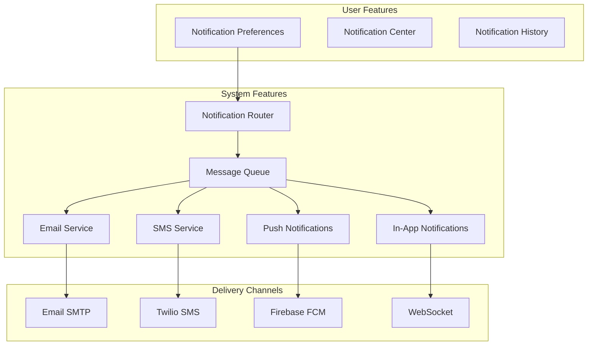

# Notification Stack

**End-to-end notification delivery via email, SMS, push, and in-app channels**

---

## Stack Overview



---

## 📊 System Features

### 1. Notification Router

```typescript
interface Notification {
  userId: string;
  type: string; // 'order_shipped', 'payment_failed', etc.
  title: string;
  message: string;
  data?: Record<string, any>;
  channels?: ('email' | 'sms' | 'push' | 'in_app')[];
  priority: 'low' | 'normal' | 'high' | 'urgent';
}

class NotificationRouter {
  async send(notification: Notification): Promise<void> {
    // Get user preferences
    const prefs = await this.getUserPreferences(notification.userId);
    
    // Determine channels based on preferences and notification type
    const channels = this.selectChannels(notification, prefs);
    
    // Send to each channel
    await Promise.all(
      channels.map(channel => this.sendToChannel(channel, notification))
    );
    
    // Log notification
    await db.notifications.create({
      data: {
        userId: notification.userId,
        type: notification.type,
        channels: channels.join(','),
        sentAt: new Date(),
      },
    });
  }
  
  private selectChannels(
    notification: Notification,
    prefs: UserPreferences
  ): string[] {
    // Priority: explicit channels > user preferences > defaults
    if (notification.channels) {
      return notification.channels;
    }
    
    const channels: string[] = [];
    
    // Check user preferences for this notification type
    const typePref = prefs.notifications?.[notification.type];
    
    if (typePref?.email && prefs.emailEnabled) {
      channels.push('email');
    }
    
    if (typePref?.sms && prefs.smsEnabled) {
      channels.push('sms');
    }
    
    if (typePref?.push && prefs.pushEnabled) {
      channels.push('push');
    }
    
    // Always send in-app (unless user opted out)
    if (prefs.inAppEnabled !== false) {
      channels.push('in_app');
    }
    
    return channels;
  }
}
```

---

### 2. Email Service

```typescript
import nodemailer from 'nodemailer';
import { render } from '@react-email/render';

class EmailService {
  private transporter: nodemailer.Transporter;
  
  constructor() {
    this.transporter = nodemailer.createTransport({
      host: process.env.SMTP_HOST,
      port: 587,
      secure: false,
      auth: {
        user: process.env.SMTP_USER,
        pass: process.env.SMTP_PASS,
      },
    });
  }
  
  async send(to: string, template: string, data: any): Promise<void> {
    // Render React Email template
    const html = render(EmailTemplate({ template, data }));
    
    await this.transporter.sendMail({
      from: process.env.FROM_EMAIL,
      to,
      subject: data.subject,
      html,
    });
  }
}
```

**Email Service Comparison**

| Service | Pros | Cons | Pricing |
|---------|------|------|---------|
| **SendGrid** | Reliable, good deliverability | Expensive at scale | $15/mo (40k emails) |
| **AWS SES** | Cheap, scalable | Manual setup | $0.10/1k emails |
| **Postmark** | Great for transactional | No marketing emails | $15/mo (10k emails) |
| **Mailgun** | Flexible, good API | Deliverability varies | $35/mo (50k emails) |
| **Resend** | Modern DX, React Email | New, smaller | $20/mo (50k emails) |

---

### 3. SMS Service

```typescript
import twilio from 'twilio';

class SMSService {
  private client: twilio.Twilio;
  
  constructor() {
    this.client = twilio(
      process.env.TWILIO_ACCOUNT_SID,
      process.env.TWILIO_AUTH_TOKEN
    );
  }
  
  async send(to: string, message: string): Promise<void> {
    await this.client.messages.create({
      from: process.env.TWILIO_PHONE_NUMBER,
      to,
      body: message,
    });
  }
}
```

---

### 4. Push Notifications

```typescript
import admin from 'firebase-admin';

class PushNotificationService {
  constructor() {
    admin.initializeApp({
      credential: admin.credential.cert({
        projectId: process.env.FIREBASE_PROJECT_ID,
        privateKey: process.env.FIREBASE_PRIVATE_KEY,
        clientEmail: process.env.FIREBASE_CLIENT_EMAIL,
      }),
    });
  }
  
  async send(tokens: string[], notification: Notification): Promise<void> {
    await admin.messaging().sendMulticast({
      tokens,
      notification: {
        title: notification.title,
        body: notification.message,
      },
      data: notification.data,
    });
  }
}
```

---

## 👥 User Features

### 1. Notification Preferences

```typescript
const NotificationPreferences: React.FC = () => {
  const [prefs, setPrefs] = useState<UserPreferences>({});
  
  const toggleChannel = (notifType: string, channel: string) => {
    setPrefs(prev => ({
      ...prev,
      notifications: {
        ...prev.notifications,
        [notifType]: {
          ...prev.notifications?.[notifType],
          [channel]: !prev.notifications?.[notifType]?.[channel],
        },
      },
    }));
  };
  
  return (
    <div className="notification-prefs">
      <h1>Notification Settings</h1>
      
      {notificationTypes.map(type => (
        <PreferenceRow key={type.id}>
          <label>{type.label}</label>
          
          <ChannelToggles>
            <Toggle
              checked={prefs.notifications?.[type.id]?.email}
              onChange={() => toggleChannel(type.id, 'email')}
              label="Email"
            />
            <Toggle
              checked={prefs.notifications?.[type.id]?.sms}
              onChange={() => toggleChannel(type.id, 'sms')}
              label="SMS"
            />
            <Toggle
              checked={prefs.notifications?.[type.id]?.push}
              onChange={() => toggleChannel(type.id, 'push')}
              label="Push"
            />
          </ChannelToggles>
        </PreferenceRow>
      ))}
    </div>
  );
};
```

### 2. Notification Center

```typescript
const NotificationCenter: React.FC = () => {
  const [notifications, setNotifications] = useState<Notification[]>([]);
  const [unreadCount, setUnreadCount] = useState(0);
  
  const markAsRead = async (id: string) => {
    await fetch(`/api/notifications/${id}/read`, { method: 'POST' });
    setNotifications(prev =>
      prev.map(n => (n.id === id ? { ...n, read: true } : n))
    );
  };
  
  return (
    <Dropdown>
      <DropdownTrigger>
        <Bell />
        {unreadCount > 0 && <Badge>{unreadCount}</Badge>}
      </DropdownTrigger>
      
      <DropdownContent>
        <NotificationList>
          {notifications.map(notification => (
            <NotificationItem
              key={notification.id}
              notification={notification}
              onClick={() => markAsRead(notification.id)}
            />
          ))}
        </NotificationList>
      </DropdownContent>
    </Dropdown>
  );
};
```

---

## 📋 Implementation Checklist

### Delivery Channels
- [ ] Email (SendGrid/SES/Postmark)
- [ ] SMS (Twilio/AWS SNS)
- [ ] Push notifications (FCM/APNs)
- [ ] In-app notifications (WebSocket/SSE)
- [ ] Webhook notifications (optional)

### User Features
- [ ] Notification preferences UI
- [ ] Notification center/inbox
- [ ] Mark as read/unread
- [ ] Notification history
- [ ] Quiet hours settings
- [ ] Digest mode (daily/weekly summary)

### System Features
- [ ] Notification router
- [ ] Template system
- [ ] Delivery queue (BullMQ/SQS)
- [ ] Retry logic (exponential backoff)
- [ ] Delivery tracking & analytics
- [ ] Unsubscribe handling

---

**Notification Stack Complete** ✅


