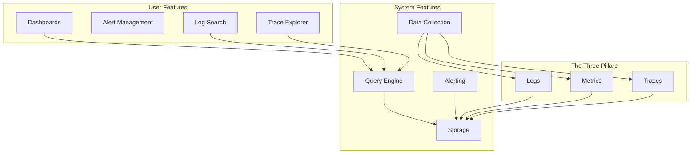
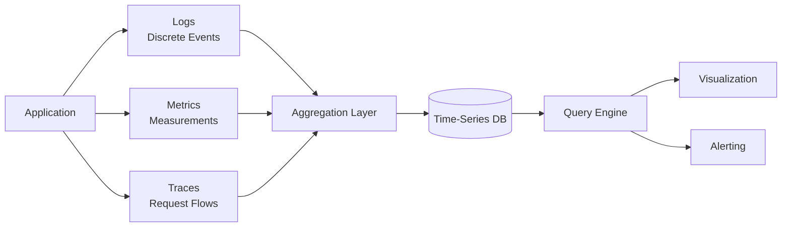
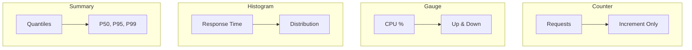
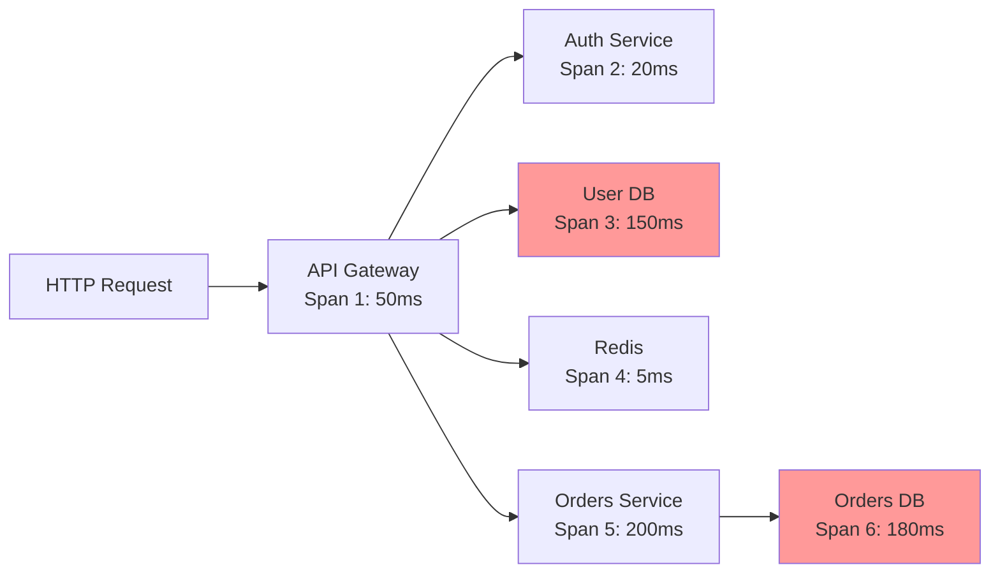

# Observability Stack

**End-to-end architecture for logs, metrics, traces, and alerts**

---

## Stack Overview



---

## 📊 System Features

### 1. The Three Pillars of Observability



**Why All Three?**

| Pillar | Question It Answers | Example |
|--------|---------------------|---------|
| **Logs** | "What happened?" | "User login failed: invalid password" |
| **Metrics** | "How much/many?" | "99th percentile latency: 450ms" |
| **Traces** | "Where is the bottleneck?" | "Database query took 3.2s of 4s total" |

---

### 2. Logging Architecture

**Structured Logging Pattern**

```typescript
// Bad: Unstructured logging
console.log('User login failed');

// Good: Structured logging
logger.error('user_login_failed', {
  userId: user.id,
  email: user.email,
  reason: 'invalid_password',
  ip: req.ip,
  userAgent: req.headers['user-agent'],
  timestamp: new Date().toISOString(),
  requestId: req.id, // For correlation
});
```

**Log Levels & Usage**

| Level | When to Use | Volume | Retention |
|-------|-------------|--------|-----------|
| **ERROR** | Something broke, needs attention | Low | 90 days |
| **WARN** | Something suspicious, might break | Medium | 30 days |
| **INFO** | Important state changes | Medium | 14 days |
| **DEBUG** | Detailed troubleshooting info | High | 3 days |
| **TRACE** | Very detailed (function entry/exit) | Very High | 1 day |

**Implementation: Structured Logger**

```typescript
// Winston-based structured logger
import winston from 'winston';

const logger = winston.createLogger({
  level: process.env.LOG_LEVEL || 'info',
  format: winston.format.combine(
    winston.format.timestamp(),
    winston.format.errors({ stack: true }),
    winston.format.json()
  ),
  defaultMeta: {
    service: 'api',
    environment: process.env.NODE_ENV,
    version: process.env.APP_VERSION,
  },
  transports: [
    // Console (local development)
    new winston.transports.Console({
      format: winston.format.combine(
        winston.format.colorize(),
        winston.format.simple()
      ),
    }),

    // File (backup)
    new winston.transports.File({
      filename: 'logs/error.log',
      level: 'error',
      maxsize: 10485760, // 10MB
      maxFiles: 5,
    }),

    // Remote (production)
    new winston.transports.Http({
      host: 'logs.example.com',
      path: '/api/logs',
      ssl: true,
    }),
  ],
});

// Add request context middleware
app.use((req, res, next) => {
  req.log = logger.child({
    requestId: req.id,
    userId: req.user?.id,
    path: req.path,
    method: req.method,
  });
  next();
});

// Usage in routes
app.post('/api/login', async (req, res) => {
  req.log.info('login_attempt', { email: req.body.email });

  try {
    const user = await authenticate(req.body);
    
    req.log.info('login_success', {
      userId: user.id,
      sessionId: req.session.id,
    });

    res.json({ user });
  } catch (error) {
    req.log.error('login_failed', {
      email: req.body.email,
      reason: error.code,
      error: error.message,
      stack: error.stack,
    });

    res.status(401).json({ error: 'Invalid credentials' });
  }
});
```

**Log Aggregation Stack Comparison**

| Stack | Best For | Pros | Cons |
|-------|----------|------|------|
| **ELK (Elasticsearch + Logstash + Kibana)** | Self-hosted, full-text search | Powerful search, free | Heavy, ops burden |
| **Grafana Loki** | Cost-effective, large volumes | Cheap storage, Prometheus-like | Limited search vs. ES |
| **Datadog** | Turnkey SaaS | Easy, powerful, APM included | Expensive at scale |
| **CloudWatch Logs** | AWS-native | Integrated, simple | Limited outside AWS |
| **Splunk** | Enterprise | Most powerful | Very expensive |

---

### 3. Metrics Collection

**Metrics Types**



**Implementation: Prometheus Metrics**

```typescript
import promClient from 'prom-client';

// Create registry
const register = new promClient.Registry();

// Default metrics (CPU, memory, etc.)
promClient.collectDefaultMetrics({ register });

// Custom metrics
const httpRequestDuration = new promClient.Histogram({
  name: 'http_request_duration_seconds',
  help: 'Duration of HTTP requests in seconds',
  labelNames: ['method', 'route', 'status_code'],
  buckets: [0.001, 0.005, 0.01, 0.05, 0.1, 0.5, 1, 5],
});

const activeConnections = new promClient.Gauge({
  name: 'active_connections',
  help: 'Number of active connections',
});

const loginAttempts = new promClient.Counter({
  name: 'login_attempts_total',
  help: 'Total number of login attempts',
  labelNames: ['status'], // 'success' or 'failure'
});

register.registerMetric(httpRequestDuration);
register.registerMetric(activeConnections);
register.registerMetric(loginAttempts);

// Middleware to track request duration
app.use((req, res, next) => {
  const start = Date.now();

  res.on('finish', () => {
    const duration = (Date.now() - start) / 1000;
    
    httpRequestDuration
      .labels(req.method, req.route?.path || req.path, res.statusCode)
      .observe(duration);
  });

  next();
});

// Track active connections
server.on('connection', (socket) => {
  activeConnections.inc();
  socket.on('close', () => activeConnections.dec());
});

// Track login attempts
app.post('/api/login', async (req, res) => {
  try {
    await authenticate(req.body);
    loginAttempts.labels('success').inc();
    res.json({ success: true });
  } catch (error) {
    loginAttempts.labels('failure').inc();
    res.status(401).json({ error: 'Invalid credentials' });
  }
});

// Metrics endpoint (scraped by Prometheus)
app.get('/metrics', async (req, res) => {
  res.set('Content-Type', register.contentType);
  res.end(await register.metrics());
});
```

**Metrics Stack Comparison**

| Stack | Storage | Query Language | Best For |
|-------|---------|----------------|----------|
| **Prometheus** | Time-series | PromQL | Self-hosted, Kubernetes |
| **Graphite** | Whisper | Graph-style | Legacy, simple metrics |
| **InfluxDB** | TSM | InfluxQL/Flux | IoT, high cardinality |
| **Datadog** | SaaS | Custom | Turnkey solution |
| **CloudWatch** | SaaS | CloudWatch Insights | AWS-native |

---

### 4. Distributed Tracing

**Tracing Concepts**



**OpenTelemetry Implementation**

```typescript
import { NodeTracerProvider } from '@opentelemetry/sdk-trace-node';
import { SimpleSpanProcessor } from '@opentelemetry/sdk-trace-base';
import { JaegerExporter } from '@opentelemetry/exporter-jaeger';
import { registerInstrumentations } from '@opentelemetry/instrumentation';
import { HttpInstrumentation } from '@opentelemetry/instrumentation-http';
import { ExpressInstrumentation } from '@opentelemetry/instrumentation-express';

// Create tracer provider
const provider = new NodeTracerProvider();

// Configure exporter (Jaeger, Zipkin, or OTLP)
const exporter = new JaegerExporter({
  endpoint: 'http://localhost:14268/api/traces',
});

provider.addSpanProcessor(new SimpleSpanProcessor(exporter));
provider.register();

// Auto-instrument HTTP and Express
registerInstrumentations({
  instrumentations: [
    new HttpInstrumentation(),
    new ExpressInstrumentation(),
  ],
});

// Get tracer
const tracer = provider.getTracer('my-app');

// Manual instrumentation for custom spans
app.post('/api/checkout', async (req, res) => {
  const span = tracer.startSpan('checkout');
  
  try {
    // Add custom attributes
    span.setAttribute('user.id', req.user.id);
    span.setAttribute('cart.items', req.body.items.length);
    
    // Child span for database operation
    const dbSpan = tracer.startSpan('db.query', {
      parent: span,
    });
    
    const order = await db.orders.create({
      userId: req.user.id,
      items: req.body.items,
    });
    
    dbSpan.end();
    
    // Child span for external API
    const paymentSpan = tracer.startSpan('payment.charge', {
      parent: span,
    });
    
    await stripe.charges.create({
      amount: order.total,
      source: req.body.paymentMethod,
    });
    
    paymentSpan.end();
    
    span.setStatus({ code: SpanStatusCode.OK });
    res.json({ order });
  } catch (error) {
    span.recordException(error);
    span.setStatus({
      code: SpanStatusCode.ERROR,
      message: error.message,
    });
    res.status(500).json({ error: error.message });
  } finally {
    span.end();
  }
});
```

**Tracing Tools**

| Tool | Type | Pros | Cons |
|------|------|------|------|
| **Jaeger** | OSS | Free, powerful UI, CNCF | Ops burden |
| **Zipkin** | OSS | Simple, mature | Less features than Jaeger |
| **Datadog APM** | SaaS | Turnkey, metrics+traces | Expensive |
| **New Relic** | SaaS | APM leader, powerful | Very expensive |
| **Honeycomb** | SaaS | Best-in-class query | Mid-tier pricing |

---

### 5. Alerting & On-Call

**Alert Rules Engine**

```typescript
// Alert configuration
interface AlertRule {
  id: string;
  name: string;
  query: string; // PromQL, LogQL, or custom
  threshold: number;
  operator: '>' | '<' | '==' | '!=';
  duration: string; // '5m', '1h'
  severity: 'critical' | 'warning' | 'info';
  channels: string[]; // ['slack', 'pagerduty', 'email']
  enabled: boolean;
}

const alertRules: AlertRule[] = [
  {
    id: 'high-error-rate',
    name: 'High Error Rate',
    query: 'rate(http_requests_total{status=~"5.."}[5m])',
    threshold: 0.05, // 5%
    operator: '>',
    duration: '5m',
    severity: 'critical',
    channels: ['pagerduty', 'slack'],
    enabled: true,
  },
  {
    id: 'high-latency',
    name: 'High P95 Latency',
    query: 'histogram_quantile(0.95, rate(http_request_duration_seconds_bucket[5m]))',
    threshold: 1.0, // 1 second
    operator: '>',
    duration: '10m',
    severity: 'warning',
    channels: ['slack'],
    enabled: true,
  },
];

// Alert manager
class AlertManager {
  private rules: Map<string, AlertRule> = new Map();
  private firing: Map<string, Alert> = new Map();

  async evaluateRules(): Promise<void> {
    for (const rule of this.rules.values()) {
      if (!rule.enabled) continue;

      const result = await this.executeQuery(rule.query);
      const shouldFire = this.checkThreshold(result, rule);

      if (shouldFire && !this.firing.has(rule.id)) {
        await this.fireAlert(rule, result);
      } else if (!shouldFire && this.firing.has(rule.id)) {
        await this.resolveAlert(rule.id);
      }
    }
  }

  private async fireAlert(rule: AlertRule, value: number): Promise<void> {
    const alert: Alert = {
      id: crypto.randomUUID(),
      ruleId: rule.id,
      name: rule.name,
      severity: rule.severity,
      value,
      firedAt: new Date(),
      status: 'firing',
    };

    this.firing.set(rule.id, alert);

    // Send to notification channels
    await Promise.all(
      rule.channels.map(channel => this.sendNotification(channel, alert))
    );

    // Log to database
    await db.alerts.create({ data: alert });
  }

  private async sendNotification(channel: string, alert: Alert): Promise<void> {
    switch (channel) {
      case 'slack':
        await slack.send({
          channel: '#alerts',
          text: `🚨 *${alert.severity.toUpperCase()}*: ${alert.name}`,
          attachments: [{
            color: alert.severity === 'critical' ? 'danger' : 'warning',
            fields: [
              { title: 'Value', value: alert.value.toString(), short: true },
              { title: 'Time', value: alert.firedAt.toISOString(), short: true },
            ],
          }],
        });
        break;

      case 'pagerduty':
        await pagerduty.trigger({
          routing_key: process.env.PAGERDUTY_KEY,
          event_action: 'trigger',
          dedup_key: alert.ruleId,
          payload: {
            summary: alert.name,
            severity: alert.severity,
            source: 'monitoring',
            custom_details: { value: alert.value },
          },
        });
        break;

      case 'email':
        await email.send({
          to: process.env.ALERT_EMAIL,
          subject: `[${alert.severity.toUpperCase()}] ${alert.name}`,
          html: `<h2>${alert.name}</h2><p>Value: ${alert.value}</p>`,
        });
        break;
    }
  }

  private async resolveAlert(ruleId: string): Promise<void> {
    const alert = this.firing.get(ruleId);
    if (!alert) return;

    alert.status = 'resolved';
    alert.resolvedAt = new Date();

    await db.alerts.update({
      where: { id: alert.id },
      data: { status: 'resolved', resolvedAt: alert.resolvedAt },
    });

    // Notify resolution
    await slack.send({
      channel: '#alerts',
      text: `✅ *RESOLVED*: ${alert.name}`,
    });

    this.firing.delete(ruleId);
  }
}

// Run evaluation every 30 seconds
setInterval(() => alertManager.evaluateRules(), 30000);
```

---

## 👥 User Features

### 1. Observability Dashboards

```typescript
// Dashboard builder
const ObservabilityDashboard: React.FC = () => {
  const [timeRange, setTimeRange] = useState<TimeRange>('1h');
  const [refreshInterval, setRefreshInterval] = useState<number>(30000);

  return (
    <DashboardLayout>
      <DashboardHeader
        title="System Overview"
        timeRange={timeRange}
        onTimeRangeChange={setTimeRange}
        refreshInterval={refreshInterval}
        onRefreshIntervalChange={setRefreshInterval}
      />

      <DashboardGrid>
        {/* Request Rate */}
        <Panel title="Request Rate" span={2}>
          <TimeSeriesChart
            query="rate(http_requests_total[5m])"
            timeRange={timeRange}
            refreshInterval={refreshInterval}
          />
        </Panel>

        {/* Error Rate */}
        <Panel title="Error Rate" span={2}>
          <TimeSeriesChart
            query='rate(http_requests_total{status=~"5.."}[5m])'
            timeRange={timeRange}
            color="red"
          />
        </Panel>

        {/* P95 Latency */}
        <Panel title="P95 Latency" span={2}>
          <TimeSeriesChart
            query="histogram_quantile(0.95, rate(http_request_duration_seconds_bucket[5m]))"
            timeRange={timeRange}
          />
        </Panel>

        {/* Active Users */}
        <Panel title="Active Users" span={1}>
          <SingleStat
            query="count(count by (user_id) (rate(http_requests_total[5m]) > 0))"
            format="number"
          />
        </Panel>

        {/* CPU Usage */}
        <Panel title="CPU Usage" span={1}>
          <Gauge
            query="avg(rate(process_cpu_seconds_total[5m])) * 100"
            unit="%"
            thresholds={[50, 80, 100]}
          />
        </Panel>

        {/* Memory Usage */}
        <Panel title="Memory Usage" span={1}>
          <Gauge
            query="process_resident_memory_bytes / 1024 / 1024"
            unit="MB"
            thresholds={[512, 1024, 2048]}
          />
        </Panel>

        {/* Top Endpoints by Traffic */}
        <Panel title="Top Endpoints" span={3}>
          <Table
            query="topk(10, sum by (route) (rate(http_requests_total[5m])))"
            columns={['Endpoint', 'RPS']}
          />
        </Panel>
      </DashboardGrid>
    </DashboardLayout>
  );
};
```

### 2. Log Explorer

```typescript
// Log search and filtering
const LogExplorer: React.FC = () => {
  const [query, setQuery] = useState('');
  const [filters, setFilters] = useState<LogFilters>({
    level: 'all',
    service: 'all',
    timeRange: '1h',
  });
  const [logs, setLogs] = useState<LogEntry[]>([]);

  const searchLogs = async () => {
    const results = await fetch('/api/logs/search', {
      method: 'POST',
      body: JSON.stringify({ query, filters }),
    });
    setLogs(await results.json());
  };

  return (
    <div className="log-explorer">
      <SearchBar
        value={query}
        onChange={setQuery}
        placeholder='service="api" AND level="error"'
        onSearch={searchLogs}
      />

      <FilterBar>
        <Select
          label="Level"
          value={filters.level}
          options={['all', 'error', 'warn', 'info', 'debug']}
          onChange={(level) => setFilters({ ...filters, level })}
        />
        
        <Select
          label="Service"
          value={filters.service}
          options={['all', 'api', 'worker', 'scheduler']}
          onChange={(service) => setFilters({ ...filters, service })}
        />
        
        <TimeRangePicker
          value={filters.timeRange}
          onChange={(timeRange) => setFilters({ ...filters, timeRange })}
        />
      </FilterBar>

      <LogTable logs={logs} />
    </div>
  );
};

// Log detail view
const LogDetail: React.FC<{ log: LogEntry }> = ({ log }) => {
  return (
    <Modal title="Log Details">
      <div className="log-detail">
        <section>
          <h3>Metadata</h3>
          <dl>
            <dt>Timestamp</dt>
            <dd>{log.timestamp.toISOString()}</dd>
            
            <dt>Level</dt>
            <dd><Badge color={log.level}>{log.level}</Badge></dd>
            
            <dt>Service</dt>
            <dd>{log.service}</dd>
            
            <dt>Request ID</dt>
            <dd><code>{log.requestId}</code></dd>
          </dl>
        </section>

        <section>
          <h3>Message</h3>
          <pre>{log.message}</pre>
        </section>

        {log.context && (
          <section>
            <h3>Context</h3>
            <CodeBlock language="json">
              {JSON.stringify(log.context, null, 2)}
            </CodeBlock>
          </section>
        )}

        {log.stack && (
          <section>
            <h3>Stack Trace</h3>
            <pre className="stack-trace">{log.stack}</pre>
          </section>
        )}

        <div className="actions">
          <Button onClick={() => searchRelated(log.requestId)}>
            Find Related Logs
          </Button>
          <Button onClick={() => viewTrace(log.traceId)}>
            View Trace
          </Button>
        </div>
      </div>
    </Modal>
  );
};
```

### 3. Alert Management UI

```typescript
// Alert inbox
const AlertInbox: React.FC = () => {
  const [alerts, setAlerts] = useState<Alert[]>([]);
  const [filter, setFilter] = useState<'all' | 'firing' | 'resolved'>('firing');

  const acknowledgeAlert = async (alertId: string) => {
    await fetch(`/api/alerts/${alertId}/acknowledge`, { method: 'POST' });
    // Refresh alerts
  };

  return (
    <div className="alert-inbox">
      <header>
        <h1>Alerts</h1>
        <ButtonGroup>
          <Button active={filter === 'all'} onClick={() => setFilter('all')}>
            All
          </Button>
          <Button active={filter === 'firing'} onClick={() => setFilter('firing')}>
            Firing ({alerts.filter(a => a.status === 'firing').length})
          </Button>
          <Button active={filter === 'resolved'} onClick={() => setFilter('resolved')}>
            Resolved
          </Button>
        </ButtonGroup>
      </header>

      <div className="alert-list">
        {alerts
          .filter(a => filter === 'all' || a.status === filter)
          .map(alert => (
            <AlertCard
              key={alert.id}
              alert={alert}
              onAcknowledge={() => acknowledgeAlert(alert.id)}
            />
          ))}
      </div>
    </div>
  );
};
```

---

## 📋 Implementation Checklist

### Logging
- [ ] Structured logging library (Winston, Pino, Bunyan)
- [ ] Request ID middleware (correlation)
- [ ] Context propagation (userId, orgId)
- [ ] Log aggregation (Loki, ELK, CloudWatch)
- [ ] Log retention policies (14d info, 90d error)
- [ ] PII scrubbing (remove sensitive data)

### Metrics
- [ ] Prometheus client library
- [ ] Custom metrics (business KPIs)
- [ ] Default metrics (CPU, memory, GC)
- [ ] /metrics endpoint (secured)
- [ ] Grafana dashboards
- [ ] Alert rules (high error rate, latency)

### Tracing
- [ ] OpenTelemetry SDK
- [ ] Auto-instrumentation (HTTP, DB, queues)
- [ ] Manual spans (business operations)
- [ ] Trace backend (Jaeger, Zipkin, Datadog)
- [ ] Trace sampling (100% in dev, 1-10% in prod)
- [ ] Cross-service context propagation

### Alerting
- [ ] Alert rule engine
- [ ] Notification channels (Slack, PagerDuty, email)
- [ ] On-call rotation (PagerDuty, Opsgenie)
- [ ] Alert escalation policies
- [ ] Runbook links (how to fix)
- [ ] Alert fatigue prevention (deduplication)

### Dashboards
- [ ] System overview dashboard
- [ ] Service-specific dashboards
- [ ] Business metrics dashboard
- [ ] On-call dashboard (current alerts)
- [ ] SLI/SLO tracking dashboard

---

## 🎯 Best Practices

### Golden Signals (Google SRE)

Monitor these 4 metrics for every service:

| Signal | What | Why | Target |
|--------|------|-----|--------|
| **Latency** | Response time | User experience | P95 < 500ms |
| **Traffic** | Requests/sec | Capacity planning | Baseline + growth |
| **Errors** | Error rate | Reliability | < 0.1% |
| **Saturation** | Resource usage | Avoid outages | CPU < 70%, Memory < 80% |

### Log Levels

```typescript
// ERROR: Something broke, needs immediate attention
logger.error('payment_failed', {
  userId: user.id,
  amount: order.total,
  error: error.message,
});

// WARN: Something suspicious, might break later
logger.warn('slow_query', {
  query: 'SELECT * FROM users',
  duration: 3.2,
  threshold: 1.0,
});

// INFO: Important state changes
logger.info('user_signup', {
  userId: user.id,
  plan: 'pro',
});

// DEBUG: Detailed troubleshooting (production off by default)
logger.debug('cache_miss', {
  key: 'user:123',
  ttl: 300,
});
```

### Alert Fatigue Prevention

- **Group similar alerts** (5 errors in 10 min → 1 alert)
- **Deduplicate** (same alert, same service → 1 alert)
- **Snooze** (maintenance window → suppress alerts)
- **Auto-resolve** (condition cleared → close alert)
- **Escalate** (not ack'd in 15 min → page on-call)

---

## 🚀 Quick Start

### 1. Add Structured Logging

```bash
npm install winston
```

```typescript
import winston from 'winston';

const logger = winston.createLogger({
  level: 'info',
  format: winston.format.json(),
  transports: [
    new winston.transports.Console(),
    new winston.transports.File({ filename: 'error.log', level: 'error' }),
  ],
});

export default logger;
```

### 2. Add Prometheus Metrics

```bash
npm install prom-client
```

```typescript
import promClient from 'prom-client';

const register = new promClient.Registry();
promClient.collectDefaultMetrics({ register });

app.get('/metrics', async (req, res) => {
  res.set('Content-Type', register.contentType);
  res.end(await register.metrics());
});
```

### 3. Add OpenTelemetry Tracing

```bash
npm install @opentelemetry/sdk-node @opentelemetry/auto-instrumentations-node
```

```typescript
import { NodeSDK } from '@opentelemetry/sdk-node';
import { getNodeAutoInstrumentations } from '@opentelemetry/auto-instrumentations-node';
import { JaegerExporter } from '@opentelemetry/exporter-jaeger';

const sdk = new NodeSDK({
  traceExporter: new JaegerExporter(),
  instrumentations: [getNodeAutoInstrumentations()],
});

sdk.start();
```

---

## 📚 Further Reading

- [Google SRE Book - Monitoring Distributed Systems](https://sre.google/sre-book/monitoring-distributed-systems/)
- [Observability Engineering (O'Reilly)](https://www.oreilly.com/library/view/observability-engineering/9781492076438/)
- [OpenTelemetry Documentation](https://opentelemetry.io/docs/)
- [Prometheus Best Practices](https://prometheus.io/docs/practices/)
- [Structured Logging Best Practices](https://www.elastic.co/guide/en/ecs/current/ecs-reference.html)

---

**Observability Stack Complete** ✅

