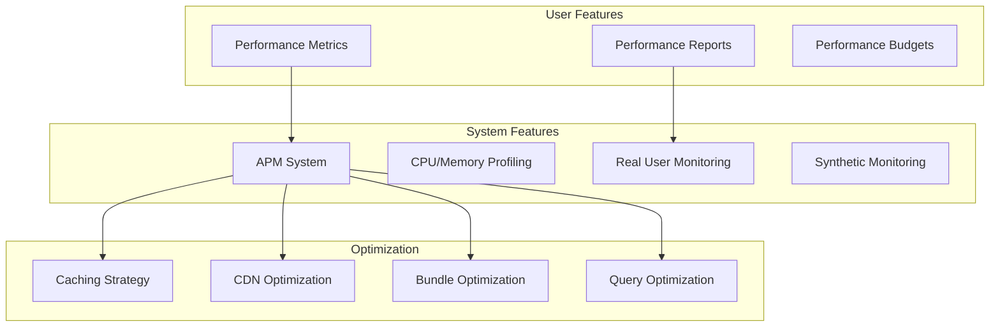

# Performance Stack

**End-to-end performance optimization, profiling, and monitoring**

---

## Stack Overview



---

## 📊 System Features

### 1. Performance Monitoring

```typescript
// Real User Monitoring (RUM)
class PerformanceMonitor {
  trackPageLoad(): void {
    if ('performance' in window) {
      window.addEventListener('load', () => {
        const perfData = performance.getEntriesByType('navigation')[0];
        
        this.track('page_load', {
          ttfb: perfData.responseStart - perfData.requestStart,
          domContentLoaded: perfData.domContentLoadedEventEnd - perfData.domContentLoadedEventStart,
          loadComplete: perfData.loadEventEnd - perfData.loadEventStart,
          totalTime: perfData.loadEventEnd - perfData.fetchStart,
        });
      });
    }
  }
  
  trackWebVitals(): void {
    // Largest Contentful Paint (LCP)
    new PerformanceObserver((list) => {
      const entries = list.getEntries();
      const lastEntry = entries[entries.length - 1];
      
      this.track('lcp', {
        value: lastEntry.renderTime || lastEntry.loadTime,
        target: LCP < 2500 ? 'good' : LCP < 4000 ? 'needs-improvement' : 'poor',
      });
    }).observe({ entryTypes: ['largest-contentful-paint'] });
    
    // First Input Delay (FID)
    new PerformanceObserver((list) => {
      list.getEntries().forEach((entry) => {
        this.track('fid', {
          value: entry.processingStart - entry.startTime,
          target: FID < 100 ? 'good' : FID < 300 ? 'needs-improvement' : 'poor',
        });
      });
    }).observe({ entryTypes: ['first-input'] });
    
    // Cumulative Layout Shift (CLS)
    let clsScore = 0;
    new PerformanceObserver((list) => {
      for (const entry of list.getEntries()) {
        if (!entry.hadRecentInput) {
          clsScore += entry.value;
        }
      }
      
      this.track('cls', {
        value: clsScore,
        target: clsScore < 0.1 ? 'good' : clsScore < 0.25 ? 'needs-improvement' : 'poor',
      });
    }).observe({ entryTypes: ['layout-shift'] });
  }
}
```

---

### 2. Bundle Optimization

```typescript
// Next.js bundle analyzer
// next.config.js
const withBundleAnalyzer = require('@next/bundle-analyzer')({
  enabled: process.env.ANALYZE === 'true',
});

module.exports = withBundleAnalyzer({
  // Code splitting
  webpack: (config) => {
    config.optimization.splitChunks = {
      chunks: 'all',
      cacheGroups: {
        default: false,
        vendors: false,
        commons: {
          name: 'commons',
          chunks: 'all',
          minChunks: 2,
        },
      },
    };
    return config;
  },
  
  // Compression
  compress: true,
  
  // Image optimization
  images: {
    formats: ['image/webp'],
    deviceSizes: [640, 750, 828, 1080, 1200],
  },
});
```

---

**Performance Stack Complete** ✅


