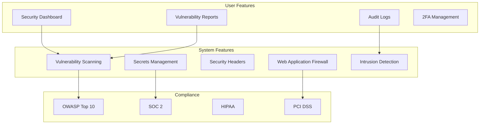

# Security Stack

**End-to-end architecture for application security, vulnerability management, and threat detection**

---

## Stack Overview



---

## 📊 System Features

### 1. Secrets Management

**Never Store Secrets in Code**

```typescript
// ❌ BAD: Hardcoded secrets
const apiKey = 'sk_live_abc123';
const dbPassword = 'password123';

// ✅ GOOD: Environment variables
const apiKey = process.env.STRIPE_API_KEY;
const dbPassword = process.env.DATABASE_PASSWORD;

// ✅ BETTER: Secrets vault
import { SecretManagerServiceClient } from '@google-cloud/secret-manager';

const client = new SecretManagerServiceClient();

async function getSecret(name: string): Promise<string> {
  const [version] = await client.accessSecretVersion({
    name: `projects/${PROJECT_ID}/secrets/${name}/versions/latest`,
  });
  
  return version.payload?.data?.toString() || '';
}

const apiKey = await getSecret('stripe-api-key');
```

**Secrets Vault Comparison**

| Tool | Type | Pros | Cons | Use When |
|------|------|------|------|----------|
| **HashiCorp Vault** | Self-hosted | Most features, dynamic secrets | Ops burden | Need full control |
| **AWS Secrets Manager** | Managed | AWS integration, auto-rotation | AWS lock-in | AWS-native |
| **Google Secret Manager** | Managed | GCP integration, versioning | GCP lock-in | GCP-native |
| **Azure Key Vault** | Managed | Azure integration, HSM | Azure lock-in | Azure-native |
| **Doppler** | SaaS | Easy, multi-env, CI/CD | Cost | Startups, multi-cloud |

---

### 2. Vulnerability Scanning

**Dependency Scanning**

```bash
# Scan npm dependencies
npm audit
npm audit fix

# Scan with Snyk
npx snyk test
npx snyk monitor

# Scan Docker images
docker scan myapp:latest

# Scan with Trivy
trivy image myapp:latest
```

**Code Scanning (SAST)**

```yaml
# GitHub Actions security scan
name: Security Scan
on: [push, pull_request]

jobs:
  security:
    runs-on: ubuntu-latest
    steps:
      - uses: actions/checkout@v3
      
      - name: Run Snyk
        uses: snyk/actions/node@master
        env:
          SNYK_TOKEN: ${{ secrets.SNYK_TOKEN }}
      
      - name: Run CodeQL
        uses: github/codeql-action/init@v2
        with:
          languages: javascript, typescript
      
      - name: Run Semgrep
        uses: returntocorp/semgrep-action@v1
```

**Vulnerability Scanning Tools**

| Tool | Type | Pros | Cons |
|------|------|------|------|
| **npm audit** | Dependency | Free, built-in | Basic |
| **Snyk** | Dependency + Code | Powerful, auto-fix PRs | Paid |
| **GitHub Dependabot** | Dependency | Free, auto-PRs | GitHub only |
| **Trivy** | Container + Dependency | Fast, open source | No auto-fix |
| **CodeQL** | SAST | Deep analysis | Slow |
| **Semgrep** | SAST | Fast, custom rules | Less accurate |

---

### 3. Security Headers

**Implement Security Headers**

```typescript
import helmet from 'helmet';

app.use(helmet({
  // Content Security Policy (prevent XSS)
  contentSecurityPolicy: {
    directives: {
      defaultSrc: ["'self'"],
      scriptSrc: ["'self'", "'unsafe-inline'", "cdn.example.com"],
      styleSrc: ["'self'", "'unsafe-inline'"],
      imgSrc: ["'self'", "data:", "https:"],
      connectSrc: ["'self'", "api.example.com"],
      fontSrc: ["'self'", "fonts.gstatic.com"],
      objectSrc: ["'none'"],
      upgradeInsecureRequests: [],
    },
  },
  
  // Prevent clickjacking
  frameguard: { action: 'deny' },
  
  // Prevent MIME sniffing
  noSniff: true,
  
  // Force HTTPS
  hsts: {
    maxAge: 31536000, // 1 year
    includeSubDomains: true,
    preload: true,
  },
  
  // Hide X-Powered-By
  hidePoweredBy: true,
  
  // Referrer policy
  referrerPolicy: { policy: 'strict-origin-when-cross-origin' },
}));

// CORS configuration
app.use(cors({
  origin: process.env.ALLOWED_ORIGINS?.split(',') || [],
  credentials: true,
  maxAge: 86400, // 24 hours
}));
```

**Security Headers Checklist**

- [ ] Content-Security-Policy (CSP)
- [ ] Strict-Transport-Security (HSTS)
- [ ] X-Frame-Options (clickjacking prevention)
- [ ] X-Content-Type-Options (MIME sniffing prevention)
- [ ] Referrer-Policy (control referer header)
- [ ] Permissions-Policy (disable unused browser features)

---

### 4. Input Validation & Sanitization

**Prevent Injection Attacks**

```typescript
import { z } from 'zod';
import DOMPurify from 'isomorphic-dompurify';

// SQL Injection Prevention: Use parameterized queries
// ❌ BAD: String concatenation
const query = `SELECT * FROM users WHERE email = '${email}'`;

// ✅ GOOD: Parameterized query
const query = 'SELECT * FROM users WHERE email = ?';
const results = await db.query(query, [email]);

// XSS Prevention: Validate and sanitize input
const userInputSchema = z.object({
  name: z.string().min(1).max(100),
  email: z.string().email(),
  bio: z.string().max(500),
});

app.post('/api/profile', async (req, res) => {
  // Validate
  const validated = userInputSchema.parse(req.body);
  
  // Sanitize HTML (if allowing HTML)
  const sanitizedBio = DOMPurify.sanitize(validated.bio, {
    ALLOWED_TAGS: ['b', 'i', 'em', 'strong', 'a'],
    ALLOWED_ATTR: ['href'],
  });
  
  await db.users.update({
    where: { id: req.user.id },
    data: {
      name: validated.name,
      email: validated.email,
      bio: sanitizedBio,
    },
  });
  
  res.json({ success: true });
});

// Path Traversal Prevention
import path from 'path';

app.get('/api/files/:filename', async (req, res) => {
  const { filename } = req.params;
  
  // Validate filename (no directory traversal)
  if (filename.includes('..') || filename.includes('/')) {
    return res.status(400).json({ error: 'Invalid filename' });
  }
  
  const filePath = path.join(__dirname, 'uploads', filename);
  
  // Ensure file is within uploads directory
  if (!filePath.startsWith(path.join(__dirname, 'uploads'))) {
    return res.status(403).json({ error: 'Access denied' });
  }
  
  res.sendFile(filePath);
});
```

---

### 5. Rate Limiting & DDoS Protection

**Implement Rate Limiting**

```typescript
import rateLimit from 'express-rate-limit';
import RedisStore from 'rate-limit-redis';
import Redis from 'ioredis';

const redis = new Redis(process.env.REDIS_URL);

// General API rate limit
const apiLimiter = rateLimit({
  store: new RedisStore({
    client: redis,
    prefix: 'rl:api:',
  }),
  windowMs: 15 * 60 * 1000, // 15 minutes
  max: 100, // 100 requests per 15 minutes
  message: 'Too many requests, please try again later',
  standardHeaders: true,
  legacyHeaders: false,
});

app.use('/api/', apiLimiter);

// Stricter limit for auth endpoints
const authLimiter = rateLimit({
  store: new RedisStore({
    client: redis,
    prefix: 'rl:auth:',
  }),
  windowMs: 15 * 60 * 1000,
  max: 5, // 5 login attempts per 15 minutes
  skipSuccessfulRequests: true, // Don't count successful logins
});

app.use('/api/auth/login', authLimiter);

// Per-user rate limiting
const userLimiter = rateLimit({
  store: new RedisStore({
    client: redis,
    prefix: 'rl:user:',
  }),
  windowMs: 60 * 1000, // 1 minute
  max: 60, // 60 requests per minute per user
  keyGenerator: (req) => req.user?.id || req.ip,
});

app.use('/api/', authenticate, userLimiter);
```

---

### 6. Security Monitoring & Incident Response

**Security Event Logging**

```typescript
// Log security events
const securityLogger = logger.child({ category: 'security' });

app.post('/api/auth/login', async (req, res) => {
  const { email, password } = req.body;
  
  try {
    const user = await authenticate(email, password);
    
    securityLogger.info('login_success', {
      userId: user.id,
      email,
      ip: req.ip,
      userAgent: req.headers['user-agent'],
    });
    
    res.json({ user });
  } catch (error) {
    securityLogger.warn('login_failed', {
      email,
      reason: error.code,
      ip: req.ip,
      userAgent: req.headers['user-agent'],
    });
    
    // Alert on brute force attempts
    const failedAttempts = await redis.incr(`login:failed:${req.ip}`);
    await redis.expire(`login:failed:${req.ip}`, 3600);
    
    if (failedAttempts > 10) {
      securityLogger.error('brute_force_detected', {
        ip: req.ip,
        attempts: failedAttempts,
      });
      
      await alertSecurity({
        type: 'brute_force',
        ip: req.ip,
        attempts: failedAttempts,
      });
    }
    
    res.status(401).json({ error: 'Invalid credentials' });
  }
});

// Monitor suspicious activity
app.use(async (req, res, next) => {
  // Detect SQL injection attempts
  if (req.url.match(/(\bUNION\b|\bSELECT\b|\bDROP\b)/i)) {
    securityLogger.error('sql_injection_attempt', {
      url: req.url,
      ip: req.ip,
      userAgent: req.headers['user-agent'],
    });
    
    return res.status(403).json({ error: 'Forbidden' });
  }
  
  // Detect XSS attempts
  if (req.body && JSON.stringify(req.body).match(/<script/i)) {
    securityLogger.error('xss_attempt', {
      body: req.body,
      ip: req.ip,
    });
    
    return res.status(403).json({ error: 'Forbidden' });
  }
  
  next();
});
```

---

## 👥 User Features

### 1. Security Dashboard

```typescript
const SecurityDashboard: React.FC = () => {
  const [securityScore, setSecurityScore] = useState<number>(0);
  const [vulnerabilities, setVulnerabilities] = useState<Vulnerability[]>([]);
  
  return (
    <DashboardLayout>
      <SecurityScore score={securityScore} />
      
      <VulnerabilityList
        vulnerabilities={vulnerabilities}
        onFix={(vuln) => fixVulnerability(vuln)}
      />
      
      <SecurityChecklist />
    </DashboardLayout>
  );
};
```

### 2. Audit Logs

```typescript
const AuditLog: React.FC = () => {
  const [events, setEvents] = useState<AuditEvent[]>([]);
  
  return (
    <AuditLogTable>
      {events.map(event => (
        <tr key={event.id}>
          <td>{event.timestamp}</td>
          <td>{event.user}</td>
          <td>{event.action}</td>
          <td>{event.resource}</td>
          <td>{event.ipAddress}</td>
        </tr>
      ))}
    </AuditLogTable>
  );
};
```

---

## 📋 Security Checklist

### Application Security
- [ ] No secrets in code (use vault)
- [ ] Input validation (Zod, Joi)
- [ ] Output sanitization (DOMPurify)
- [ ] Parameterized queries (prevent SQL injection)
- [ ] CSP headers (prevent XSS)
- [ ] HTTPS only (HSTS)
- [ ] Secure session management (httpOnly, secure cookies)

### Authentication & Authorization
- [ ] Strong password policy (min 12 chars, complexity)
- [ ] Password hashing (bcrypt, argon2)
- [ ] MFA/2FA available
- [ ] Rate limiting on login (5 attempts/15min)
- [ ] Session timeout (30 min idle, 24h absolute)
- [ ] OAuth scopes (least privilege)
- [ ] RBAC/ABAC (proper authorization)

### Infrastructure Security
- [ ] Dependency scanning (npm audit, Snyk)
- [ ] Container scanning (Trivy)
- [ ] SAST (CodeQL, Semgrep)
- [ ] DAST (OWASP ZAP)
- [ ] Secrets scanning (git-secrets, trufflehog)
- [ ] Security headers (helmet.js)
- [ ] WAF (Cloudflare, AWS WAF)

### Compliance
- [ ] PII encryption at rest
- [ ] PII encryption in transit (TLS 1.3)
- [ ] Data retention policies
- [ ] Right to erasure (GDPR)
- [ ] Audit logging (who, what, when)
- [ ] Security incident response plan
- [ ] Penetration testing (annual)

---

**Security Stack Complete** ✅


