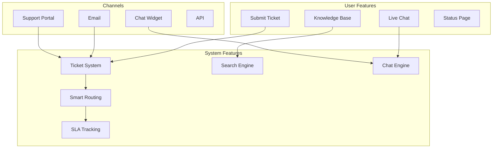

# Support Stack

**End-to-end customer support infrastructure with ticketing, knowledge base, and live chat**

---

## Stack Overview



---

## 📊 System Features

### 1. Ticket Management System

```typescript
interface Ticket {
  id: string;
  userId: string;
  subject: string;
  description: string;
  status: 'new' | 'open' | 'pending' | 'resolved' | 'closed';
  priority: 'low' | 'normal' | 'high' | 'urgent';
  category: string;
  assignedTo?: string;
  tags: string[];
  createdAt: Date;
  updatedAt: Date;
  resolvedAt?: Date;
  slaDeadline: Date;
}

class TicketSystem {
  async createTicket(data: CreateTicketInput): Promise<Ticket> {
    // Auto-categorize using keywords/ML
    const category = await this.categorizeTicket(data.subject, data.description);
    
    // Calculate priority
    const priority = await this.calculatePriority(data.userId, category);
    
    // Assign to agent (smart routing)
    const assignedTo = await this.assignTicket(category, priority);
    
    // Calculate SLA deadline
    const slaDeadline = this.calculateSLA(priority);
    
    const ticket = await db.tickets.create({
      data: {
        ...data,
        category,
        priority,
        assignedTo,
        slaDeadline,
        status: 'new',
      },
    });
    
    // Notify assigned agent
    await notificationRouter.send({
      userId: assignedTo,
      type: 'ticket_assigned',
      title: 'New Ticket Assigned',
      message: `${data.subject} (#${ticket.id})`,
      data: { ticketId: ticket.id },
      channels: ['email', 'in_app'],
    });
    
    return ticket;
  }
  
  private async categorizeTicket(subject: string, description: string): Promise<string> {
    const text = `${subject} ${description}`.toLowerCase();
    
    // Simple keyword matching (or use ML classification)
    if (text.includes('billing') || text.includes('payment')) {
      return 'billing';
    } else if (text.includes('bug') || text.includes('error')) {
      return 'technical';
    } else if (text.includes('feature') || text.includes('request')) {
      return 'feature_request';
    } else {
      return 'general';
    }
  }
  
  private calculateSLA(priority: string): Date {
    const hours = {
      urgent: 4,
      high: 8,
      normal: 24,
      low: 48,
    }[priority];
    
    return new Date(Date.now() + hours * 60 * 60 * 1000);
  }
}
```

---

### 2. Knowledge Base

```typescript
interface Article {
  id: string;
  title: string;
  content: string;
  category: string;
  tags: string[];
  views: number;
  helpful: number;
  notHelpful: number;
  published: boolean;
  createdAt: Date;
  updatedAt: Date;
}

class KnowledgeBase {
  async search(query: string): Promise<Article[]> {
    // Full-text search using Elasticsearch
    const results = await elasticsearch.search({
      index: 'kb_articles',
      body: {
        query: {
          multi_match: {
            query,
            fields: ['title^3', 'content'],
            fuzziness: 'AUTO',
          },
        },
        highlight: {
          fields: {
            title: {},
            content: {},
          },
        },
      },
    });
    
    return results.hits.hits.map(hit => ({
      ...hit._source,
      highlights: hit.highlight,
    }));
  }
  
  async suggestArticles(ticketDescription: string): Promise<Article[]> {
    // Suggest relevant KB articles for ticket
    return this.search(ticketDescription);
  }
}
```

---

### 3. Live Chat

```typescript
class ChatEngine {
  private rooms = new Map<string, ChatRoom>();
  
  async startChat(userId: string): Promise<ChatRoom> {
    // Find available agent
    const agent = await this.findAvailableAgent();
    
    if (!agent) {
      return this.createQueue(userId);
    }
    
    const room = {
      id: crypto.randomUUID(),
      userId,
      agentId: agent.id,
      status: 'active',
      messages: [],
      createdAt: new Date(),
    };
    
    this.rooms.set(room.id, room);
    
    // Notify agent
    await this.notifyAgent(agent.id, room.id);
    
    return room;
  }
  
  async sendMessage(roomId: string, from: string, message: string): Promise<void> {
    const room = this.rooms.get(roomId);
    if (!room) throw new Error('Room not found');
    
    const msg = {
      id: crypto.randomUUID(),
      from,
      message,
      timestamp: new Date(),
    };
    
    room.messages.push(msg);
    
    // Broadcast via WebSocket
    this.broadcast(roomId, msg);
    
    // Save to database
    await db.chatMessages.create({ data: msg });
  }
}
```

---

## 👥 User Features

### 1. Support Portal

```typescript
const SupportPortal: React.FC = () => {
  return (
    <div className="support-portal">
      <SearchBar placeholder="Search for help..." />
      
      <QuickLinks>
        <Link to="/support/kb">Knowledge Base</Link>
        <Link to="/support/tickets">My Tickets</Link>
        <Link to="/support/status">System Status</Link>
      </QuickLinks>
      
      <PopularArticles />
      
      <ContactOptions>
        <Button onClick={() => openChat()}>💬 Live Chat</Button>
        <Button onClick={() => createTicket()}>📧 Submit Ticket</Button>
      </ContactOptions>
    </div>
  );
};
```

### 2. Ticket Creation

```typescript
const CreateTicket: React.FC = () => {
  const [subject, setSubject] = useState('');
  const [description, setDescription] = useState('');
  const [suggestedArticles, setSuggestedArticles] = useState<Article[]>([]);
  
  // Auto-suggest KB articles as user types
  useEffect(() => {
    const suggest = async () => {
      if (description.length > 20) {
        const articles = await fetch('/api/kb/suggest', {
          method: 'POST',
          body: JSON.stringify({ query: description }),
        }).then(r => r.json());
        
        setSuggestedArticles(articles);
      }
    };
    
    const timeout = setTimeout(suggest, 500);
    return () => clearTimeout(timeout);
  }, [description]);
  
  return (
    <form onSubmit={handleSubmit}>
      <Input
        label="Subject"
        value={subject}
        onChange={setSubject}
      />
      
      <Textarea
        label="Description"
        value={description}
        onChange={setDescription}
        rows={8}
      />
      
      {suggestedArticles.length > 0 && (
        <SuggestedArticles>
          <h3>Before submitting, check these articles:</h3>
          {suggestedArticles.map(article => (
            <ArticleLink key={article.id} article={article} />
          ))}
        </SuggestedArticles>
      )}
      
      <Button type="submit">Submit Ticket</Button>
    </form>
  );
};
```

---

**Support Stack Complete** ✅


