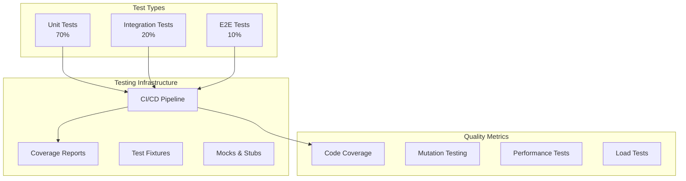

# Testing Stack

**End-to-end testing strategy from unit tests to load testing**

---

## Stack Overview



---

## 📊 System Features

### 1. Test Pyramid

```
       /\
      /E2E\      ← 10% - Slow, expensive, brittle
     /------\
    /Integr.\   ← 20% - Medium speed, test interactions
   /----------\
  /   Unit     \ ← 70% - Fast, cheap, many tests
 /--------------\
```

**Unit Tests**

```typescript
// Pure function - easy to test
export function calculateTax(amount: number, rate: number): number {
  return amount * rate;
}

// Test
describe('calculateTax', () => {
  it('should calculate tax correctly', () => {
    expect(calculateTax(100, 0.1)).toBe(10);
  });
  
  it('should handle zero rate', () => {
    expect(calculateTax(100, 0)).toBe(0);
  });
  
  it('should handle negative amounts', () => {
    expect(() => calculateTax(-100, 0.1)).toThrow();
  });
});
```

**Integration Tests**

```typescript
// Test API endpoint + database
describe('POST /api/users', () => {
  beforeEach(async () => {
    await db.users.deleteMany();
  });
  
  it('should create user', async () => {
    const response = await request(app)
      .post('/api/users')
      .send({ email: 'test@example.com', password: 'password123' })
      .expect(201);
    
    expect(response.body.user.email).toBe('test@example.com');
    
    // Verify in database
    const user = await db.users.findUnique({
      where: { email: 'test@example.com' },
    });
    
    expect(user).toBeDefined();
    expect(user.password).not.toBe('password123'); // Should be hashed
  });
});
```

**E2E Tests (Playwright)**

```typescript
import { test, expect } from '@playwright/test';

test('user signup flow', async ({ page }) => {
  // Navigate to signup
  await page.goto('/signup');
  
  // Fill form
  await page.fill('input[name="email"]', 'test@example.com');
  await page.fill('input[name="password"]', 'SecurePass123!');
  await page.click('button[type="submit"]');
  
  // Should redirect to dashboard
  await expect(page).toHaveURL('/dashboard');
  
  // Should see welcome message
  await expect(page.locator('h1')).toHaveText('Welcome!');
});
```

---

### 2. Test Frameworks & Tools

**JavaScript/TypeScript**

| Tool | Type | Pros | Cons | Use When |
|------|------|------|------|----------|
| **Jest** | Unit + Integration | Fast, snapshot testing, mocking | Can be slow at scale | React, Node.js |
| **Vitest** | Unit + Integration | Very fast, Vite-compatible | Newer, smaller ecosystem | Vite projects |
| **Playwright** | E2E | Cross-browser, fast, reliable | Newer | Modern E2E testing |
| **Cypress** | E2E | Great DX, time-travel debugging | Chromium only (limited) | Frontend E2E |
| **Supertest** | API Testing | Simple HTTP assertions | Limited features | API integration tests |

**Python**

| Tool | Type | Use When |
|------|------|----------|
| **pytest** | Unit + Integration | Python projects (best-in-class) |
| **unittest** | Unit | Standard library, no deps |
| **Selenium** | E2E | Cross-browser testing |

---

### 3. Test Data & Fixtures

**Factory Pattern**

```typescript
// Test data factories
export const userFactory = {
  build: (overrides?: Partial<User>): User => ({
    id: crypto.randomUUID(),
    email: `user-${Date.now()}@example.com`,
    password: 'hashed_password',
    createdAt: new Date(),
    ...overrides,
  }),
  
  buildMany: (count: number, overrides?: Partial<User>): User[] => {
    return Array.from({ length: count }, () => userFactory.build(overrides));
  },
};

// Usage
const user = userFactory.build({ email: 'specific@example.com' });
const users = userFactory.buildMany(10);
```

**Database Seeding**

```typescript
// Seed test database
export async function seedTestDatabase() {
  await db.users.createMany({
    data: userFactory.buildMany(100),
  });
  
  await db.posts.createMany({
    data: postFactory.buildMany(500),
  });
}

beforeAll(async () => {
  await seedTestDatabase();
});

afterAll(async () => {
  await db.users.deleteMany();
  await db.posts.deleteMany();
});
```

---

### 4. Mocking & Stubbing

**API Mocking (MSW)**

```typescript
import { rest } from 'msw';
import { setupServer } from 'msw/node';

// Mock API server
const server = setupServer(
  rest.get('/api/users/:id', (req, res, ctx) => {
    return res(
      ctx.json({
        id: req.params.id,
        email: 'test@example.com',
      })
    );
  }),
  
  rest.post('/api/orders', (req, res, ctx) => {
    return res(ctx.status(201), ctx.json({ orderId: '123' }));
  })
);

beforeAll(() => server.listen());
afterEach(() => server.resetHandlers());
afterAll(() => server.close());

// Test
test('should fetch user', async () => {
  const user = await fetchUser('123');
  expect(user.email).toBe('test@example.com');
});
```

**Function Mocking (Jest)**

```typescript
// Mock external service
jest.mock('../services/emailService');

import { sendEmail } from '../services/emailService';
const mockSendEmail = sendEmail as jest.MockedFunction<typeof sendEmail>;

test('should send welcome email on signup', async () => {
  mockSendEmail.mockResolvedValue({ success: true });
  
  await signupUser({ email: 'test@example.com' });
  
  expect(mockSendEmail).toHaveBeenCalledWith({
    to: 'test@example.com',
    subject: 'Welcome!',
    template: 'welcome',
  });
});
```

---

### 5. Code Coverage

**Coverage Targets**

| Coverage Type | Target | Why |
|---------------|--------|-----|
| **Statement Coverage** | 80% | Most code executed |
| **Branch Coverage** | 75% | Most conditions tested |
| **Function Coverage** | 90% | Most functions tested |
| **Line Coverage** | 80% | Most lines executed |

**Generate Coverage Reports**

```bash
# Jest
npm test -- --coverage

# Vitest
npx vitest --coverage

# Upload to Codecov
bash <(curl -s https://codecov.io/bash)
```

---

### 6. Performance & Load Testing

**Performance Testing (k6)**

```javascript
// load-test.js
import http from 'k6/http';
import { check, sleep } from 'k6';

export const options = {
  stages: [
    { duration: '30s', target: 20 },  // Ramp up to 20 users
    { duration: '1m', target: 20 },   // Stay at 20 users
    { duration: '30s', target: 0 },   // Ramp down
  ],
  thresholds: {
    http_req_duration: ['p(95)<500'], // 95% of requests < 500ms
    http_req_failed: ['rate<0.01'],   // <1% error rate
  },
};

export default function () {
  const response = http.get('https://api.example.com/users');
  
  check(response, {
    'status is 200': (r) => r.status === 200,
    'response time < 500ms': (r) => r.timings.duration < 500,
  });
  
  sleep(1);
}
```

**Load Testing Tools**

| Tool | Type | Best For |
|------|------|----------|
| **k6** | OSS | Modern, JavaScript, CI/CD |
| **Artillery** | OSS | Simple, YAML config |
| **Gatling** | OSS | Complex scenarios, Scala |
| **JMeter** | OSS | Legacy, GUI-based |
| **Loader.io** | SaaS | Quick tests, cloud-based |

---

## 👥 User Features

### 1. Test Reports Dashboard

```typescript
const TestReportsDashboard: React.FC = () => {
  const [report, setReport] = useState<TestReport | null>(null);
  
  return (
    <Dashboard>
      <TestSummary
        total={report.total}
        passed={report.passed}
        failed={report.failed}
        skipped={report.skipped}
      />
      
      <CoverageChart coverage={report.coverage} />
      
      <FailedTestsList tests={report.failedTests} />
    </Dashboard>
  );
};
```

### 2. Test Execution UI

```typescript
const TestRunner: React.FC = () => {
  const [running, setRunning] = useState(false);
  
  const runTests = async (filter?: string) => {
    setRunning(true);
    await fetch('/api/tests/run', {
      method: 'POST',
      body: JSON.stringify({ filter }),
    });
    setRunning(false);
  };
  
  return (
    <div>
      <Button onClick={() => runTests()} disabled={running}>
        {running ? 'Running...' : 'Run All Tests'}
      </Button>
      
      <TestList onRunTest={(test) => runTests(test.path)} />
    </div>
  );
};
```

---

## 📋 Implementation Checklist

### Unit Testing
- [ ] Jest/Vitest configured
- [ ] 70%+ code coverage
- [ ] Test all business logic
- [ ] Test edge cases (null, empty, invalid)
- [ ] Fast (<1s for all unit tests)

### Integration Testing
- [ ] API tests (Supertest)
- [ ] Database tests (test DB)
- [ ] External service mocks (MSW)
- [ ] 20% of test suite
- [ ] Run in CI/CD

### E2E Testing
- [ ] Playwright/Cypress configured
- [ ] Test critical paths (signup, checkout)
- [ ] Cross-browser testing (Chrome, Firefox, Safari)
- [ ] Visual regression testing (Percy, Chromatic)
- [ ] 10% of test suite

### CI/CD Integration
- [ ] Tests run on every PR
- [ ] Coverage reports generated
- [ ] Failed tests block merge
- [ ] Parallel test execution
- [ ] Test result artifacts

---

**Testing Stack Complete** ✅

